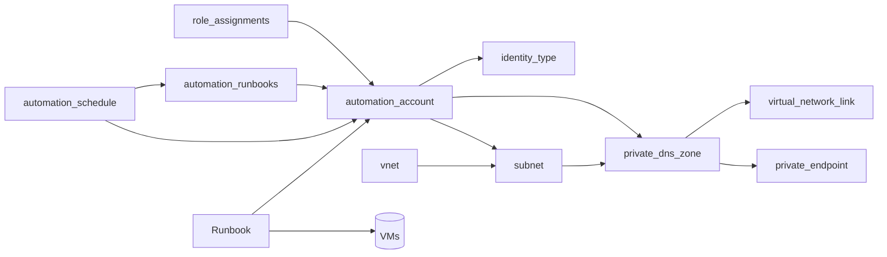
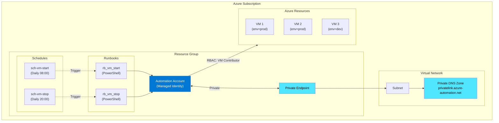

Contenido de Automation Accounts – Runbook.
## 1. Resumen

- **Objetivo**: Utilizar Azure Automation Account para ejecutar Runbooks PowerShell que gestionan el arranque y parada de máquinas virtuales, controlados mediante schedules y filtrados por tags.

- **Dependencias**: [RG], [role_assignments], [vnet], [subnet], [private_dns_zone]


> ⚠️ **Warning**
>
> public_network_access_enabled = false implica que debes validar conectividad privada (Private Endpoint/DNS) para operar según el diseño.
{: .prompt-warning }

> 💡 **Tip**
>
> Los vm_start_schedule_start_time deben ser fechas futuras en formato ISO8601 (en el código: 2026-01-15T...+01:00) y con vm_start_schedule_timezone = Europe/Madrid.
{: .prompt-tip }

> 💡 **Tip**
>
>Microsoft recomienda el uso de Managed Identities frente a credenciales embebidas para la ejecución de Runbooks.
{: .prompt-tip }

## 2. Arquitectura

> ℹ️ **Info**
>
> El Automation Account se despliega con System Assigned Managed Identity, acceso público deshabilitado y resolución de nombres mediante Private DNS Zone.
{: .prompt-info }




## 3. Diseño

- Naming: aa
- SKU: Automation Account: Basic (suficiente para ejecución de Runbooks sin características avanzadas como Update Management).
- Terraform: <a href="https://registry.terraform.io/providers/hashicorp/azurerm/latest/docs/resources/automation_account" target="_blank" rel="noopener noreferrer">Azure Automation</a>
- Cost: Azure Automation se factura por tiempo de ejecución del job y número de jobs según el modelo vigente de Microsoft.
- Red: private endpoint
- Hybrid: No se utiliza Hybrid Runbook Worker en este diseño.

## 4. Implementación (IaC)
### Terraform
```terraform
resource "azurerm_automation_account" "this" {
  name                          = var.automation_account_name
  location                      = var.location
  resource_group_name           = var.resource_group_name
  sku_name                      = var.sku_name
  public_network_access_enabled = var.public_network_access_enabled

  identity {
    type = var.identity_type
  }
  tags = var.tags
}
#############################################################################
# PRIVATE ENDPOINT
#############################################################################
resource "azurerm_private_endpoint" "private_endpoint" {
  name                = "pe-${var.automation_account_name}"
  location            = azurerm_automation_account.this.location
  resource_group_name = azurerm_automation_account.this.resource_group_name
  subnet_id           = var.subnet_id

  private_service_connection {
    name                           = "psc-${var.automation_account_name}"
    private_connection_resource_id = azurerm_automation_account.this.id
    subresource_names              = ["Webhook"]
    is_manual_connection           = false
  }
 
  private_dns_zone_group {
    name                 = "pdnszg-${var.automation_account_name}"
    private_dns_zone_ids = [var.private_dns_zone_ids]
  }
    tags = var.tags
}
```
## 5. Administración (CLI Azure)
### Powershell
```powershell
# Requiere Azure CLI instalado y sesión iniciada
az login
az account show -o table

# (Opcional) Fijar suscripción
az account set --subscription "<SUBSCRIPTION_ID>"

# Variables de ejemplo (ajústalas a tu entorno)
$rg = "rg-lab-01"
$aa = "aa-prod"

# -------------------------------
# AUTOMATION ACCOUNT (consultas)
# -------------------------------

# Ver detalles del Automation Account
az automation account show `
  --resource-group $rg `
  --name $aa `
  -o jsonc

# Listar Automation Accounts en un RG
az automation account list `
  --resource-group $rg `
  -o table

# Listar Runbooks del Automation Account
az automation runbook list `
  --resource-group $rg `
  --automation-account-name $aa `
  -o table

# Ver detalles de un Runbook
az automation runbook show `
  --resource-group $rg `
  --automation-account-name $aa `
  --name "rb_vm_start" `
  -o jsonc

# -------------------------------
# SCHEDULES + VINCULOS (job schedules)
# -------------------------------

# Listar schedules del Automation Account
az automation schedule list `
  --resource-group $rg `
  --automation-account-name $aa `
  -o table

# Ver un schedule concreto
az automation schedule show `
  --resource-group $rg `
  --automation-account-name $aa `
  --name "sch-vm-start-daily-0800" `
  -o jsonc

# Listar vínculos Runbook <-> Schedule (Job Schedules)
az automation job-schedule list `
  --resource-group $rg `
  --automation-account-name $aa `
  -o table

# -------------------------------
# EJECUCION DE RUNBOOKS (jobs)
# -------------------------------

# Iniciar un Runbook (crea un Job)
# Nota: si tu runbook requiere parámetros, añádelos con --parameters
az automation runbook start `
  --resource-group $rg `
  --automation-account-name $aa `
  --name "rb_vm_start"

# Listar jobs recientes del Automation Account
az automation job list `
  --resource-group $rg `
  --automation-account-name $aa `
  -o table

# Ver detalle de un job
az automation job show `
  --resource-group $rg `
  --automation-account-name $aa `
  --name "<JOB_ID>" `
  -o jsonc

# Obtener el output del job
az automation job output show `
  --resource-group $rg `
  --automation-account-name $aa `
  --name "<JOB_ID>" `
  -o jsonc

# Obtener los streams (Verbose/Warning/Error/Progress) del job
az automation job stream list `
  --resource-group $rg `
  --automation-account-name $aa `
  --job-id "<JOB_ID>" `
  -o table

# Ver un stream concreto
az automation job stream show `
  --resource-group $rg `
  --automation-account-name $aa `
  --job-id "<JOB_ID>" `
  --stream-id "<STREAM_ID>" `
  -o jsonc

# -------------------------------
# IDENTIDAD (Managed Identity) + RBAC
# -------------------------------

# Ver la identidad del Automation Account (principalId / tenantId)
az automation account show `
  --resource-group $rg `
  --name $aa `
  --query "identity" `
  -o jsonc

# Listar role assignments (RBAC) asignados a la Managed Identity en un scope
# (ejemplo: RG)
$sub = "<SUBSCRIPTION_ID>"
$scopeRg = "/subscriptions/$sub/resourceGroups/$rg"

# Sustituye <PRINCIPAL_ID> por identity.principalId del Automation Account
az role assignment list `
  --assignee-object-id "<PRINCIPAL_ID>" `
  --scope $scopeRg `
  -o table

# Crear una asignación de rol (ejemplo)
az role assignment create `
  --assignee-object-id "<PRINCIPAL_ID>" `
  --assignee-principal-type ServicePrincipal `
  --role "Virtual Machine Contributor" `
  --scope "/subscriptions/<SUBSCRIPTION_ID>/resourceGroups/<RG_NAME>"

# -------------------------------
# RED PRIVADA (Private DNS Zone - consultas típicas)
# -------------------------------

# Listar Private DNS Zones en un RG
az network private-dns zone list `
  --resource-group $rg `
  -o table

# Ver una Private DNS Zone concreta
az network private-dns zone show `
  --resource-group $rg `
  --name "privatelink.azure-automation.net" `
  -o jsonc

# Listar Virtual Network Links de una Private DNS Zone
az network private-dns link vnet list `
  --resource-group $rg `
  --zone-name "privatelink.azure-automation.net" `
  -o table

# Listar Private Endpoints (si aplica en tu despliegue)
az network private-endpoint list `
  --resource-group $rg `
  -o table

```
## 6. Referencias


### Diagrama de Arquitectura

