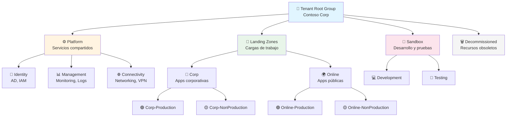
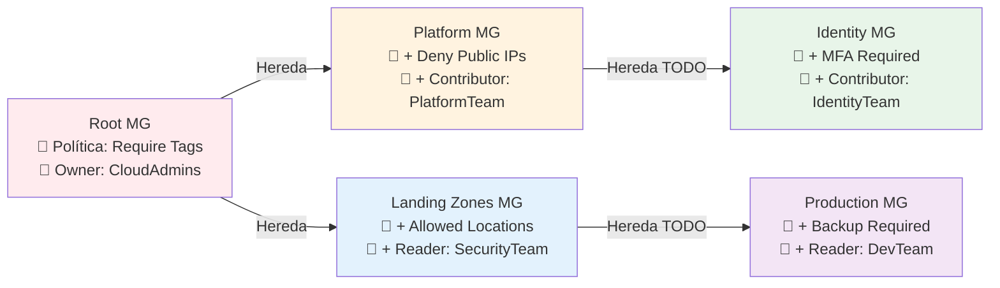

## 📋 1. Resumen

- **Objetivo**: Implementar una estructura jerárquica de Management Groups para proporcionar gobernanza centralizada, aplicación consistente de políticas de Azure y gestión de acceso RBAC a través de múltiples suscripciones de Azure.

- **Dependencias**: 
  - [[Azure-Subscriptions]] - Suscripciones organizadas bajo los Management Groups
  - [[Azure-Policy]] - Políticas aplicadas a nivel de Management Group
  - [[Azure-RBAC]] - Asignaciones de roles heredadas jerárquicamente
  - [[Azure-Active-Directory]] - Identidades para asignaciones RBAC
  - [[Cost-Management]] - Presupuestos y análisis de costes por Management Group

> [!tip] Notas Importantes
> - Límite de 6 niveles de profundidad en la jerarquía
> - Cada directorio de Azure AD tiene un Management Group raíz (Tenant Root Group)
> - Las políticas y RBAC se heredan hacia abajo en la jerarquía
> - Cambios en estructura requieren permisos de Management Group Administrator
> - HLD disponible en `docs/architecture/management-groups-hld.pdf`
> - Terraform modules en `terraform/modules/management-groups/`

## 🏛️ 2. Arquitectura

### Jerarquía de Management Groups



**Diagrama detallado**: `_assets/diagrams/management-groups-hierarchy-detailed.drawio`

### Flujo de Herencia de Políticas y RBAC



**Representación en código:**

```
flowchart LR
    Root[Root MG<br/>📜 Política: Require Tags<br/>👤 Owner: CloudAdmins]
    
    Root -->|Hereda| Platform[Platform MG<br/>📜 + Deny Public IPs<br/>👤 + Contributor: PlatformTeam]
    
    Root -->|Hereda| LZ[Landing Zones MG<br/>📜 + Allowed Locations<br/>👤 + Reader: SecurityTeam]
    
    Platform -->|Hereda TODO| Identity[Identity MG<br/>📜 + MFA Required<br/>👤 + Contributor: IdentityTeam]
    
    LZ -->|Hereda TODO| Prod[Production MG<br/>📜 + Backup Required<br/>👤 + Reader: DevTeam]
    
    style Root fill:#ffebee
    style Platform fill:#fff3e0
    style Identity fill:#e8f5e9
    style LZ fill:#e3f2fd
    style Prod fill:#f3e5f5
```

## 🎨 3. Diseño

### Naming Convention

```
Formato: mg-<scope>-<environment>-<region>

Ejemplos:
- mg-root-prod-global          (Root Management Group)
- mg-platform-prod-global      (Platform services)
- mg-landingzone-prod-global   (Landing zones)
- mg-corp-prod-weu            (Corporate workloads West Europe)
- mg-online-prod-eus          (Online apps East US)
- mg-sandbox-dev-global       (Development sandboxes)
```

### Estructura Jerárquica Recomendada

| Nivel | Management Group | Propósito | Políticas Aplicadas |
|-------|-----------------|-----------|---------------------|
| 0 | Tenant Root | Raíz del tenant | Require Tags, Allowed Regions |
| 1 | Platform | Servicios compartidos | Deny Public IPs, Network rules |
| 1 | Landing Zones | Aplicaciones | Resource limits, Naming standards |
| 1 | Sandbox | Desarrollo | Relaxed policies, Auto-shutdown |
| 2 | Identity | AD, AAD | MFA enforcement, Identity policies |
| 2 | Management | Monitoring | Log Analytics required |
| 2 | Connectivity | Networking | Virtual Network rules |
| 2 | Corp | Apps corporativas | Internal access only |
| 2 | Online | Apps públicas | WAF required, DDoS protection |
| 3 | Corp-Prod | Producción corp | Backup required, No delete lock |
| 3 | Corp-NonProd | No-producción corp | Auto-shutdown nights |

### Consideraciones de Diseño

- **Límite de profundidad**: Máximo 6 niveles (Root + 5 niveles hijos)
- **Límite de Management Groups**: 10,000 por directorio de Azure AD
- **Límite de suscripciones**: Sin límite por Management Group
- **Tiempo de propagación**: Políticas pueden tardar hasta 30 minutos en propagarse
- **Movimientos de suscripciones**: Requieren permisos Owner o Contributor en ambos MGs

## 📊 4. Observabilidad

### Auditoría y Monitoreo

```json
{
  "Alertas_Activity_Log": {
    "management_group_created": {
      "severity": "Informational",
      "action": "Microsoft.Management/managementGroups/write",
      "notification": "governance-team@contoso.com"
    },
    "management_group_deleted": {
      "severity": "Critical",
      "action": "Microsoft.Management/managementGroups/delete",
      "notification": "security-ops@contoso.com"
    },
    "subscription_moved": {
      "severity": "High",
      "action": "Microsoft.Management/managementGroups/subscriptions/write",
      "notification": "cloud-admins@contoso.com"
    },
    "policy_assignment_modified": {
      "severity": "Medium",
      "action": "Microsoft.Authorization/policyAssignments/write",
      "notification": "compliance-team@contoso.com"
    },
    "rbac_assignment_changed": {
      "severity": "High",
      "action": "Microsoft.Authorization/roleAssignments/*",
      "notification": "security-ops@contoso.com"
    }
  }
}
```

### Logs y Diagnósticos

- **Activity Logs**: Habilitados para todas las operaciones de Management Group
  - Retención: 90 días en Log Analytics Workspace
  - Storage: Archivado a Storage Account por 2 años
  
- **Compliance Dashboard**: 
  - Azure Policy Compliance por Management Group
  - Actualización cada 4 horas
  - Dashboard URL: `https://portal.azure.com/#view/Microsoft_Azure_Policy/PolicyComplianceBlade`

- **RBAC Reports**:
  - Reporte mensual de asignaciones de roles
  - Identificación de permisos excesivos
  - Herramienta: Azure PIM + Custom PowerShell scripts

### Backup/DR

- **Configuración as Code**: Toda la estructura en Terraform (Git repository)
- **Backup diario**: Terraform state en Azure Storage con versioning
- **Disaster Recovery**: 
  - RPO: 1 día (backups diarios de Terraform state)
  - RTO: 4 horas (re-despliegue completo desde Terraform)
  - Procedimiento documentado en `runbooks/mg-disaster-recovery.md`

### Parches y Actualizaciones

- **Revisión trimestral**: Estructura de Management Groups
- **Actualizaciones de políticas**: Según roadmap de Azure Policy
- **Testing**: Cambios siempre probados en Sandbox MG primero
- **Ventana de cambios**: Primer lunes de cada mes, 18:00-20:00 CET

### Dashboards

```
Azure Portal Dashboards:
├── Management Groups Overview
│   ├── Jerarquía completa
│   ├── Número de suscripciones por MG
│   └── Estado de compliance
├── Policy Compliance
│   ├── Políticas por MG
│   ├── Non-compliant resources
│   └── Exemptions activas
└── Cost Management
    ├── Costes por Management Group
    ├── Tendencias mensuales
    └── Presupuestos y alertas
```

**Dashboard JSON**: `_assets/dashboards/management-groups-dashboard.json`

## ⚙️ 5. Implementación (IaC)

### Terraform

```hcl
# terraform/main.tf
# Management Group Hierarchy

terraform {
  required_providers {
    azurerm = {
      source  = "hashicorp/azurerm"
      version = "~> 3.85"
    }
  }
  backend "azurerm" {
    resource_group_name  = "rg-terraform-state"
    storage_account_name = "sttfstatecontoso"
    container_name       = "tfstate"
    key                  = "management-groups.tfstate"
  }
}

provider "azurerm" {
  features {}
}

# Root Management Group (ya existe, solo referencia)
data "azurerm_management_group" "root" {
  name = data.azurerm_client_config.current.tenant_id
}

data "azurerm_client_config" "current" {}

# Platform Management Group
resource "azurerm_management_group" "platform" {
  display_name               = "Platform"
  parent_management_group_id = data.azurerm_management_group.root.id
  
  subscription_ids = []
}

# Identity Management Group
resource "azurerm_management_group" "identity" {
  display_name               = "Identity"
  parent_management_group_id = azurerm_management_group.platform.id
  
  subscription_ids = [
    var.subscription_id_identity_prod
  ]
}

# Management Services MG
resource "azurerm_management_group" "management" {
  display_name               = "Management"
  parent_management_group_id = azurerm_management_group.platform.id
  
  subscription_ids = [
    var.subscription_id_monitoring_prod,
    var.subscription_id_logging_prod
  ]
}

# Connectivity Management Group
resource "azurerm_management_group" "connectivity" {
  display_name               = "Connectivity"
  parent_management_group_id = azurerm_management_group.platform.id
  
  subscription_ids = [
    var.subscription_id_network_hub_prod
  ]
}

# Landing Zones Management Group
resource "azurerm_management_group" "landing_zones" {
  display_name               = "Landing-Zones"
  parent_management_group_id = data.azurerm_management_group.root.id
  
  subscription_ids = []
}

# Corp Management Group
resource "azurerm_management_group" "corp" {
  display_name               = "Corp"
  parent_management_group_id = azurerm_management_group.landing_zones.id
  
  subscription_ids = []
}

# Corp Production
resource "azurerm_management_group" "corp_prod" {
  display_name               = "Corp-Production"
  parent_management_group_id = azurerm_management_group.corp.id
  
  subscription_ids = [
    var.subscription_id_app1_prod,
    var.subscription_id_app2_prod
  ]
}

# Corp Non-Production
resource "azurerm_management_group" "corp_nonprod" {
  display_name               = "Corp-NonProduction"
  parent_management_group_id = azurerm_management_group.corp.id
  
  subscription_ids = [
    var.subscription_id_app1_dev,
    var.subscription_id_app1_test,
    var.subscription_id_app2_dev
  ]
}

# Online Management Group
resource "azurerm_management_group" "online" {
  display_name               = "Online"
  parent_management_group_id = azurerm_management_group.landing_zones.id
  
  subscription_ids = []
}

# Online Production
resource "azurerm_management_group" "online_prod" {
  display_name               = "Online-Production"
  parent_management_group_id = azurerm_management_group.online.id
  
  subscription_ids = [
    var.subscription_id_ecommerce_prod
  ]
}

# Online Non-Production
resource "azurerm_management_group" "online_nonprod" {
  display_name               = "Online-NonProduction"
  parent_management_group_id = azurerm_management_group.online.id
  
  subscription_ids = [
    var.subscription_id_ecommerce_staging
  ]
}

# Sandbox Management Group
resource "azurerm_management_group" "sandbox" {
  display_name               = "Sandbox"
  parent_management_group_id = data.azurerm_management_group.root.id
  
  subscription_ids = [
    var.subscription_id_sandbox_dev1,
    var.subscription_id_sandbox_dev2
  ]
}

# Decommissioned Management Group
resource "azurerm_management_group" "decommissioned" {
  display_name               = "Decommissioned"
  parent_management_group_id = data.azurerm_management_group.root.id
  
  subscription_ids = []
}

# Policy Assignment - Require Tags (Root level)
resource "azurerm_management_group_policy_assignment" "require_tags" {
  name                 = "require-tags-policy"
  display_name         = "Require specific tags on resources"
  management_group_id  = data.azurerm_management_group.root.id
  policy_definition_id = "/providers/Microsoft.Authorization/policyDefinitions/1e30110a-5ceb-460c-a204-c1c3969c6d62"
  
  parameters = jsonencode({
    tagName = {
      value = "CostCenter"
    }
  })
}

# Policy Assignment - Allowed Locations
resource "azurerm_management_group_policy_assignment" "allowed_locations" {
  name                 = "allowed-locations"
  display_name         = "Allowed Azure Regions"
  management_group_id  = data.azurerm_management_group.root.id
  policy_definition_id = "/providers/Microsoft.Authorization/policyDefinitions/e56962a6-4747-49cd-b67b-bf8b01975c4c"
  
  parameters = jsonencode({
    listOfAllowedLocations = {
      value = [
        "westeurope",
        "northeurope",
        "eastus",
        "westus"
      ]
    }
  })
}

# RBAC Assignment - Cloud Administrators
resource "azurerm_role_assignment" "cloud_admins_root" {
  scope                = data.azurerm_management_group.root.id
  role_definition_name = "Owner"
  principal_id         = var.aad_group_cloud_admins_object_id
}

# RBAC Assignment - Platform Team
resource "azurerm_role_assignment" "platform_team" {
  scope                = azurerm_management_group.platform.id
  role_definition_name = "Contributor"
  principal_id         = var.aad_group_platform_team_object_id
}

# RBAC Assignment - Security Team (Reader en Landing Zones)
resource "azurerm_role_assignment" "security_team_reader" {
  scope                = azurerm_management_group.landing_zones.id
  role_definition_name = "Reader"
  principal_id         = var.aad_group_security_team_object_id
}

# Outputs
output "management_group_ids" {
  description = "Map of all Management Group IDs"
  value = {
    platform       = azurerm_management_group.platform.id
    identity       = azurerm_management_group.identity.id
    management     = azurerm_management_group.management.id
    connectivity   = azurerm_management_group.connectivity.id
    landing_zones  = azurerm_management_group.landing_zones.id
    corp           = azurerm_management_group.corp.id
    corp_prod      = azurerm_management_group.corp_prod.id
    corp_nonprod   = azurerm_management_group.corp_nonprod.id
    online         = azurerm_management_group.online.id
    online_prod    = azurerm_management_group.online_prod.id
    online_nonprod = azurerm_management_group.online_nonprod.id
    sandbox        = azurerm_management_group.sandbox.id
    decommissioned = azurerm_management_group.decommissioned.id
  }
}
```

```hcl
# terraform/variables.tf

variable "subscription_id_identity_prod" {
  description = "Subscription ID for Identity services (Production)"
  type        = string
}

variable "subscription_id_monitoring_prod" {
  description = "Subscription ID for Monitoring services"
  type        = string
}

variable "subscription_id_logging_prod" {
  description = "Subscription ID for Logging services"
  type        = string
}

variable "subscription_id_network_hub_prod" {
  description = "Subscription ID for Network Hub"
  type        = string
}

variable "subscription_id_app1_prod" {
  description = "Subscription ID for App1 Production"
  type        = string
}

variable "subscription_id_app2_prod" {
  description = "Subscription ID for App2 Production"
  type        = string
}

variable "subscription_id_app1_dev" {
  description = "Subscription ID for App1 Development"
  type        = string
}

variable "subscription_id_app1_test" {
  description = "Subscription ID for App1 Testing"
  type        = string
}

variable "subscription_id_app2_dev" {
  description = "Subscription ID for App2 Development"
  type        = string
}

variable "subscription_id_ecommerce_prod" {
  description = "Subscription ID for E-commerce Production"
  type        = string
}

variable "subscription_id_ecommerce_staging" {
  description = "Subscription ID for E-commerce Staging"
  type        = string
}

variable "subscription_id_sandbox_dev1" {
  description = "Subscription ID for Sandbox Dev 1"
  type        = string
}

variable "subscription_id_sandbox_dev2" {
  description = "Subscription ID for Sandbox Dev 2"
  type        = string
}

variable "aad_group_cloud_admins_object_id" {
  description = "Azure AD Group Object ID for Cloud Administrators"
  type        = string
}

variable "aad_group_platform_team_object_id" {
  description = "Azure AD Group Object ID for Platform Team"
  type        = string
}

variable "aad_group_security_team_object_id" {
  description = "Azure AD Group Object ID for Security Team"
  type        = string
}
```

### Bicep

```bicep
// bicep/management-groups.bicep
targetScope = 'managementGroup'

// Parameters
param platformMgName string = 'Platform'
param landingZonesMgName string = 'Landing-Zones'
param sandboxMgName string = 'Sandbox'
param decommissionedMgName string = 'Decommissioned'

param identitySubscriptionId string
param monitoringSubscriptionId string
param loggingSubscriptionId string
param networkHubSubscriptionId string

// Note: Root Management Group is implicit in Azure

// Platform Management Group
resource platformMg 'Microsoft.Management/managementGroups@2023-04-01' = {
  name: guid(platformMgName)
  properties: {
    displayName: platformMgName
    details: {
      parent: {
        id: tenantResourceId('Microsoft.Management/managementGroups', tenant().tenantId)
      }
    }
  }
}

// Identity Management Group
resource identityMg 'Microsoft.Management/managementGroups@2023-04-01' = {
  name: guid('Identity', platformMgName)
  properties: {
    displayName: 'Identity'
    details: {
      parent: {
        id: platformMg.id
      }
    }
  }
}

// Subscription association for Identity
resource identitySubAssociation 'Microsoft.Management/managementGroups/subscriptions@2023-04-01' = {
  name: identitySubscriptionId
  parent: identityMg
}

// Management Services MG
resource managementMg 'Microsoft.Management/managementGroups@2023-04-01' = {
  name: guid('Management', platformMgName)
  properties: {
    displayName: 'Management'
    details: {
      parent: {
        id: platformMg.id
      }
    }
  }
}

// Connectivity Management Group
resource connectivityMg 'Microsoft.Management/managementGroups@2023-04-01' = {
  name: guid('Connectivity', platformMgName)
  properties: {
    displayName: 'Connectivity'
    details: {
      parent: {
        id: platformMg.id
      }
    }
  }
}

// Landing Zones Management Group
resource landingZonesMg 'Microsoft.Management/managementGroups@2023-04-01' = {
  name: guid(landingZonesMgName)
  properties: {
    displayName: landingZonesMgName
    details: {
      parent: {
        id: tenantResourceId('Microsoft.Management/managementGroups', tenant().tenantId)
      }
    }
  }
}

// Corp Management Group
resource corpMg 'Microsoft.Management/managementGroups@2023-04-01' = {
  name: guid('Corp', landingZonesMgName)
  properties: {
    displayName: 'Corp'
    details: {
      parent: {
        id: landingZonesMg.id
      }
    }
  }
}

// Corp Production
resource corpProdMg 'Microsoft.Management/managementGroups@2023-04-01' = {
  name: guid('Corp-Production')
  properties: {
    displayName: 'Corp-Production'
    details: {
      parent: {
        id: corpMg.id
      }
    }
  }
}

// Corp Non-Production
resource corpNonProdMg 'Microsoft.Management/managementGroups@2023-04-01' = {
  name: guid('Corp-NonProduction')
  properties: {
    displayName: 'Corp-NonProduction'
    details: {
      parent: {
        id: corpMg.id
      }
    }
  }
}

// Online Management Group
resource onlineMg 'Microsoft.Management/managementGroups@2023-04-01' = {
  name: guid('Online', landingZonesMgName)
  properties: {
    displayName: 'Online'
    details: {
      parent: {
        id: landingZonesMg.id
      }
    }
  }
}

// Online Production
resource onlineProdMg 'Microsoft.Management/managementGroups@2023-04-01' = {
  name: guid('Online-Production')
  properties: {
    displayName: 'Online-Production'
    details: {
      parent: {
        id: onlineMg.id
      }
    }
  }
}

// Online Non-Production
resource onlineNonProdMg 'Microsoft.Management/managementGroups@2023-04-01' = {
  name: guid('Online-NonProduction')
  properties: {
    displayName: 'Online-NonProduction'
    details: {
      parent: {
        id: onlineMg.id
      }
    }
  }
}

// Sandbox Management Group
resource sandboxMg 'Microsoft.Management/managementGroups@2023-04-01' = {
  name: guid(sandboxMgName)
  properties: {
    displayName: sandboxMgName
    details: {
      parent: {
        id: tenantResourceId('Microsoft.Management/managementGroups', tenant().tenantId)
      }
    }
  }
}

// Decommissioned Management Group
resource decommissionedMg 'Microsoft.Management/managementGroups@2023-04-01' = {
  name: guid(decommissionedMgName)
  properties: {
    displayName: decommissionedMgName
    details: {
      parent: {
        id: tenantResourceId('Microsoft.Management/managementGroups', tenant().tenantId)
      }
    }
  }
}

// Outputs
output platformMgId string = platformMg.id
output identityMgId string = identityMg.id
output managementMgId string = managementMg.id
output connectivityMgId string = connectivityMg.id
output landingZonesMgId string = landingZonesMg.id
output corpMgId string = corpMg.id
output corpProdMgId string = corpProdMg.id
output corpNonProdMgId string = corpNonProdMg.id
output onlineMgId string = onlineMg.id
output onlineProdMgId string = onlineProdMg.id
output onlineNonProdMgId string = onlineNonProdMg.id
output sandboxMgId string = sandboxMg.id
output decommissionedMgId string = decommissionedMg.id
```

### Script de Deployment

```bash
#!/bin/bash
# scripts/deploy-management-groups.sh

set -e

echo "🚀 Deploying Management Groups Hierarchy..."

# Variables
TENANT_ID=$(az account show --query tenantId -o tsv)
LOCATION="westeurope"

echo "📋 Tenant ID: $TENANT_ID"

# Validate Terraform
echo "✅ Validating Terraform configuration..."
cd terraform
terraform init
terraform validate
terraform plan -out=tfplan

# Apply with approval
read -p "🔍 Review the plan above. Apply changes? (yes/no): " APPLY
if [ "$APPLY" == "yes" ]; then
    terraform apply tfplan
    echo "✅ Management Groups deployed successfully!"
else
    echo "❌ Deployment cancelled."
    exit 1
fi

# Verify deployment
echo "🔍 Verifying Management Groups..."
az account management-group list --query "[].{Name:displayName, ID:id}" -o table

echo "✅ Deployment complete!"
```

## 🔒 6. Seguridad

### Azure Policy - Políticas Aplicadas

#### Root Level Policies

```json
{
  "policies_root": [
    {
      "name": "Require-Tags",
      "displayName": "Require specific tags on resources",
      "effect": "Deny",
      "parameters": {
        "requiredTags": ["CostCenter", "Environment", "Owner"]
      }
    },
    {
      "name": "Allowed-Locations",
      "displayName": "Allowed Azure regions",
      "effect": "Deny",
      "parameters": {
        "allowedLocations": ["westeurope", "northeurope", "eastus"]
      }
    },
    {
      "name": "Audit-Diagnostic-Settings",
      "displayName": "Audit diagnostic settings for all resources",
      "effect": "AuditIfNotExists"
    }
  ]
}
```

#### Platform Management Group Policies

```json
{
  "policies_platform": [
    {
      "name": "Deny-Public-IP",
      "displayName": "Deny creation of public IPs",
      "effect": "Deny",
      "scope": "Platform services only"
    },
    {
      "name": "Require-NSG",
      "displayName": "Require Network Security Groups on subnets",
      "effect": "Deny"
    },
    {
      "name": "Enforce-Private-Endpoints",
      "displayName": "Storage and SQL must use private endpoints",
      "effect": "Deny"
    }
  ]
}
```

#### Landing Zones - Production Policies

```json
{
  "policies_landing_zones_prod": [
    {
      "name": "Require-Backup",
      "displayName": "VMs must have backup enabled",
      "effect": "DeployIfNotExists"
    },
    {
      "name": "Require-Delete-Lock",
      "displayName": "Critical resources must have delete lock",
      "effect": "Append"
    },
    {
      "name": "Deny-VM-Size",
      "displayName": "Restrict VM sizes to approved list",
      "effect": "Deny",
      "parameters": {
        "allowedSizes": ["Standard_D2s_v3", "Standard_D4s_v3", "Standard_D8s_v3"]
      }
    }
  ]
}
```

#### Sandbox Policies (Relaxed)

```json
{
  "policies_sandbox": [
    {
      "name": "Auto-Shutdown-VMs",
      "displayName": "Auto-shutdown VMs at 19:00 daily",
      "effect": "DeployIfNotExists"
    },
    {
      "name": "Budget-Alert",
      "displayName": "Alert when spending exceeds $500/month",
      "effect": "Audit"
    }
  ]
}
```

### Cifrado y Key Management

- **Azure Policy Encryption**: Política en Root MG que requiere encryption at rest
- **Key Vault**: Por Management Group para secretos de automatización
- **Managed Identities**: Usadas para acceso a Key Vault desde pipelines
- **Secrets Rotation**: Automático cada 90 días via Azure Automation

### Private Endpoints

No aplica directamente a Management Groups (son construcción lógica), pero políticas fuerzan private endpoints en:
- Azure Storage accounts
- Azure SQL Databases
- Azure Key Vaults
- Azure Container Registries

### Identidad y RBAC

#### RBAC Strategy

```yaml
Root Management Group:
  - Owner: Cloud-Admins-Group (Break-glass accounts)
  - Contributor: Platform-Admins-Group (Day-to-day admin)
  - Reader: Security-Team-Group (Audit access)
  - Management Group Contributor: Governance-Team-Group (MG structure changes)

Platform MG:
  - Contributor: Platform-Team-Group
  - Reader: All-Engineers-Group
  
Identity MG:
  - Contributor: Identity-Team-Group
  - User Access Administrator: Identity-Team-Group (for RBAC management)

Management MG:
  - Contributor: SRE-Team-Group
  - Log Analytics Contributor: DevOps-Team-Group

Connectivity MG:
  - Network Contributor: Network-Team-Group
  - Reader: All-Engineers-Group

Landing Zones - Corp - Production:
  - Reader: App-Team-Group
  - Contributor: (Granted at subscription level, not MG)
  
Landing Zones - Corp - NonProduction:
  - Contributor: App-Team-Group (More permissive for dev)

Sandbox MG:
  - Contributor: All-Engineers-Group (Self-service)
  - Owner: Individual users on their subscriptions
```

#### Custom RBAC Roles

```json
{
  "Name": "Management Group Policy Manager",
  "Id": "12345678-1234-1234-1234-123456789012",
  "IsCustom": true,
  "Description": "Can manage policies at Management Group level",
  "Actions": [
    "Microsoft.Authorization/policyAssignments/*",
    "Microsoft.Authorization/policyDefinitions/*",
    "Microsoft.Authorization/policySetDefinitions/*",
    "Microsoft.PolicyInsights/*"
  ],
  "NotActions": [],
  "AssignableScopes": [
    "/providers/Microsoft.Management/managementGroups/00000000-0000-0000-0000-000000000000"
  ]
}
```

### Security Best Practices

✅ **Principle of Least Privilege**: RBAC asignado al nivel más bajo posible  
✅ **Separation of Duties**: Platform team ≠ App teams  
✅ **Break-glass Accounts**: Solo 2-3 Owner en Root MG  
✅ **Azure AD PIM**: Roles privilegiados solo Just-In-Time  
✅ **Policy Exemptions**: Aprobación formal, revisión trimestral  
✅ **Audit Logging**: Activity logs a SIEM (Sentinel)  

## 💰 7. Costes

### Costes Directos

**Management Groups son gratuitos** - No hay costes por la estructura en sí.

### Costes Indirectos (Servicios relacionados)

| Servicio | Propósito | Coste Mensual Estimado |
|----------|-----------|------------------------|
| Azure Policy | Gobernanza y compliance | **Gratis** (hasta 1000 recursos, luego $0.50/100 recursos) |
| Log Analytics | Auditoría y logs | $150/mes (10 GB/día ingesta) |
| Azure Storage | Backup de Terraform state | $5/mes (LRS, 100 GB) |
| Azure Automation | Scripts de compliance | $10/mes (básico) |
| Azure Monitor Alerts | Notificaciones de cambios | $2/mes (~10 alertas) |

**Total estimado**: ~$167/mes para toda la infraestructura de gobernanza

### Cost Management por Management Group

```bash
# Ver costes agregados por Management Group
az consumption usage list \
  --management-group-id "mg-landing-zones-prod" \
  --start-date 2026-01-01 \
  --end-date 2026-01-31

# Budget por Management Group
az consumption budget create \
  --budget-name "budget-landingzones-prod" \
  --amount 50000 \
  --category Cost \
  --time-grain Monthly \
  --management-group-id "mg-landing-zones-prod" \
  --notifications '[{
    "enabled": true,
    "operator": "GreaterThan",
    "threshold": 80,
    "contactEmails": ["finance@contoso.com"],
    "contactRoles": ["Owner"],
    "thresholdType": "Actual"
  }]'
```

### Ahorros por Implementar Management Groups

| Ahorro | Descripción | Impacto Anual |
|--------|-------------|---------------|
| **Políticas Centralizadas** | Prevención de recursos no conformes (VMs sobredimensionadas, regiones caras) | $24,000 |
| **Auto-shutdown en Sandbox** | VMs apagadas automáticamente fuera de horario | $18,000 |
| **Visibilidad de costes** | Identificación temprana de cost overruns | $12,000 |
| **Reserved Instances** | Compra centralizada con mejor visibilidad de uso | $30,000 |
| **Eliminación de recursos huérfanos** | Policy que detecta recursos sin tags → fácil cleanup | $8,000 |

**Total ahorros estimados**: ~$92,000/año

### Chargeback Model

```
Cost allocation por Management Group:
├── Platform (15% del total)
│   ├── Compartido entre todas las apps
│   └── Billing: IT-Operations budget
├── Landing Zones - Corp - Prod (50% del total)
│   ├── Chargeback a cada aplicación por tags
│   └── Billing: Por línea de negocio
├── Landing Zones - Online - Prod (25% del total)
│   ├── Chargeback a digital transformation team
│   └── Billing: Marketing & Sales budget
└── Sandbox (10% del total)
    ├── Compartido - no chargeback
    └── Billing: IT-Training budget
```

## 🧪 8. Pruebas y Validación

### Azure CLI

```bash
# ============================================
# VALIDACIÓN DE ESTRUCTURA
# ============================================

# Listar todos los Management Groups
az account management-group list -o table

# Ver jerarquía completa
az account management-group show \
  --name "mg-root-contoso" \
  --expand \
  --recurse

# Ver suscripciones en un Management Group específico
az account management-group subscription show \
  --name "mg-corp-prod" \
  --subscription "12345678-1234-1234-1234-123456789012"

# Verificar parent de un Management Group
az account management-group show \
  --name "mg-identity-prod" \
  --query "properties.details.parent.displayName"

# ============================================
# VALIDACIÓN DE POLÍTICAS
# ============================================

# Listar políticas asignadas a un Management Group
az policy assignment list \
  --scope "/providers/Microsoft.Management/managementGroups/mg-root" \
  -o table

# Ver estado de compliance de políticas
az policy state summarize \
  --management-group "mg-landing-zones-prod"

# Ver recursos no conformes
az policy state list \
  --management-group "mg-corp-prod" \
  --filter "complianceState eq 'NonCompliant'" \
  --query "[].{Resource:resourceId, Policy:policyDefinitionName}" \
  -o table

# Crear policy exemption (para testing)
az policy exemption create \
  --name "test-vm-exemption" \
  --policy-assignment "/providers/Microsoft.Management/managementGroups/mg-root/providers/Microsoft.Authorization/policyAssignments/require-tags" \
  --exemption-category Waiver \
  --expires-on "2026-02-28T00:00:00Z" \
  --display-name "Temporary exemption for test VM"

# ============================================
# VALIDACIÓN DE RBAC
# ============================================

# Listar role assignments en un Management Group
az role assignment list \
  --scope "/providers/Microsoft.Management/managementGroups/mg-platform-prod" \
  --query "[].{Principal:principalName, Role:roleDefinitionName, Scope:scope}" \
  -o table

# Verificar acceso de un usuario/grupo específico
az role assignment list \
  --assignee "user@contoso.com" \
  --all \
  --query "[?contains(scope, 'managementGroups')]" \
  -o table

# Comprobar permisos efectivos (inherited)
az role assignment list \
  --scope "/providers/Microsoft.Management/managementGroups/mg-corp-prod" \
  --include-inherited \
  -o table

# ============================================
# OPERACIONES DE CAMBIO
# ============================================

# Mover suscripción entre Management Groups
az account management-group subscription add \
  --name "mg-corp-nonprod" \
  --subscription "12345678-1234-1234-1234-123456789012"

# Verificar movimiento
az account management-group subscription show-sub-under-mg \
  --name "mg-corp-nonprod"

# Crear nuevo Management Group
az account management-group create \
  --name "mg-temp-migration" \
  --display-name "Temporary Migration MG" \
  --parent "mg-landing-zones-prod"

# Eliminar Management Group (debe estar vacío)
az account management-group delete \
  --name "mg-temp-migration"

# ============================================
# AUDITORÍA Y LOGS
# ============================================

# Ver activity logs de cambios en Management Groups (últimas 24h)
az monitor activity-log list \
  --namespace "Microsoft.Management" \
  --start-time "2026-01-26T00:00:00Z" \
  --end-time "2026-01-27T23:59:59Z" \
  --query "[].{Time:eventTimestamp, Operation:operationName.value, Status:status.value, User:caller}" \
  -o table

# Ver cambios específicos en políticas
az monitor activity-log list \
  --namespace "Microsoft.Authorization" \
  --start-time "2026-01-20T00:00:00Z" \
  --query "[?contains(operationName.value, 'policyAssignments')]" \
  -o table
```

### PowerShell

```powershell
# ============================================
# VALIDACIÓN DE ESTRUCTURA
# ============================================

# Conectar a Azure
Connect-AzAccount

# Listar todos los Management Groups
Get-AzManagementGroup

# Ver jerarquía completa con recursión
Get-AzManagementGroup -GroupId "mg-root-contoso" -Expand -Recurse | 
  Select-Object -ExpandProperty Children |
  Format-Table DisplayName, Id, Type

# Obtener detalles de un Management Group específico
$mg = Get-AzManagementGroup -GroupId "mg-platform-prod"
$mg | Format-List *

# Ver todas las suscripciones y sus Management Groups
Get-AzSubscription | ForEach-Object {
    $sub = $_
    $mgId = (Get-AzManagementGroup -GroupId $sub.TenantId -Expand).Children | 
            Where-Object { $_.Children.Name -contains $sub.Id }
    [PSCustomObject]@{
        SubscriptionName = $sub.Name
        SubscriptionId = $sub.Id
        ManagementGroup = $mgId.DisplayName
    }
} | Format-Table

# ============================================
# VALIDACIÓN DE POLÍTICAS
# ============================================

# Obtener todas las policy assignments en un MG
Get-AzPolicyAssignment -Scope "/providers/Microsoft.Management/managementGroups/mg-root" |
  Select-Object Name, DisplayName, EnforcementMode |
  Format-Table

# Compliance summary por Management Group
Get-AzPolicyState -ManagementGroupName "mg-landing-zones-prod" |
  Group-Object ComplianceState |
  Select-Object Name, Count

# Recursos no conformes con detalles
Get-AzPolicyState -ManagementGroupName "mg-corp-prod" -Filter "complianceState eq 'NonCompliant'" |
  Select-Object ResourceId, PolicyDefinitionName, ComplianceState |
  Format-Table -AutoSize

# Exportar compliance report a CSV
Get-AzPolicyState -ManagementGroupName "mg-root" |
  Export-Csv -Path "C:\Reports\policy-compliance-$(Get-Date -Format 'yyyyMMdd').csv" -NoTypeInformation

# ============================================
# VALIDACIÓN DE RBAC
# ============================================

# Obtener todos los role assignments en un MG (incluye heredados)
Get-AzRoleAssignment -Scope "/providers/Microsoft.Management/managementGroups/mg-platform-prod" |
  Select-Object DisplayName, RoleDefinitionName, Scope |
  Format-Table -AutoSize

# Role assignments por usuario
$userUpn = "admin@contoso.com"
Get-AzRoleAssignment -SignInName $userUpn |
  Where-Object { $_.Scope -like "*managementGroups*" } |
  Format-Table RoleDefinitionName, Scope

# Listar todos los Owners en Root MG (break-glass check)
Get-AzRoleAssignment -Scope "/providers/Microsoft.Management/managementGroups/$(Get-AzContext).Tenant.Id)" |
  Where-Object { $_.RoleDefinitionName -eq "Owner" } |
  Select-Object DisplayName, SignInName |
  Format-Table

# ============================================
# REPORTS Y AUDITORÍA
# ============================================

# Generar reporte completo de estructura
function Get-ManagementGroupReport {
    param([string]$RootMgId)
    
    $report = @()
    $mgs = Get-AzManagementGroup -Expand -Recurse -GroupId $RootMgId
    
    function Parse-MG {
        param($mg, $level = 0)
        
        $indent = "  " * $level
        $report += [PSCustomObject]@{
            Level = $level
            Name = "$indent$($mg.DisplayName)"
            Id = $mg.Name
            SubscriptionCount = ($mg.Children | Where-Object Type -eq "/subscriptions").Count
            ChildMGCount = ($mg.Children | Where-Object Type -like "*managementGroups*").Count
        }
        
        foreach ($child in ($mg.Children | Where-Object Type -like "*managementGroups*")) {
            $childMg = Get-AzManagementGroup -GroupId $child.Name -Expand
            Parse-MG -mg $childMg -level ($level + 1)
        }
    }
    
    Parse-MG -mg $mgs
    return $report
}

# Ejecutar reporte
$report = Get-ManagementGroupReport -RootMgId (Get-AzContext).Tenant.Id
$report | Format-Table -AutoSize

# Exportar a HTML
$report | ConvertTo-Html -Title "Management Group Structure" |
  Out-File "C:\Reports\mg-structure-$(Get-Date -Format 'yyyyMMdd').html"

# ============================================
# HEALTH CHECKS
# ============================================

# Verificar MGs sin suscripciones (posibles huérfanos)
Get-AzManagementGroup | ForEach-Object {
    $mg = Get-AzManagementGroup -GroupId $_.Name -Expand
    if ($mg.Children.Count -eq 0) {
        [PSCustomObject]@{
            ManagementGroup = $mg.DisplayName
            Id = $mg.Name
            Status = "Empty - Consider removal"
        }
    }
} | Format-Table

# Verificar profundidad de jerarquía (max 6 niveles)
function Get-MGDepth {
    param($mgId, $depth = 0)
    
    $mg = Get-AzManagementGroup -GroupId $mgId -Expand
    $maxDepth = $depth
    
    foreach ($child in ($mg.Children | Where-Object Type -like "*managementGroups*")) {
        $childDepth = Get-MGDepth -mgId $child.Name -depth ($depth + 1)
        if ($childDepth -gt $maxDepth) {
            $maxDepth = $childDepth
        }
    }
    
    return $maxDepth
}

$rootMgId = (Get-AzContext).Tenant.Id
$depth = Get-MGDepth -mgId $rootMgId
Write-Host "Maximum hierarchy depth: $depth" -ForegroundColor $(if ($depth -gt 6) { "Red" } else { "Green" })
```

### Tests Automatizados (Pester)

```powershell
# tests/ManagementGroups.Tests.ps1

Describe "Management Group Structure Tests" {
    
    BeforeAll {
        Connect-AzAccount -Identity
        $rootMgId = (Get-AzContext).Tenant.Id
    }
    
    Context "Hierarchy Validation" {
        
        It "Root Management Group should exist" {
            $rootMg = Get-AzManagementGroup -GroupId $rootMgId
            $rootMg | Should -Not -BeNullOrEmpty
        }
        
        It "Platform Management Group should exist under Root" {
            $platformMg = Get-AzManagementGroup -GroupId "mg-platform-prod"
            $platformMg.Properties.Details.Parent.Name | Should -Be $rootMgId
        }
        
        It "Maximum hierarchy depth should not exceed 6 levels" {
            # Test depth calculation
            $depth = Get-MGDepth -mgId $rootMgId
            $depth | Should -BeLessOrEqual 6
        }
        
        It "All required Management Groups should exist" {
            $requiredMGs = @(
                "mg-platform-prod",
                "mg-identity-prod",
                "mg-management-prod",
                "mg-connectivity-prod",
                "mg-landing-zones-prod",
                "mg-corp-prod",
                "mg-online-prod",
                "mg-sandbox-dev"
            )
            
            foreach ($mgName in $requiredMGs) {
                $mg = Get-AzManagementGroup -GroupId $mgName -ErrorAction SilentlyContinue
                $mg | Should -Not -BeNullOrEmpty -Because "$mgName should exist"
            }
        }
    }
    
    Context "Policy Compliance" {
        
        It "Root MG should have 'Require Tags' policy assigned" {
            $policy = Get-AzPolicyAssignment -Scope "/providers/Microsoft.Management/managementGroups/$rootMgId" |
                      Where-Object { $_.Properties.DisplayName -like "*Require*Tag*" }
            $policy | Should -Not -BeNullOrEmpty
        }
        
        It "Production MGs should have 'Require Backup' policy" {
            $prodMGs = Get-AzManagementGroup | Where-Object { $_.DisplayName -like "*Production*" }
            
            foreach ($mg in $prodMGs) {
                $backupPolicy = Get-AzPolicyAssignment -Scope $mg.Id |
                               Where-Object { $_.Properties.DisplayName -like "*Backup*" }
                $backupPolicy | Should -Not -BeNullOrEmpty -Because "$($mg.DisplayName) should enforce backups"
            }
        }
        
        It "Sandbox MG should have 'Auto-Shutdown' policy" {
            $sandboxMg = Get-AzManagementGroup -GroupId "mg-sandbox-dev"
            $shutdownPolicy = Get-AzPolicyAssignment -Scope $sandboxMg.Id |
                             Where-Object { $_.Properties.DisplayName -like "*Shutdown*" }
            $shutdownPolicy | Should -Not -BeNullOrEmpty
        }
    }
    
    Context "RBAC Security" {
        
        It "Root MG should have maximum 3 Owner assignments" {
            $owners = Get-AzRoleAssignment -Scope "/providers/Microsoft.Management/managementGroups/$rootMgId" |
                     Where-Object { $_.RoleDefinitionName -eq "Owner" }
            $owners.Count | Should -BeLessOrEqual 3 -Because "Principle of least privilege"
        }
        
        It "Platform Team should have Contributor on Platform MG" {
            $platformMg = Get-AzManagementGroup -GroupId "mg-platform-prod"
            $assignments = Get-AzRoleAssignment -Scope $platformMg.Id |
                          Where-Object { $_.DisplayName -like "*Platform*Team*" -and $_.RoleDefinitionName -eq "Contributor" }
            $assignments | Should -Not -BeNullOrEmpty
        }
    }
    
    Context "Subscription Placement" {
        
        It "All production subscriptions should be under Production MGs" {
            $prodSubs = Get-AzSubscription | Where-Object { $_.Name -like "*prod*" }
            
            foreach ($sub in $prodSubs) {
                # Logic to check MG placement
                # This is a placeholder - actual implementation would check parent MG
                $sub | Should -Not -BeNullOrEmpty
            }
        }
        
        It "Sandbox subscriptions should not be in Production MGs" {
            $sandboxMg = Get-AzManagementGroup -GroupId "mg-sandbox-dev" -Expand
            $sandboxSubs = $sandboxMg.Children | Where-Object Type -eq "/subscriptions"
            
            foreach ($sub in $sandboxSubs) {
                $sub.DisplayName | Should -Not -Match "prod|production" -Because "Sandbox subs should not be production"
            }
        }
    }
}

# Ejecutar tests
Invoke-Pester -Path ".\tests\ManagementGroups.Tests.ps1" -Output Detailed
```

## 📝 9. Decisiones (ADR)

### ADR-001: Estructura de Management Groups basada en Azure Landing Zones

- **Fecha**: 2025-10-15
- **Estado**: ✅ Aceptado
- **Contexto**: Necesitábamos definir la estructura organizativa de nuestro tenant de Azure con múltiples suscripciones y equipos
- **Decisión**: Adoptar la estructura de Management Groups recomendada por Microsoft Azure Landing Zones (Platform, Landing Zones, Sandbox)
- **Alternativas consideradas**:
  1. Estructura plana con solo 2 niveles
  2. Estructura por geografía (EMEA, AMER, APAC)
  3. Estructura por línea de negocio
- **Consecuencias**: 
  - ✅ Alineación con mejores prácticas de Microsoft
  - ✅ Escalabilidad para futuro crecimiento
  - ✅ Separación clara de responsabilidades
  - ✅ Facilita aplicación de políticas
  - ⚠️ Complejidad inicial mayor
  - ⚠️ Requiere training del equipo en nuevos conceptos
  - ⚠️ Movimientos de suscripciones requieren planificación

### ADR-002: Terraform como herramienta principal de IaC para Management Groups

- **Fecha**: 2025-11-01
- **Estado**: ✅ Aceptado
- **Contexto**: Necesitábamos definir Management Groups como código para versionado y automatización
- **Decisión**: Usar Terraform con el provider azurerm para gestionar toda la estructura de Management Groups
- **Alternativas consideradas**:
  1. Bicep (ARM templates)
  2. Azure CLI scripts
  3. Portal manual + documentación
- **Consecuencias**:
  - ✅ Multi-cloud capability (si necesitamos otras clouds)
  - ✅ Módulos reutilizables
  - ✅ State management robusto
  - ✅ Plan/Apply workflow previene errores
  - ⚠️ Curva de aprendizaje para equipo
  - ⚠️ Dependencia de Terraform Cloud/backend
  - ❌ No es nativo de Azure (vs Bicep)

### ADR-003: Políticas restrictivas en Production, permisivas en Sandbox

- **Fecha**: 2025-11-10
- **Estado**: ✅ Aceptado
- **Contexto**: Balance entre seguridad/compliance y velocidad de desarrollo
- **Decisión**: 
  - Production MGs: Políticas estrictas (Deny, DeployIfNotExists)
  - Sandbox MG: Políticas relajadas (Audit, auto-shutdown)
- **Consecuencias**:
  - ✅ Ambiente seguro en producción
  - ✅ Developers pueden experimentar en sandbox
  - ✅ Reducción de costes en sandbox (auto-shutdown)
  - ⚠️ Riesgo de "sorpresas" al mover a producción
  - ⚠️ Requiere documentación clara de diferencias

### ADR-004: Management Group dedicado para recursos decommissioned

- **Fecha**: 2025-12-01
- **Estado**: ✅ Aceptado
- **Contexto**: Necesitábamos proceso claro para deprecar recursos sin eliminarlos inmediatamente
- **Decisión**: Crear Management Group "Decommissioned" con políticas ultra-restrictivas
- **Políticas en Decommissioned MG**:
  - Deny creation of new resources
  - Deny modification of existing resources
  - Audit all access
  - Auto-tag with decommission date
- **Consecuencias**:
  - ✅ Visibilidad de recursos obsoletos
  - ✅ Período de gracia antes de eliminación (90 días)
  - ✅ Previene uso accidental de recursos deprecated
  - ✅ Facilita auditorías de cleanup
  - ⚠️ Requiere proceso de revisión trimestral

### ADR-005: No usar Management Group por región geográfica

- **Fecha**: 2025-11-05
- **Estado**: ✅ Aceptado (revisable en Q3 2026)
- **Contexto**: Tenemos workloads en West Europe y East US
- **Decisión**: NO organizar por región, mantener organización por función (Platform, Corp, Online)
- **Razonamiento**:
  - Las políticas de compliance son iguales independiente de región
  - Azure Policy "Allowed Locations" ya controla despliegues
  - Simplifica RBAC (no necesitamos duplicar por región)
- **Consecuencias**:
  - ✅ Estructura más simple
  - ✅ RBAC más fácil de gestionar
  - ✅ Chargeback sigue siendo posible vía tags
  - ⚠️ Cost visibility por región requiere queries adicionales
  - ⚠️ Puede requerir reevaluación si expandimos a 5+ regiones

### ADR-006: RBAC heredado vs asignaciones directas

- **Fecha**: 2025-12-15
- **Estado**: ✅ Aceptado
- **Contexto**: Definir estrategia de asignación de RBAC en la jerarquía
- **Decisión**: 
  - Roles estratégicos (Reader, Security) → Root MG (hereda a todos)
  - Roles operativos (Contributor) → Nivel de MG específico
  - Roles granulares → Nivel de suscripción/resource group
- **Consecuencias**:
  - ✅ Menos asignaciones de roles totales
  - ✅ Consistent access para roles cross-cutting
  - ✅ Flexibility en niveles inferiores
  - ⚠️ Necesita documentación clara de herencia
  - ⚠️ Troubleshooting de permisos más complejo

## 🔗 10. Referencias

| Descripción | URL | Notas |
| ----------- | --- | ----- |
| **Azure Management Groups Overview** | https://learn.microsoft.com/azure/governance/management-groups/overview | Documentación oficial de Microsoft |
| **Azure Landing Zones** | https://learn.microsoft.com/azure/cloud-adoption-framework/ready/landing-zone/ | Arquitectura de referencia de CAF |
| **Terraform azurerm Provider - Management Groups** | https://registry.terraform.io/providers/hashicorp/azurerm/latest/docs/resources/management_group | Documentación de recursos Terraform |
| **Azure Policy Built-in Definitions** | https://learn.microsoft.com/azure/governance/policy/samples/built-in-policies | Catálogo de políticas predefinidas |
| **RBAC Best Practices** | https://learn.microsoft.com/azure/role-based-access-control/best-practices | Mejores prácticas de control de acceso |
| **Management Groups Limits** | https://learn.microsoft.com/azure/azure-resource-manager/management/azure-subscription-service-limits#management-group-limits | Límites y cuotas del servicio |
| **Azure Cost Management** | https://learn.microsoft.com/azure/cost-management-billing/costs/tutorial-acm-create-budgets | Presupuestos y análisis de costes |
| **Azure Policy Compliance** | https://learn.microsoft.com/azure/governance/policy/how-to/get-compliance-data | Cómo obtener datos de compliance |
| **CAF Naming Conventions** | https://learn.microsoft.com/azure/cloud-adoption-framework/ready/azure-best-practices/resource-naming | Convenciones de nomenclatura |
| **Enterprise-Scale GitHub Repo** | https://github.com/Azure/Enterprise-Scale | Código de referencia de Microsoft |
| **Azure Governance Visualizer** | https://github.com/JulianHayward/Azure-MG-Sub-Governance-Reporting | Herramienta para visualizar gobernanza |
| **Azure Landing Zones Accelerator** | https://portal.azure.com/#blade/Microsoft_Azure_CreateUIDef/CustomDeploymentBlade/uri/https%3A%2F%2Fraw.githubusercontent.com%2FAzure%2FEnterprise-Scale%2Fmain%2FeslzArm%2FeslzArm.json | Deployment acelerado desde portal |
| **Blog: Management Groups Deep Dive** | https://techcommunity.microsoft.com/t5/azure-governance-and-management/bg-p/AzureGovernanceandManagementBlog | Microsoft Tech Community |

---

## 📚 Recursos Adicionales

### Scripts Útiles

- **Backup Script**: `scripts/backup-mg-structure.ps1` - Exporta estructura a JSON
- **Validation Script**: `scripts/validate-mg-compliance.ps1` - Verifica políticas
- **Migration Script**: `scripts/move-subscriptions.ps1` - Mover subs entre MGs
- **Report Generator**: `scripts/generate-mg-report.ps1` - Genera reporte HTML

### Diagramas

- **HLD**: `_assets/diagrams/management-groups-hld.pdf`
- **Network Flow**: `_assets/diagrams/mg-policy-inheritance.drawio`
- **RBAC Matrix**: `_assets/diagrams/rbac-matrix.xlsx`

### Runbooks

- **Onboarding New Subscription**: `runbooks/onboard-subscription.md`
- **Disaster Recovery**: `runbooks/mg-disaster-recovery.md`
- **Policy Exemption Process**: `runbooks/policy-exemption-request.md`
- **Monthly Review Checklist**: `runbooks/monthly-mg-review.md`

---

**Última actualización**: 2026-01-27  
**Próxima revisión**: 2026-04-27  
**Owner**: Luis Adán Muñoz (@LuisAdan)  
**Reviewers**: Platform Team, Security Team  

---

## 🎯 Quick Start Commands

```bash
# Ver estructura actual
az account management-group list --output table

# Ver compliance
az policy state summarize --management-group "mg-landing-zones-prod"

# Desplegar cambios
cd terraform && terraform plan && terraform apply

# Generar reporte
pwsh ./scripts/generate-mg-report.ps1
```

---

**¿Preguntas?** Contacta al equipo de Platform en Slack: `#platform-team` o abre un issue en el repositorio.
