## 📋 1. Resumen

- **Objetivo**: Implementar un framework de gobernanza y compliance mediante Azure Policy para garantizar que todos los recursos desplegados en Azure cumplan con los estándares de seguridad, naming conventions, configuraciones obligatorias y requisitos regulatorios de la organización.

- **Dependencias**: 
  - [[Azure-Management-Groups]] - Estructura jerárquica donde se aplican las políticas
  - [[Azure-Subscriptions]] - Suscripciones donde se evalúan los recursos
  - [[Azure-RBAC]] - Permisos necesarios para asignar y gestionar políticas
  - [[Azure-Monitor]] - Logs y alertas de compliance
  - [[Azure-Remediation]] - Tareas de remediación automática

> [!tip] Notas Importantes
> - Azure Policy evalúa recursos cada 24 horas por defecto
> - Los efectos Deny/Append/Modify actúan en tiempo real durante el despliegue
> - Policy Assignments se heredan desde Management Groups hacia abajo
> - Las Policy Initiatives agrupan múltiples políticas relacionadas
> - Usa Policy Exemptions con aprobación formal y fecha de expiración
> - HLD disponible en `docs/architecture/azure-policy-hld.pdf`
> - Políticas custom en `terraform/modules/azure-policy/`

## 🏛️ 2. Arquitectura

### Jerarquía de Azure Policy

```mermaid
flowchart TB
    PolicyDef[📜 Policy Definitions<br/>Reglas individuales]
    Initiative[📚 Policy Initiatives<br/>Sets de políticas]
    Assignment[🎯 Policy Assignments<br/>Aplicación en scope]
    Compliance[✅ Compliance State<br/>Evaluación de recursos]
    Remediation[🔧 Remediation Tasks<br/>Corrección automática]
    
    PolicyDef --> Initiative
    Initiative --> Assignment
    PolicyDef --> Assignment
    Assignment --> Compliance
    Compliance --> Remediation
    
    style PolicyDef fill:#e3f2fd
    style Initiative fill:#f3e5f5
    style Assignment fill:#fff3e0
    style Compliance fill:#e8f5e9
    style Remediation fill:#ffebee
```



**Representación en código:**

```
flowchart TB
    PolicyDef[📜 Policy Definitions<br/>Reglas individuales]
    Initiative[📚 Policy Initiatives<br/>Sets de políticas]
    Assignment[🎯 Policy Assignments<br/>Aplicación en scope]
    Compliance[✅ Compliance State<br/>Evaluación de recursos]
    Remediation[🔧 Remediation Tasks<br/>Corrección automática]
    
    PolicyDef --> Initiative
    Initiative --> Assignment
    PolicyDef --> Assignment
    Assignment --> Compliance
    Compliance --> Remediation
```

### Flujo de Evaluación de Azure Policy

```mermaid
flowchart LR
    Resource[📦 Recurso<br/>Creación/Actualización]
    Eval[🔍 Evaluación<br/>Policy Engine]
    Effect{Efecto}
    
    Resource --> Eval
    Eval --> Effect
    
    Effect -->|Deny| Blocked[❌ Bloqueado<br/>Deployment failed]
    Effect -->|Audit| Logged[📝 Auditado<br/>Non-compliant log]
    Effect -->|Append| Modified[➕ Modificado<br/>Properties added]
    Effect -->|Modify| Changed[🔄 Cambiado<br/>Properties modified]
    Effect -->|DeployIfNotExists| Deployed[🚀 Desplegado<br/>Resource created]
    Effect -->|AuditIfNotExists| Check[🔎 Verificado<br/>Related resource checked]
    
    style Resource fill:#e3f2fd
    style Eval fill:#fff3e0
    style Effect fill:#f3e5f5
    style Blocked fill:#ffcdd2
    style Logged fill:#fff9c4
    style Modified fill:#c8e6c9
    style Changed fill:#b3e5fc
    style Deployed fill:#dcedc8
    style Check fill:#f0f4c3
```



**Representación en código:**

```
flowchart LR
    Resource[📦 Recurso] --> Eval[🔍 Evaluación]
    Eval --> Effect{Efecto}
    
    Effect -->|Deny| Blocked[❌ Bloqueado]
    Effect -->|Audit| Logged[📝 Auditado]
    Effect -->|Append| Modified[➕ Modificado]
    Effect -->|Modify| Changed[🔄 Cambiado]
    Effect -->|DeployIfNotExists| Deployed[🚀 Desplegado]
    Effect -->|AuditIfNotExists| Check[🔎 Verificado]
```

### Estructura de Asignación de Políticas

```mermaid
flowchart TB
    Root[🏢 Root MG<br/>Políticas globales]
    
    Root --> Platform[⚙️ Platform MG<br/>Políticas de infraestructura]
    Root --> LZ[🎯 Landing Zones MG<br/>Políticas de aplicaciones]
    Root --> Sandbox[🧪 Sandbox MG<br/>Políticas relajadas]
    
    Platform --> Identity[🔐 Identity<br/>MFA, Conditional Access]
    Platform --> Management[📊 Management<br/>Monitoring, Logs]
    Platform --> Connectivity[🌐 Connectivity<br/>Network policies]
    
    LZ --> Corp[🏢 Corp<br/>Internal apps]
    LZ --> Online[🌍 Online<br/>Public apps]
    
    Corp --> CorpProd[🟢 Corp-Prod<br/>Backup, DR, Locks]
    Online --> OnlineProd[🟢 Online-Prod<br/>WAF, DDoS]
    
    style Root fill:#ffebee
    style Platform fill:#fff3e0
    style LZ fill:#e3f2fd
    style Sandbox fill:#fce4ec
```



**Diagrama detallado**: `_assets/diagrams/azure-policy-hierarchy.drawio`

## 🎨 3. Diseño

### Naming Convention

```
Policy Definitions:
- policy-<category>-<action>-<resource>
  Ejemplos: policy-security-deny-public-ip
           policy-naming-audit-resource-names
           policy-cost-deny-expensive-skus

Policy Initiatives (Sets):
- initiative-<scope>-<purpose>
  Ejemplos: initiative-security-baseline
           initiative-production-compliance
           initiative-cost-optimization

Policy Assignments:
- assignment-<scope>-<policy-name>
  Ejemplos: assignment-root-require-tags
           assignment-prod-backup-vms
           assignment-platform-deny-public-ip
```

### Categorías de Políticas

| Categoría | Propósito | Efecto Típico | Ejemplos |
|-----------|-----------|---------------|----------|
| **Security** | Seguridad y protección | Deny, Audit | Deny public IPs, Require encryption, Enforce HTTPS |
| **Compliance** | Cumplimiento regulatorio | Audit, AuditIfNotExists | ISO 27001, PCI-DSS, HIPAA requirements |
| **Naming** | Convenciones de nombres | Deny, Audit | Enforce naming patterns, Required prefixes |
| **Tagging** | Gestión de etiquetas | Deny, Append, Modify | Require tags, Inherit tags from RG |
| **Cost** | Control de costos | Deny, Audit | Restrict VM sizes, Deny expensive SKUs |
| **Networking** | Configuración de red | Deny, DeployIfNotExists | NSG required, Private endpoints only |
| **Monitoring** | Observabilidad | DeployIfNotExists, AuditIfNotExists | Diagnostic settings, Log Analytics |
| **Backup** | Protección de datos | DeployIfNotExists, AuditIfNotExists | Backup required for VMs, Retention policies |

### Efectos de Azure Policy

```yaml
Efectos disponibles:
  Deny:
    descripción: "Bloquea la creación/modificación del recurso"
    uso: "Prevención proactiva de configuraciones no conformes"
    ejemplo: "Deny creation of public IPs"
    
  Audit:
    descripción: "Registra en Activity Log pero no bloquea"
    uso: "Monitoreo de compliance sin impacto"
    ejemplo: "Audit VMs without backup"
    
  Append:
    descripción: "Añade propiedades al recurso durante creación"
    uso: "Agregar tags o configuraciones automáticamente"
    ejemplo: "Append CostCenter tag from Resource Group"
    
  Modify:
    descripción: "Modifica propiedades existentes del recurso"
    uso: "Corregir configuraciones automáticamente"
    ejemplo: "Modify: Add system-assigned managed identity"
    
  DeployIfNotExists (DINE):
    descripción: "Despliega recurso relacionado si no existe"
    uso: "Crear configuraciones complementarias automáticamente"
    ejemplo: "Deploy Log Analytics agent if not exists"
    
  AuditIfNotExists:
    descripción: "Audita si recurso relacionado no existe"
    uso: "Verificar configuraciones complementarias"
    ejemplo: "Audit if VM doesn't have backup configured"
    
  Disabled:
    descripción: "Desactiva la política sin eliminarla"
    uso: "Testing o troubleshooting temporal"
```

### Policy Initiatives (Sets) Recomendadas

```json
{
  "initiatives": [
    {
      "name": "Security Baseline",
      "displayName": "Security Baseline for Azure Resources",
      "description": "Comprehensive security policies for all resources",
      "policies": [
        "Require encryption at rest",
        "Deny public IPs on NICs",
        "Require HTTPS for storage accounts",
        "Require HTTPS for web apps",
        "Require secure transfer for storage",
        "Deny unrestricted network access",
        "Require private endpoints for PaaS"
      ]
    },
    {
      "name": "Production Compliance",
      "displayName": "Production Environment Standards",
      "description": "Mandatory policies for production workloads",
      "policies": [
        "Require backup for VMs",
        "Require delete locks on critical resources",
        "Require diagnostic settings",
        "Audit resources without tags",
        "Require allowed locations (West Europe, North Europe)",
        "Deny non-approved VM sizes"
      ]
    },
    {
      "name": "Cost Optimization",
      "displayName": "Cost Management Policies",
      "description": "Policies to prevent cost overruns",
      "policies": [
        "Deny expensive VM SKUs",
        "Audit unused resources",
        "Require autoscaling for scalable resources",
        "Deny premium storage unless approved",
        "Require budget alerts"
      ]
    },
    {
      "name": "Naming and Tagging",
      "displayName": "Naming Conventions and Tagging Standards",
      "description": "Enforce organizational naming and tagging",
      "policies": [
        "Require specific tag: CostCenter",
        "Require specific tag: Environment",
        "Require specific tag: Owner",
        "Inherit tags from resource group",
        "Enforce naming pattern for resources"
      ]
    }
  ]
}
```

## 📊 4. Observabilidad

### Monitoreo de Compliance

```json
{
  "compliance_monitoring": {
    "dashboards": {
      "azure_portal": "https://portal.azure.com/#view/Microsoft_Azure_Policy/PolicyMenuBlade/~/Compliance",
      "frequency": "Updated every 24 hours (on-demand via API)",
      "metrics": [
        "Compliance percentage by subscription",
        "Non-compliant resources count",
        "Policy exemptions active",
        "Recently failed evaluations"
      ]
    },
    "alertas": {
      "compliance_threshold": {
        "severity": "High",
        "condition": "Compliance < 95%",
        "action": "Email to governance-team@contoso.com"
      },
      "new_non_compliant": {
        "severity": "Medium",
        "condition": "Non-compliant resources > 10",
        "action": "Teams notification to #governance"
      },
      "policy_exemption_expiring": {
        "severity": "Low",
        "condition": "Exemption expires in < 7 days",
        "action": "Email to exemption owner"
      }
    }
  }
}
```

### Logs y Diagnósticos

- **Activity Logs**: Todas las operaciones de Policy (assignments, exemptions)
  - Retención: 90 días en Log Analytics
  - Queries frecuentes guardadas en Workbooks
  
- **Compliance Logs**: 
  - Evaluation results por recurso
  - Estado histórico de compliance
  - Tracking de remediaciones
  
- **Policy Insights**:
  - API para consultas programáticas
  - Exportación a SIEM (Azure Sentinel)
  - Integración con Azure Resource Graph

### Queries útiles (Kusto/KQL)

```kql
// Recursos no conformes por categoría de política
PolicyResources
| where type == "microsoft.policyinsights/policystates"
| where properties.complianceState == "NonCompliant"
| extend policyCategory = tostring(properties.policyDefinitionGroupNames[0])
| summarize count() by policyCategory
| order by count_ desc

// Top 10 políticas más violadas
PolicyResources
| where type == "microsoft.policyinsights/policystates"
| where properties.complianceState == "NonCompliant"
| summarize count() by policyDefinitionName = tostring(properties.policyDefinitionName)
| top 10 by count_ desc

// Recursos sin tags requeridos
Resources
| where tags !has "CostCenter" or tags !has "Environment" or tags !has "Owner"
| project name, type, resourceGroup, subscriptionId, tags

// Evolución de compliance en últimos 30 días
PolicyResources
| where type == "microsoft.policyinsights/policystates"
| where properties.timestamp >= ago(30d)
| summarize 
    compliant = countif(properties.complianceState == "Compliant"),
    nonCompliant = countif(properties.complianceState == "NonCompliant")
    by bin(todatetime(properties.timestamp), 1d)
| project timestamp = column1, complianceRate = compliant * 100.0 / (compliant + nonCompliant)
| render timechart

// Policy exemptions activas
PolicyResources
| where type == "microsoft.authorization/policyexemptions"
| extend expiresOn = tostring(properties.expiresOn)
| where expiresOn == "" or todatetime(expiresOn) > now()
| project name, exemptionCategory = properties.exemptionCategory, 
          policyAssignment = properties.policyAssignmentId,
          expiresOn, displayName = properties.displayName
```

### Backup/DR

- **Políticas como código**: Todas las custom policies en Git
- **Estado en Terraform**: Policy definitions, initiatives, assignments
- **Disaster Recovery**: 
  - RPO: Commit en Git (inmediato)
  - RTO: 2 horas (re-deploy vía pipeline)
  - Runbook: `runbooks/policy-disaster-recovery.md`

### Parches y Actualizaciones

- **Revisión mensual**: Built-in policies de Microsoft
- **Testing de nuevas políticas**: Sandbox MG → NonProd → Prod
- **Ventana de cambios**: Segundo martes de cada mes, 19:00-21:00 CET
- **Rollback plan**: Disable policy assignment → evaluar impacto → re-enable

### Dashboards

```
Azure Portal Workbooks:
├── Policy Compliance Overview
│   ├── Compliance % por Management Group
│   ├── Trending de compliance (30 días)
│   ├── Top 10 non-compliant policies
│   └── Resources por compliance state
├── Policy Assignments
│   ├── Assignments por scope
│   ├── Enforcement mode (Default vs DoNotEnforce)
│   └── Policy parameters por assignment
├── Exemptions Management
│   ├── Active exemptions
│   ├── Expiring soon (< 30 días)
│   └── Exemptions por categoria
└── Remediation Tracking
    ├── Active remediation tasks
    ├── Success/failure rate
    └── Resources remediated (last 7 days)
```

**Workbook JSON**: `_assets/dashboards/azure-policy-compliance.json`

## ⚙️ 5. Implementación (IaC)

### Terraform

#### Policy Definitions (Custom)

```hcl
# terraform/policy-definitions.tf

# Custom Policy: Require specific tags
resource "azurerm_policy_definition" "require_tags" {
  name         = "policy-tagging-require-specific-tags"
  display_name = "Require specific tags on resources"
  description  = "Enforces the existence of CostCenter, Environment, and Owner tags"
  policy_type  = "Custom"
  mode         = "Indexed"
  
  metadata = jsonencode({
    category = "Tagging"
    version  = "1.0.0"
  })
  
  policy_rule = jsonencode({
    if = {
      anyOf = [
        {
          field  = "tags['CostCenter']"
          exists = false
        },
        {
          field  = "tags['Environment']"
          exists = false
        },
        {
          field  = "tags['Owner']"
          exists = false
        }
      ]
    }
    then = {
      effect = "deny"
    }
  })
}

# Custom Policy: Naming convention for resources
resource "azurerm_policy_definition" "naming_convention" {
  name         = "policy-naming-enforce-pattern"
  display_name = "Enforce naming pattern for Azure resources"
  description  = "Resources must follow pattern: <type>-<app>-<env>-<region>-<instance>"
  policy_type  = "Custom"
  mode         = "Indexed"
  
  metadata = jsonencode({
    category = "Naming"
    version  = "1.0.0"
  })
  
  policy_rule = jsonencode({
    if = {
      allOf = [
        {
          field = "type"
          in    = [
            "Microsoft.Compute/virtualMachines",
            "Microsoft.Storage/storageAccounts",
            "Microsoft.Network/virtualNetworks"
          ]
        },
        {
          field      = "name"
          notMatch   = "[a-z]{2,4}-[a-z0-9]{3,12}-[a-z]{3,4}-[a-z]{3,6}-[0-9]{2,3}"
        }
      ]
    }
    then = {
      effect = "deny"
    }
  })
}

# Custom Policy: Deny expensive VM SKUs
resource "azurerm_policy_definition" "deny_expensive_vms" {
  name         = "policy-cost-deny-expensive-vms"
  display_name = "Deny expensive VM SKUs"
  description  = "Prevents deployment of VMs larger than Standard_D8s_v3"
  policy_type  = "Custom"
  mode         = "Indexed"
  
  metadata = jsonencode({
    category = "Cost Management"
    version  = "1.0.0"
  })
  
  parameters = jsonencode({
    allowedSKUs = {
      type = "Array"
      metadata = {
        displayName = "Allowed VM SKUs"
        description = "List of allowed VM sizes"
      }
      defaultValue = [
        "Standard_B2s",
        "Standard_B2ms",
        "Standard_D2s_v3",
        "Standard_D4s_v3",
        "Standard_D8s_v3"
      ]
    }
  })
  
  policy_rule = jsonencode({
    if = {
      allOf = [
        {
          field = "type"
          equals = "Microsoft.Compute/virtualMachines"
        },
        {
          field  = "Microsoft.Compute/virtualMachines/sku.name"
          notIn  = "[parameters('allowedSKUs')]"
        }
      ]
    }
    then = {
      effect = "deny"
    }
  })
}

# Custom Policy: Deploy diagnostic settings (DINE)
resource "azurerm_policy_definition" "deploy_diagnostics" {
  name         = "policy-monitoring-deploy-diagnostics"
  display_name = "Deploy diagnostic settings to Log Analytics"
  description  = "Automatically configure diagnostic settings for supported resources"
  policy_type  = "Custom"
  mode         = "Indexed"
  
  metadata = jsonencode({
    category = "Monitoring"
    version  = "1.0.0"
  })
  
  parameters = jsonencode({
    logAnalyticsWorkspaceId = {
      type = "String"
      metadata = {
        displayName = "Log Analytics Workspace ID"
        description = "Target workspace for diagnostic logs"
        strongType  = "omsWorkspace"
      }
    }
  })
  
  policy_rule = jsonencode({
    if = {
      field = "type"
      in    = [
        "Microsoft.Compute/virtualMachines",
        "Microsoft.Network/networkSecurityGroups",
        "Microsoft.Storage/storageAccounts"
      ]
    }
    then = {
      effect = "deployIfNotExists"
      details = {
        type              = "Microsoft.Insights/diagnosticSettings"
        existenceCondition = {
          allOf = [
            {
              field  = "Microsoft.Insights/diagnosticSettings/workspaceId"
              equals = "[parameters('logAnalyticsWorkspaceId')]"
            }
          ]
        }
        deployment = {
          properties = {
            mode = "incremental"
            template = {
              "$schema"      = "https://schema.management.azure.com/schemas/2019-04-01/deploymentTemplate.json#"
              contentVersion = "1.0.0.0"
              parameters = {
                resourceName = {
                  type = "string"
                }
                location = {
                  type = "string"
                }
                workspaceId = {
                  type = "string"
                }
              }
              resources = [
                {
                  type       = "Microsoft.Insights/diagnosticSettings"
                  apiVersion = "2021-05-01-preview"
                  name       = "policy-diagnostics"
                  scope      = "[parameters('resourceName')]"
                  properties = {
                    workspaceId = "[parameters('workspaceId')]"
                    logs = [
                      {
                        category = "Administrative"
                        enabled  = true
                      }
                    ]
                    metrics = [
                      {
                        category = "AllMetrics"
                        enabled  = true
                      }
                    ]
                  }
                }
              ]
            }
            parameters = {
              resourceName = {
                value = "[field('name')]"
              }
              location = {
                value = "[field('location')]"
              }
              workspaceId = {
                value = "[parameters('logAnalyticsWorkspaceId')]"
              }
            }
          }
        }
        roleDefinitionIds = [
          "/providers/microsoft.authorization/roleDefinitions/92aaf0da-9dab-42b6-94a3-d43ce8d16293" // Log Analytics Contributor
        ]
      }
    }
  })
}
```

#### Policy Initiatives (Sets)

```hcl
# terraform/policy-initiatives.tf

# Security Baseline Initiative
resource "azurerm_policy_set_definition" "security_baseline" {
  name         = "initiative-security-baseline"
  display_name = "Security Baseline for Azure Resources"
  description  = "Comprehensive security policies for all resources"
  policy_type  = "Custom"
  
  metadata = jsonencode({
    category = "Security"
    version  = "1.0.0"
  })
  
  # Built-in policy: Require encryption at rest
  policy_definition_reference {
    policy_definition_id = "/providers/Microsoft.Authorization/policyDefinitions/0961003e-5a0a-4549-abde-af6a37f2724d"
    reference_id         = "requireEncryption"
  }
  
  # Built-in policy: Deny public IPs
  policy_definition_reference {
    policy_definition_id = "/providers/Microsoft.Authorization/policyDefinitions/83a86a26-fd1f-447c-b59d-e51f44264114"
    reference_id         = "denyPublicIP"
  }
  
  # Built-in policy: Require HTTPS for storage
  policy_definition_reference {
    policy_definition_id = "/providers/Microsoft.Authorization/policyDefinitions/404c3081-a854-4457-ae30-26a93ef643f9"
    reference_id         = "requireHTTPSStorage"
  }
  
  # Custom policy: Require tags
  policy_definition_reference {
    policy_definition_id = azurerm_policy_definition.require_tags.id
    reference_id         = "requireTags"
  }
}

# Production Compliance Initiative
resource "azurerm_policy_set_definition" "production_compliance" {
  name         = "initiative-production-compliance"
  display_name = "Production Environment Standards"
  description  = "Mandatory policies for production workloads"
  policy_type  = "Custom"
  
  metadata = jsonencode({
    category = "Compliance"
    version  = "1.0.0"
  })
  
  # Require backup for VMs
  policy_definition_reference {
    policy_definition_id = "/providers/Microsoft.Authorization/policyDefinitions/013e242c-8828-4970-87b3-ab247555486d"
    reference_id         = "requireBackup"
  }
  
  # Require diagnostic settings
  policy_definition_reference {
    policy_definition_id = azurerm_policy_definition.deploy_diagnostics.id
    reference_id         = "deployDiagnostics"
    parameter_values = jsonencode({
      logAnalyticsWorkspaceId = {
        value = var.log_analytics_workspace_id
      }
    })
  }
  
  # Allowed locations
  policy_definition_reference {
    policy_definition_id = "/providers/Microsoft.Authorization/policyDefinitions/e56962a6-4747-49cd-b67b-bf8b01975c4c"
    reference_id         = "allowedLocations"
    parameter_values = jsonencode({
      listOfAllowedLocations = {
        value = ["westeurope", "northeurope"]
      }
    })
  }
}

# Cost Optimization Initiative
resource "azurerm_policy_set_definition" "cost_optimization" {
  name         = "initiative-cost-optimization"
  display_name = "Cost Management Policies"
  description  = "Policies to prevent cost overruns"
  policy_type  = "Custom"
  
  metadata = jsonencode({
    category = "Cost Management"
    version  = "1.0.0"
  })
  
  # Custom policy: Deny expensive VMs
  policy_definition_reference {
    policy_definition_id = azurerm_policy_definition.deny_expensive_vms.id
    reference_id         = "denyExpensiveVMs"
    parameter_values = jsonencode({
      allowedSKUs = {
        value = [
          "Standard_B2s",
          "Standard_D2s_v3",
          "Standard_D4s_v3"
        ]
      }
    })
  }
}
```

#### Policy Assignments

```hcl
# terraform/policy-assignments.tf

# Data sources para Management Groups
data "azurerm_management_group" "root" {
  name = data.azurerm_client_config.current.tenant_id
}

data "azurerm_management_group" "platform" {
  name = "mg-platform-prod"
}

data "azurerm_management_group" "landing_zones" {
  name = "mg-landing-zones-prod"
}

data "azurerm_management_group" "corp_prod" {
  name = "mg-corp-prod"
}

# Assignment: Security Baseline en Root
resource "azurerm_management_group_policy_assignment" "security_baseline_root" {
  name                 = "assignment-root-security-baseline"
  display_name         = "Security Baseline (Root)"
  management_group_id  = data.azurerm_management_group.root.id
  policy_definition_id = azurerm_policy_set_definition.security_baseline.id
  
  identity {
    type = "SystemAssigned"
  }
  
  location = var.location
}

# Assignment: Require Tags en Root
resource "azurerm_management_group_policy_assignment" "require_tags_root" {
  name                 = "assignment-root-require-tags"
  display_name         = "Require Tags (Root)"
  management_group_id  = data.azurerm_management_group.root.id
  policy_definition_id = azurerm_policy_definition.require_tags.id
  
  enforcement_mode = "Default" # or "DoNotEnforce" for testing
}

# Assignment: Production Compliance en Corp Production
resource "azurerm_management_group_policy_assignment" "prod_compliance_corp" {
  name                 = "assignment-corp-prod-compliance"
  display_name         = "Production Compliance (Corp)"
  management_group_id  = data.azurerm_management_group.corp_prod.id
  policy_definition_id = azurerm_policy_set_definition.production_compliance.id
  
  identity {
    type = "SystemAssigned"
  }
  
  location = var.location
  
  parameters = jsonencode({
    logAnalyticsWorkspaceId = {
      value = var.log_analytics_workspace_id
    }
  })
}

# Assignment: Cost Optimization en Landing Zones
resource "azurerm_management_group_policy_assignment" "cost_opt_lz" {
  name                 = "assignment-lz-cost-optimization"
  display_name         = "Cost Optimization (Landing Zones)"
  management_group_id  = data.azurerm_management_group.landing_zones.id
  policy_definition_id = azurerm_policy_set_definition.cost_optimization.id
}

# RBAC para Managed Identity de Policies (para DINE/Modify)
resource "azurerm_role_assignment" "policy_remediation" {
  scope                = data.azurerm_management_group.root.id
  role_definition_name = "Contributor"
  principal_id         = azurerm_management_group_policy_assignment.security_baseline_root.identity[0].principal_id
}
```

#### Policy Exemptions

```hcl
# terraform/policy-exemptions.tf

# Exemption: Allow test VM to violate expensive VM policy
resource "azurerm_resource_policy_exemption" "test_vm_exemption" {
  name                 = "exemption-test-vm-expensive"
  display_name         = "Test VM - Expensive SKU Exemption"
  description          = "Temporary exemption for performance testing"
  resource_id          = azurerm_virtual_machine.test_vm.id
  policy_assignment_id = azurerm_management_group_policy_assignment.cost_opt_lz.id
  exemption_category   = "Waiver" # or "Mitigated"
  
  expires_on = "2026-03-31T23:59:59Z"
  
  metadata = jsonencode({
    requestedBy = "john.doe@contoso.com"
    approvedBy  = "jane.smith@contoso.com"
    ticketId    = "JIRA-1234"
  })
}
```

### Bicep

```bicep
// bicep/policy-definition.bicep
targetScope = 'managementGroup'

param policyName string
param displayName string
param description string
param category string

resource customPolicy 'Microsoft.Authorization/policyDefinitions@2021-06-01' = {
  name: policyName
  properties: {
    displayName: displayName
    description: description
    policyType: 'Custom'
    mode: 'Indexed'
    metadata: {
      category: category
      version: '1.0.0'
    }
    policyRule: {
      if: {
        anyOf: [
          {
            field: 'tags[\'CostCenter\']'
            exists: false
          }
          {
            field: 'tags[\'Environment\']'
            exists: false
          }
          {
            field: 'tags[\'Owner\']'
            exists: false
          }
        ]
      }
      then: {
        effect: 'deny'
      }
    }
  }
}

output policyId string = customPolicy.id
```

```bicep
// bicep/policy-assignment.bicep
targetScope = 'managementGroup'

param policyAssignmentName string
param policyDefinitionId string
param displayName string
param managementGroupId string
param enforcementMode string = 'Default'

resource policyAssignment 'Microsoft.Authorization/policyAssignments@2022-06-01' = {
  name: policyAssignmentName
  properties: {
    displayName: displayName
    policyDefinitionId: policyDefinitionId
    enforcementMode: enforcementMode
    metadata: {
      assignedBy: 'Terraform Pipeline'
      version: '1.0.0'
    }
  }
}

output assignmentId string = policyAssignment.id
```

### Scripts de Deployment

```bash
#!/bin/bash
# scripts/deploy-policies.sh

set -e

echo "🚀 Deploying Azure Policies..."

# Variables
TENANT_ID=$(az account show --query tenantId -o tsv)
MANAGEMENT_GROUP_ID="mg-root-contoso"

echo "📋 Tenant ID: $TENANT_ID"
echo "📋 Management Group: $MANAGEMENT_GROUP_ID"

# Step 1: Deploy Policy Definitions
echo "📜 Step 1: Deploying Policy Definitions..."
cd terraform
terraform init
terraform plan -target=azurerm_policy_definition -out=tfplan-definitions
terraform apply tfplan-definitions

# Step 2: Deploy Policy Initiatives
echo "📚 Step 2: Deploying Policy Initiatives..."
terraform plan -target=azurerm_policy_set_definition -out=tfplan-initiatives
terraform apply tfplan-initiatives

# Step 3: Deploy Policy Assignments
echo "🎯 Step 3: Deploying Policy Assignments..."
terraform plan -target=azurerm_management_group_policy_assignment -out=tfplan-assignments
terraform apply tfplan-assignments

# Step 4: Trigger compliance scan
echo "🔍 Step 4: Triggering compliance scan..."
az policy state trigger-scan --resource-group rg-all --no-wait

echo "✅ Policy deployment complete!"
echo "⏳ Note: Compliance evaluation may take up to 24 hours for full results"

# Verify deployment
echo "📊 Current policy assignments:"
az policy assignment list --query "[].{Name:displayName, Scope:scope}" -o table
```

## 🔒 6. Seguridad

### Políticas de Seguridad Críticas

#### Nivel 1: Root Management Group (Aplicables a todos)

```json
{
  "critical_security_policies": [
    {
      "name": "Require Tags",
      "effect": "Deny",
      "rationale": "Garantiza trazabilidad y chargeback",
      "required_tags": ["CostCenter", "Environment", "Owner"]
    },
    {
      "name": "Allowed Locations",
      "effect": "Deny",
      "rationale": "Data residency y compliance regulatorio",
      "allowed_regions": ["westeurope", "northeurope"]
    },
    {
      "name": "Require Diagnostic Settings",
      "effect": "DeployIfNotExists",
      "rationale": "Auditoría y troubleshooting",
      "target": "Log Analytics Workspace"
    },
    {
      "name": "Audit Missing System Updates",
      "effect": "AuditIfNotExists",
      "rationale": "Security patching compliance"
    }
  ]
}
```

#### Nivel 2: Platform Management Group

```json
{
  "platform_security_policies": [
    {
      "name": "Deny Public IPs",
      "effect": "Deny",
      "rationale": "Fuerza uso de private connectivity",
      "exemptions": "VPN Gateway, Bastion Host"
    },
    {
      "name": "Require NSG on Subnets",
      "effect": "Deny",
      "rationale": "Network segmentation obligatoria"
    },
    {
      "name": "Require Private Endpoints",
      "effect": "Deny",
      "rationale": "PaaS services deben usar private link",
      "resources": ["Storage", "SQL", "KeyVault", "ACR"]
    },
    {
      "name": "Deny Internet Outbound",
      "effect": "Deny",
      "rationale": "Fuerza uso de Firewall/Proxy",
      "exemptions": "Specific approved subnets"
    }
  ]
}
```

#### Nivel 3: Production Workloads

```json
{
  "production_security_policies": [
    {
      "name": "Require Backup",
      "effect": "DeployIfNotExists",
      "rationale": "Data protection obligatoria",
      "resources": ["VMs", "SQL", "File Shares"]
    },
    {
      "name": "Require Delete Lock",
      "effect": "Append",
      "rationale": "Previene eliminación accidental",
      "resources": ["Critical resources"]
    },
    {
      "name": "Require Encryption at Rest",
      "effect": "Deny",
      "rationale": "Data protection",
      "resources": ["Storage", "SQL", "Disks"]
    },
    {
      "name": "Require HTTPS Only",
      "effect": "Deny",
      "rationale": "Encryption in transit",
      "resources": ["Storage", "Web Apps", "Function Apps"]
    },
    {
      "name": "Require Managed Identity",
      "effect": "Modify",
      "rationale": "Elimina credenciales hardcoded",
      "resources": ["VMs", "App Services", "Function Apps"]
    }
  ]
}
```

### Cifrado y Key Management

- **Azure Policy**: "Require encryption at rest" en Root MG
- **Key Vault**: Políticas fuerzan uso de Key Vault para secrets
- **Customer-Managed Keys**: Policy permite audit de uso de CMK
- **TLS/SSL**: Políticas requieren TLS 1.2+ en todos los servicios

### Compliance Frameworks

```yaml
Built-in Initiatives disponibles:
  - Azure Security Benchmark:
      policies: 200+
      coverage: Comprehensive security baseline
      
  - ISO 27001:2013:
      policies: 53
      coverage: Information security management
      
  - PCI DSS 3.2.1:
      policies: 35
      coverage: Payment card industry
      
  - HIPAA HITRUST:
      policies: 120+
      coverage: Healthcare data protection
      
  - NIST SP 800-53 R4:
      policies: 798
      coverage: US government security controls
      
  - CIS Microsoft Azure Foundations Benchmark:
      policies: 90+
      coverage: Center for Internet Security baseline
```

### Gestión de Exemptions

```yaml
Exemption Process:
  1_Request:
    - Owner: Resource owner
    - Method: Service Now ticket
    - Information_required:
        - Business justification
        - Risk assessment
        - Compensating controls
        - Duration needed
        
  2_Approval:
    - Reviewer: Security team
    - Approval_criteria:
        - Valid business need
        - Acceptable risk level
        - Temporary nature
        - Compensating controls documented
        
  3_Implementation:
    - Method: Terraform exemption resource
    - Expiration: Maximum 90 days
    - Metadata: Ticket ID, approver, reason
    
  4_Review:
    - Frequency: Every 30 days
    - Auto-expire: After expiration date
    - Extension: Requires new approval
```

### Security Best Practices

✅ **Defense in Depth**: Múltiples políticas complementarias  
✅ **Principle of Least Privilege**: Deny by default, allow con justificación  
✅ **Continuous Monitoring**: Compliance dashboards revisados semanalmente  
✅ **Automated Remediation**: DINE policies para auto-healing  
✅ **Regular Reviews**: Políticas revisadas trimestralmente  
✅ **Testing in Sandbox**: Nuevas políticas probadas antes de producción  

## 💰 7. Costes

### Costes Directos de Azure Policy

```
Azure Policy Pricing (2026):
├── Primeros 1,000 recursos: GRATIS
├── Siguientes recursos: $2.00 USD por 1,000 recursos/mes
└── Scans adicionales (on-demand): Sin coste adicional

Ejemplo de costos:
- 500 recursos    = $0/mes
- 2,000 recursos  = $2/mes
- 5,000 recursos  = $8/mes
- 10,000 recursos = $18/mes
- 50,000 recursos = $98/mes
```

**Nota**: Los costes son mínimos comparados con el valor aportado.

### Costes Indirectos (Servicios relacionados)

| Servicio | Propósito | Coste Mensual Estimado |
|----------|-----------|------------------------|
| **Log Analytics** | Compliance logs y queries | $100/mes (5 GB/día) |
| **Azure Monitor** | Alertas de compliance | $5/mes (~20 alertas) |
| **Azure Storage** | Terraform state backup | $3/mes (50 GB, LRS) |
| **Azure Automation** | Remediation runbooks | $15/mes (10 jobs/día) |

**Total estimado**: ~$123/mes para infraestructura completa de policies

### ROI y Ahorros

| Beneficio | Descripción | Impacto Anual |
|-----------|-------------|---------------|
| **Prevención de recursos caros** | Deny expensive VM SKUs | $36,000 |
| **Auto-remediation** | Reduce tiempo manual de fixes | $24,000 (equiv. 400h x $60/h) |
| **Compliance automation** | Elimina auditorías manuales | $18,000 (equiv. 300h x $60/h) |
| **Prevención de security breaches** | Deny public IPs, enforce encryption | $100,000+ (costo promedio de breach) |
| **Tagging automático** | Facilita chargeback preciso | $12,000 (mejora en allocation) |
| **Eliminación de recursos no conformes** | Policy identifica recursos para cleanup | $8,000 |

**Total ROI estimado**: ~$198,000/año con inversión de ~$1,500/año

**Ratio costo-beneficio**: 132:1

### Cost Management con Policies

```bash
# Políticas recomendadas para control de costos

# 1. Restrict VM sizes
az policy assignment create \
  --name "restrict-vm-sizes" \
  --policy "/providers/Microsoft.Authorization/policyDefinitions/cccc23c7-8427-4f53-ad12-b6a63eb452b3" \
  --params '{
    "listOfAllowedSKUs": {
      "value": ["Standard_B2s", "Standard_D2s_v3", "Standard_D4s_v3"]
    }
  }'

# 2. Enforce autoscaling
az policy assignment create \
  --name "require-autoscaling" \
  --policy "/providers/Microsoft.Authorization/policyDefinitions/6c1f7ceb-5d8e-45c5-9599-8b9d2e6e9c5a"

# 3. Audit unused resources
az policy assignment create \
  --name "audit-unused-resources" \
  --policy "/providers/Microsoft.Authorization/policyDefinitions/e1e5fd5d-3e4c-4ce1-8661-7d1873ae6b15"

# 4. Budget alerts via policy
az policy assignment create \
  --name "enforce-budget-alerts" \
  --policy-set "/providers/Microsoft.Authorization/policySetDefinitions/cost-management-baseline"
```

## 🧪 8. Pruebas y Validación

### Azure CLI

```bash
# ============================================
# VALIDACIÓN DE POLICY DEFINITIONS
# ============================================

# Listar todas las policy definitions (built-in + custom)
az policy definition list --query "[].{Name:displayName, Type:policyType}" -o table

# Ver custom policies solamente
az policy definition list --query "[?policyType=='Custom'].{Name:displayName, Category:metadata.category}" -o table

# Ver detalles de una policy específica
az policy definition show --name "policy-tagging-require-specific-tags"

# Validar policy rule syntax (local JSON file)
az policy definition validate --rules policy-rule.json

# ============================================
# VALIDACIÓN DE POLICY INITIATIVES
# ============================================

# Listar todas las initiatives (policy sets)
az policy set-definition list --query "[].{Name:displayName, Type:policyType, Policies:length(policyDefinitions)}" -o table

# Ver detalles de una initiative
az policy set-definition show --name "initiative-security-baseline"

# Listar policies dentro de una initiative
az policy set-definition show \
  --name "initiative-security-baseline" \
  --query "policyDefinitions[].{Policy:policyDefinitionId, Ref:policyDefinitionReferenceId}" -o table

# ============================================
# VALIDACIÓN DE POLICY ASSIGNMENTS
# ============================================

# Listar todos los assignments
az policy assignment list --query "[].{Name:displayName, Scope:scope, Enforcement:enforcementMode}" -o table

# Assignments por Management Group específico
az policy assignment list \
  --scope "/providers/Microsoft.Management/managementGroups/mg-root" \
  -o table

# Ver detalles de un assignment
az policy assignment show --name "assignment-root-security-baseline"

# Ver parameters de un assignment
az policy assignment show \
  --name "assignment-corp-prod-compliance" \
  --query "parameters" -o json

# ============================================
# COMPLIANCE EVALUATION
# ============================================

# Ver compliance summary (toda la organización)
az policy state summarize \
  --management-group "mg-root" \
  --query "policyAssignments[].{Assignment:policyAssignmentName, Compliant:results.nonCompliantResources, Total:results.resourceDetails.total}"

# Ver compliance por subscription
az policy state summarize \
  --subscription "12345678-1234-1234-1234-123456789012"

# Listar recursos NO CONFORMES
az policy state list \
  --filter "complianceState eq 'NonCompliant'" \
  --query "[].{Resource:resourceId, Policy:policyDefinitionName, Reason:complianceReasonCode}" \
  -o table

# Recursos no conformes para una policy específica
az policy state list \
  --filter "policyDefinitionName eq 'policy-tagging-require-specific-tags' and complianceState eq 'NonCompliant'" \
  --query "[].resourceId" -o tsv

# ============================================
# TRIGGER COMPLIANCE SCAN
# ============================================

# Trigger scan para subscription
az policy state trigger-scan --subscription "12345678-1234-1234-1234-123456789012"

# Trigger scan para resource group
az policy state trigger-scan --resource-group "rg-production-apps"

# Check scan status
az policy state list --query "[0].timestamp" -o tsv

# ============================================
# REMEDIATION TASKS
# ============================================

# Listar remediation tasks
az policy remediation list --query "[].{Name:name, Status:provisioningState, Resources:deploymentSummary.totalDeployments}" -o table

# Crear remediation task para non-compliant resources
az policy remediation create \
  --name "remediate-diagnostics" \
  --policy-assignment "assignment-corp-prod-compliance" \
  --resource-discovery-mode "ReEvaluateCompliance"

# Ver progreso de remediation
az policy remediation show --name "remediate-diagnostics"

# Cancelar remediation en progreso
az policy remediation cancel --name "remediate-diagnostics"

# ============================================
# POLICY EXEMPTIONS
# ============================================

# Listar exemptions activas
az policy exemption list --query "[].{Name:displayName, Category:exemptionCategory, Expires:expiresOn}" -o table

# Exemptions que expiran pronto (próximos 30 días)
az policy exemption list \
  --query "[?expiresOn <= '2026-02-27'].{Name:displayName, Expires:expiresOn, Resource:scope}" \
  -o table

# Crear exemption
az policy exemption create \
  --name "exemption-test-vm" \
  --display-name "Test VM Exemption" \
  --policy-assignment "/subscriptions/.../policyAssignments/assignment-root-require-tags" \
  --exemption-category "Waiver" \
  --expires-on "2026-03-31T23:59:59Z" \
  --description "Temporary exemption for testing"

# Eliminar exemption
az policy exemption delete --name "exemption-test-vm"

# ============================================
# TESTING Y VALIDATION
# ============================================

# Test policy effect en modo "What-If"
# (requiere deployment template)
az deployment group what-if \
  --resource-group "rg-test" \
  --template-file vm-deployment.json \
  --parameters vm-parameters.json

# Verificar si recurso específico es compliant
az policy state list \
  --resource "/subscriptions/.../resourceGroups/rg-prod/providers/Microsoft.Compute/virtualMachines/vm-app01" \
  --query "[].{Policy:policyDefinitionName, State:complianceState}" -o table
```

### PowerShell

```powershell
# ============================================
# VALIDACIÓN DE POLICY DEFINITIONS
# ============================================

# Conectar a Azure
Connect-AzAccount

# Listar todas las policies
Get-AzPolicyDefinition | 
  Select-Object Name, DisplayName, PolicyType |
  Format-Table -AutoSize

# Custom policies solamente
Get-AzPolicyDefinition | 
  Where-Object { $_.Properties.PolicyType -eq "Custom" } |
  Select-Object Name, @{N='Category';E={$_.Properties.Metadata.category}} |
  Format-Table

# Ver policy específica
$policy = Get-AzPolicyDefinition -Name "policy-tagging-require-specific-tags"
$policy.Properties | Format-List

# Exportar policy rule a JSON
$policy.Properties.PolicyRule | ConvertTo-Json -Depth 10 | 
  Out-File "policy-rule-export.json"

# ============================================
# VALIDACIÓN DE INITIATIVES
# ============================================

# Listar initiatives
Get-AzPolicySetDefinition | 
  Select-Object Name, DisplayName, 
                @{N='Policies';E={$_.Properties.PolicyDefinitions.Count}} |
  Format-Table -AutoSize

# Ver initiative específica
$initiative = Get-AzPolicySetDefinition -Name "initiative-security-baseline"
$initiative.Properties.PolicyDefinitions | 
  Select-Object policyDefinitionId, policyDefinitionReferenceId |
  Format-Table

# ============================================
# VALIDACIÓN DE ASSIGNMENTS
# ============================================

# Listar todos los assignments
Get-AzPolicyAssignment | 
  Select-Object Name, DisplayName, 
                @{N='Scope';E={$_.Properties.Scope}},
                @{N='EnforcementMode';E={$_.Properties.EnforcementMode}} |
  Format-Table -AutoSize

# Assignments en un Management Group específico
Get-AzPolicyAssignment -Scope "/providers/Microsoft.Management/managementGroups/mg-root" |
  Format-Table Name, DisplayName

# Assignments con Managed Identity (para DINE/Modify)
Get-AzPolicyAssignment | 
  Where-Object { $_.Identity -ne $null } |
  Select-Object Name, @{N='IdentityType';E={$_.Identity.Type}},
                @{N='PrincipalId';E={$_.Identity.PrincipalId}} |
  Format-Table

# ============================================
# COMPLIANCE EVALUATION
# ============================================

# Compliance summary por subscription
Get-AzPolicyStateSummary -SubscriptionId "12345678-1234-1234-1234-123456789012"

# Compliance summary por Management Group
Get-AzPolicyStateSummary -ManagementGroupName "mg-root"

# Recursos no conformes
Get-AzPolicyState | 
  Where-Object { $_.ComplianceState -eq "NonCompliant" } |
  Select-Object ResourceId, PolicyDefinitionName, ComplianceState |
  Format-Table -AutoSize

# Top 10 policies con más violations
Get-AzPolicyState |
  Where-Object { $_.ComplianceState -eq "NonCompliant" } |
  Group-Object PolicyDefinitionName |
  Sort-Object Count -Descending |
  Select-Object -First 10 Name, Count |
  Format-Table

# Compliance por resource type
Get-AzPolicyState |
  Group-Object ResourceType, ComplianceState |
  Select-Object @{N='ResourceType';E={$_.Values[0]}},
                @{N='State';E={$_.Values[1]}},
                Count |
  Format-Table -AutoSize

# ============================================
# REMEDIATION TASKS
# ============================================

# Listar remediation tasks
Get-AzPolicyRemediation | 
  Select-Object Name, ProvisioningState, 
                @{N='TotalDeployments';E={$_.DeploymentSummary.TotalDeployments}},
                @{N='Successful';E={$_.DeploymentSummary.SuccessfulDeployments}} |
  Format-Table -AutoSize

# Crear remediation task
Start-AzPolicyRemediation `
  -Name "remediate-diagnostics" `
  -PolicyAssignmentId "/subscriptions/.../policyAssignments/assignment-corp-prod-compliance" `
  -ResourceDiscoveryMode ReEvaluateCompliance

# Monitor remediation progress
$remediation = Get-AzPolicyRemediation -Name "remediate-diagnostics"
Write-Host "Progress: $($remediation.DeploymentSummary.SuccessfulDeployments) / $($remediation.DeploymentSummary.TotalDeployments)"

# ============================================
# POLICY EXEMPTIONS
# ============================================

# Listar exemptions
Get-AzPolicyExemption | 
  Select-Object Name, DisplayName, ExemptionCategory, ExpiresOn |
  Format-Table -AutoSize

# Exemptions que expiran en 30 días
$expiryDate = (Get-Date).AddDays(30)
Get-AzPolicyExemption | 
  Where-Object { $_.Properties.ExpiresOn -and $_.Properties.ExpiresOn -le $expiryDate } |
  Format-Table Name, DisplayName, ExpiresOn

# ============================================
# REPORTS Y ANALYTICS
# ============================================

# Generar compliance report completo
function Get-PolicyComplianceReport {
    param([string]$ManagementGroupId)
    
    $report = @()
    $states = Get-AzPolicyState -ManagementGroupName $ManagementGroupId
    
    $summary = $states | Group-Object ComplianceState | 
               Select-Object Name, Count, 
                             @{N='Percentage';E={($_.Count / $states.Count * 100).ToString("0.00") + "%"}}
    
    Write-Host "`nCompliance Summary for MG: $ManagementGroupId"
    $summary | Format-Table -AutoSize
    
    # Resources por compliance state
    $byResource = $states | Group-Object ResourceType, ComplianceState |
                  Sort-Object Count -Descending |
                  Select-Object -First 20 @{N='ResourceType';E={$_.Values[0]}},
                                           @{N='State';E={$_.Values[1]}},
                                           Count
    
    Write-Host "`nTop 20 Resource Types by Compliance:"
    $byResource | Format-Table -AutoSize
    
    # Export to CSV
    $states | Export-Csv -Path "compliance-report-$(Get-Date -Format 'yyyyMMdd').csv" -NoTypeInformation
    Write-Host "`nFull report exported to: compliance-report-$(Get-Date -Format 'yyyyMMdd').csv"
}

# Ejecutar report
Get-PolicyComplianceReport -ManagementGroupId "mg-root"

# ============================================
# TESTING EN ENFORCEMENT MODE "DONOTENFORCE"
# ============================================

# Cambiar assignment a modo testing
Set-AzPolicyAssignment `
  -Name "assignment-root-require-tags" `
  -EnforcementMode DoNotEnforce

# Verificar modo
(Get-AzPolicyAssignment -Name "assignment-root-require-tags").Properties.EnforcementMode

# Después de testing, reactivar enforcement
Set-AzPolicyAssignment `
  -Name "assignment-root-require-tags" `
  -EnforcementMode Default
```

### Tests Automatizados (Pester)

```powershell
# tests/AzurePolicy.Tests.ps1

Describe "Azure Policy Tests" {
    
    BeforeAll {
        Connect-AzAccount -Identity
        $rootMgId = (Get-AzContext).Tenant.Id
    }
    
    Context "Policy Definitions" {
        
        It "Custom policies should exist" {
            $requiredPolicies = @(
                "policy-tagging-require-specific-tags",
                "policy-naming-enforce-pattern",
                "policy-cost-deny-expensive-vms"
            )
            
            foreach ($policyName in $requiredPolicies) {
                $policy = Get-AzPolicyDefinition -Name $policyName -ErrorAction SilentlyContinue
                $policy | Should -Not -BeNullOrEmpty -Because "$policyName should be deployed"
            }
        }
        
        It "Security baseline initiative should contain required policies" {
            $initiative = Get-AzPolicySetDefinition -Name "initiative-security-baseline"
            $initiative.Properties.PolicyDefinitions.Count | Should -BeGreaterThan 3
        }
    }
    
    Context "Policy Assignments" {
        
        It "Root MG should have security baseline assigned" {
            $assignment = Get-AzPolicyAssignment -Scope "/providers/Microsoft.Management/managementGroups/$rootMgId" |
                         Where-Object { $_.Properties.DisplayName -like "*Security Baseline*" }
            $assignment | Should -Not -BeNullOrEmpty
        }
        
        It "Production MGs should have compliance policies" {
            $prodMGs = Get-AzManagementGroup | Where-Object { $_.DisplayName -like "*Production*" }
            
            foreach ($mg in $prodMGs) {
                $assignments = Get-AzPolicyAssignment -Scope $mg.Id
                $assignments.Count | Should -BeGreaterThan 0 -Because "$($mg.DisplayName) should have policies"
            }
        }
        
        It "All DINE/Modify assignments should have Managed Identity" {
            $dineAssignments = Get-AzPolicyAssignment | 
                              Where-Object { 
                                  $policy = Get-AzPolicyDefinition -Id $_.Properties.PolicyDefinitionId
                                  $policy.Properties.PolicyRule.then.effect -in @('deployIfNotExists', 'modify')
                              }
            
            foreach ($assignment in $dineAssignments) {
                $assignment.Identity | Should -Not -BeNullOrEmpty -Because "$($assignment.Name) requires Managed Identity"
            }
        }
    }
    
    Context "Compliance State" {
        
        It "Compliance rate should be above 90%" {
            $summary = Get-AzPolicyStateSummary -ManagementGroupName $rootMgId
            $compliant = $summary.Results.ResourceDetails.CompliantResources
            $total = $summary.Results.ResourceDetails.TotalResources
            
            $complianceRate = ($compliant / $total) * 100
            $complianceRate | Should -BeGreaterThan 90 -Because "Organization should maintain >90% compliance"
        }
        
        It "No critical resources should be non-compliant" {
            $criticalNonCompliant = Get-AzPolicyState | 
                                   Where-Object { 
                                       $_.ComplianceState -eq "NonCompliant" -and
                                       $_.ResourceTags.Criticality -eq "High"
                                   }
            
            $criticalNonCompliant.Count | Should -Be 0 -Because "Critical resources must be compliant"
        }
    }
    
    Context "Policy Exemptions" {
        
        It "No exemption should be older than 90 days" {
            $oldExemptions = Get-AzPolicyExemption | 
                            Where-Object { 
                                $_.Properties.ExpiresOn -and
                                $_.Properties.ExpiresOn -gt (Get-Date).AddDays(90)
                            }
            
            $oldExemptions.Count | Should -Be 0 -Because "Exemptions should not exceed 90 days"
        }
        
        It "All exemptions should have metadata" {
            $exemptions = Get-AzPolicyExemption
            
            foreach ($exemption in $exemptions) {
                $exemption.Properties.Metadata | Should -Not -BeNullOrEmpty -Because "$($exemption.Name) should have approval metadata"
            }
        }
    }
    
    Context "Remediation" {
        
        It "Failed remediation tasks should be below 5%" {
            $remediations = Get-AzPolicyRemediation
            
            if ($remediations.Count -gt 0) {
                $totalDeployments = ($remediations | Measure-Object -Property {$_.DeploymentSummary.TotalDeployments} -Sum).Sum
                $failedDeployments = ($remediations | Measure-Object -Property {$_.DeploymentSummary.FailedDeployments} -Sum).Sum
                
                $failureRate = ($failedDeployments / $totalDeployments) * 100
                $failureRate | Should -BeLessThan 5
            }
        }
    }
}

# Ejecutar tests
Invoke-Pester -Path ".\tests\AzurePolicy.Tests.ps1" -Output Detailed
```

## 📝 9. Decisiones (ADR)

### ADR-001: Uso de Policy Initiatives sobre Policies individuales

- **Fecha**: 2025-10-20
- **Estado**: ✅ Aceptado
- **Contexto**: Decidir entre asignar policies individuales o agruparlas en initiatives
- **Decisión**: Usar Policy Initiatives (Sets) para agrupar políticas relacionadas
- **Razonamiento**:
  - Facilita gestión: un solo assignment para múltiples policies
  - Mejora compliance reporting: vista agregada por initiative
  - Simplifica troubleshooting: scope claro de cada initiative
  - Alineación con frameworks: ISO, PCI-DSS, etc. son initiatives
- **Consecuencias**:
  - ✅ Menos assignments totales (más fácil de gestionar)
  - ✅ Compliance dashboards más claros
  - ✅ Onboarding más rápido (assign initiative completa)
  - ⚠️ Cambios en initiative requieren actualización de todos los assignments
  - ⚠️ Menos granularidad en enforcement (todo o nada por initiative)

### ADR-002: DeployIfNotExists sobre Modify para configuraciones automáticas

- **Fecha**: 2025-11-05
- **Estado**: ✅ Aceptado
- **Contexto**: Elegir efecto para auto-remediation (DINE vs Modify)
- **Decisión**: Preferir DeployIfNotExists para recursos complementarios, Modify para propiedades
- **Ejemplos**:
  - DINE: Deploy Log Analytics agent, Deploy Backup, Deploy Diagnostic Settings
  - Modify: Add system-assigned managed identity, Modify tags
- **Consecuencias**:
  - ✅ DINE no modifica el recurso original (menos riesgo)
  - ✅ Modify es más rápido para cambios simples
  - ✅ DINE permite despliegues complejos (templates ARM)
  - ⚠️ DINE requiere Managed Identity con permisos Contributor
  - ⚠️ Modify tiene limitaciones en properties que puede cambiar

### ADR-003: Enforcement Mode "Default" en producción, "DoNotEnforce" en testing

- **Fecha**: 2025-11-15
- **Estado**: ✅ Aceptado
- **Contexto**: Estrategia para testing de nuevas policies sin impacto
- **Decisión**: 
  - Nuevas policies: Assign con "DoNotEnforce" en Sandbox durante 2 semanas
  - Después de validation: Cambiar a "Default" progresivamente (Sandbox → NonProd → Prod)
- **Consecuencias**:
  - ✅ Previene breaking changes en producción
  - ✅ Permite ver compliance sin bloquear deployments
  - ✅ Facilita detección de false positives
  - ⚠️ Requiere disciplina para no olvidar reactivar enforcement
  - ⚠️ Período de testing añade latencia a rollout

### ADR-004: Policy Exemptions con aprobación formal y expiración máxima 90 días

- **Fecha**: 2025-12-01
- **Estado**: ✅ Aceptado
- **Contexto**: Gestión de excepciones a políticas
- **Decisión**: 
  - Todas las exemptions requieren ticket en Service Now
  - Aprobación por Security Team obligatoria
  - Duración máxima: 90 días
  - Metadata obligatoria: approver, ticket ID, business justification
  - Revisión mensual de exemptions activas
- **Consecuencias**:
  - ✅ Accountability clara para excepciones
  - ✅ Previene "exemption sprawl"
  - ✅ Fuerza revisión periódica de necesidad
  - ⚠️ Proceso puede ser percibido como burocrático
  - ⚠️ Requiere automation para avisos de expiración

### ADR-005: Políticas de Naming Convention con Deny effect

- **Fecha**: 2025-12-10
- **Estado**: ✅ Aceptado
- **Contexto**: Enforcement de convenciones de nombres
- **Decisión**: Usar effect "Deny" para naming conventions, no "Audit"
- **Razonamiento**:
  - Nombres no se pueden cambiar post-deployment para muchos recursos
  - Audit no previene el problema, solo lo reporta después
  - Naming inconsistente complica automation y troubleshooting
- **Consecuencias**:
  - ✅ Garantiza naming consistency desde día 1
  - ✅ Facilita automation (nombres predecibles)
  - ✅ Mejora troubleshooting y búsqueda de recursos
  - ⚠️ Requiere documentación clara de naming patterns
  - ⚠️ Puede frustrar a developers inicialmente
  - ⚠️ Necesita exemption process bien definido para edge cases

### ADR-006: Políticas de Tagging con Modify effect (no Append)

- **Fecha**: 2026-01-10
- **Estado**: ✅ Aceptado
- **Contexto**: Automatizar aplicación de tags obligatorios
- **Decisión**: Usar Modify para heredar tags de Resource Group
- **Razonamiento**:
  - Modify puede actualizar recursos existentes (Append solo funciona en creación)
  - Modify permite remediation tasks en bulk
  - Modify respeta tags existentes, solo añade los faltantes
- **Consecuencias**:
  - ✅ Remediation automática de recursos sin tags
  - ✅ Funciona en recursos existentes y nuevos
  - ✅ Menos carga administrativa (no manual tagging)
  - ⚠️ Requiere Managed Identity con permisos Tag Contributor
  - ⚠️ Remediation puede tardar horas en completarse

## 🔗 10. Referencias

| Descripción | URL | Notas |
| ----------- | --- | ----- |
| **Azure Policy Overview** | https://learn.microsoft.com/azure/governance/policy/overview | Documentación oficial |
| **Policy Definition Structure** | https://learn.microsoft.com/azure/governance/policy/concepts/definition-structure | Sintaxis de policies |
| **Policy Effects** | https://learn.microsoft.com/azure/governance/policy/concepts/effects | Deny, Audit, DINE, Modify, etc. |
| **Built-in Policies** | https://learn.microsoft.com/azure/governance/policy/samples/built-in-policies | Catálogo completo |
| **Built-in Initiatives** | https://learn.microsoft.com/azure/governance/policy/samples/built-in-initiatives | ISO, PCI-DSS, HIPAA, etc. |
| **Terraform azurerm - Policy** | https://registry.terraform.io/providers/hashicorp/azurerm/latest/docs/resources/policy_definition | Provider documentation |
| **Azure Policy Pricing** | https://azure.microsoft.com/pricing/details/azure-policy/ | Costes del servicio |
| **Policy Compliance** | https://learn.microsoft.com/azure/governance/policy/how-to/get-compliance-data | Queries y reports |
| **Remediation Tasks** | https://learn.microsoft.com/azure/governance/policy/how-to/remediate-resources | Auto-healing |
| **Policy Exemptions** | https://learn.microsoft.com/azure/governance/policy/concepts/exemption-structure | Gestión de excepciones |
| **Azure Resource Graph** | https://learn.microsoft.com/azure/governance/resource-graph/overview | Queries a escala |
| **Policy as Code** | https://learn.microsoft.com/azure/governance/policy/concepts/policy-as-code | CI/CD integration |
| **Enterprise-Scale Policies** | https://github.com/Azure/Enterprise-Scale/tree/main/src/resources/Microsoft.Authorization/policyDefinitions | Referencia de Microsoft |
| **Community Policies** | https://github.com/Azure/Community-Policy | Contribuciones de la comunidad |

---

## 📚 Recursos Adicionales

### Scripts Útiles

- **Policy Deployment**: `scripts/deploy-policies.sh` - Deploy completo de policies
- **Compliance Report**: `scripts/generate-compliance-report.ps1` - Report HTML
- **Exemption Audit**: `scripts/audit-exemptions.ps1` - Revisa exemptions activas
- **Bulk Remediation**: `scripts/bulk-remediate.ps1` - Remedia non-compliant resources

### Diagramas

- **HLD**: `_assets/diagrams/azure-policy-hld.pdf`
- **Policy Flow**: `_assets/diagrams/policy-evaluation-flow.drawio`
- **Compliance Dashboard**: `_assets/dashboards/azure-policy-compliance.json`

### Runbooks

- **New Policy Creation**: `runbooks/create-new-policy.md`
- **Policy Testing Process**: `runbooks/test-policy-before-prod.md`
- **Exemption Request**: `runbooks/request-policy-exemption.md`
- **Monthly Compliance Review**: `runbooks/monthly-compliance-review.md`

### Policy Examples Library

```
examples/
├── security/
│   ├── deny-public-ip.json
│   ├── require-encryption.json
│   └── enforce-https.json
├── naming/
│   ├── resource-naming-pattern.json
│   └── storage-account-naming.json
├── tagging/
│   ├── require-tags.json
│   ├── inherit-tags-from-rg.json
│   └── append-costcenter-tag.json
├── cost/
│   ├── deny-expensive-vms.json
│   └── audit-unused-resources.json
└── compliance/
    ├── iso-27001-baseline.json
    ├── pci-dss-requirements.json
    └── hipaa-compliance.json
```

---

**Última actualización**: 2026-01-27  
**Próxima revisión**: 2026-04-27  
**Owner**: Luis Adán Muñoz (@LuisAdan)  
**Reviewers**: Security Team, Governance Team  

---

## 🎯 Quick Start Commands

```bash
# Ver compliance actual
az policy state summarize --management-group "mg-root"

# Listar recursos no conformes
az policy state list --filter "complianceState eq 'NonCompliant'" -o table

# Trigger compliance scan
az policy state trigger-scan --resource-group rg-all

# Desplegar policies desde Terraform
cd terraform && terraform plan && terraform apply

# Generar compliance report
pwsh ./scripts/generate-compliance-report.ps1
```

---

**¿Preguntas?** Contacta al equipo de Governance en Slack: `#governance-team` o abre un issue en el repositorio.
