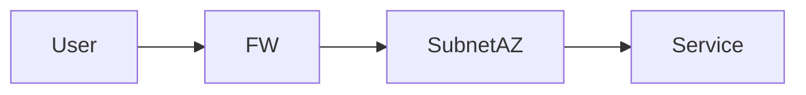

## 1. Resumen

- **Objetivo**:   
- **Dependencias**: [[...]]  

> [!tip] Notas Importantes
> HLD, LLD, Terraform/Bicep, Runbooks, pruebas.

## 2. Arquitectura


**Diagrama fuente**: `_assets/diagrams/...`

## 3. Diseño

- Naming:
- SKUs:
- Red:  

## 4. Observabilidad

- Alertas (Logs, métricas, alertas):
- Backup/DR:   
- Parches/Actualizaciones: 
- Dashboards: 

## 5. Implementación (IaC)
### Terraform

```hcl
# módulo / ejemplo
module "svc" {
  source = "./modules/svc"
}
```

## 6. Seguridad
-  Policy
- Cifrado/keys:  
- Private endpoint:
- Identidad / RBAC:  

## 7. Costes
- Estimación mensual (SKU x horas):  
- Ahorros: Reserved/Spot/Autoscaling:

## 8. Pruebas y validación
### CLI
```bicep
// ejemplo
resource rg 'Microsoft.Resources/resourceGroups@2024-03-01' = {
  name: rgName
  location: location
}
```


## 9. Decisiones (ADR)
- Cuando haya decisión relevante.

## 10. Referencias
- Docs, enlaces externos

| Descripción | URL | Notas |
| ----------- | --- | ----- |
|             |     |       |
|             |     |       |
