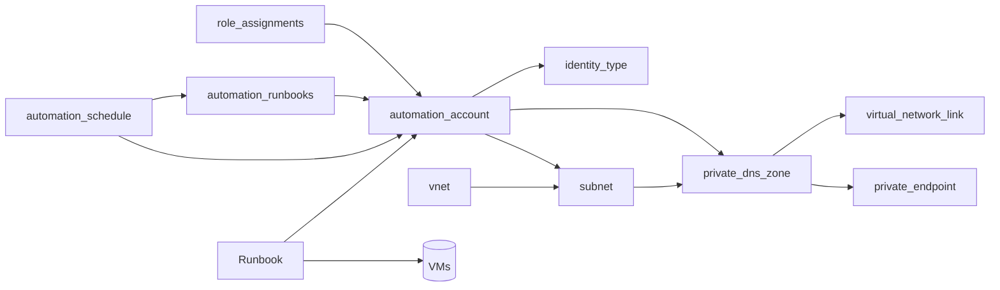

Contenido de Automation Accounts – Runbook.
## 1. Resumen

- **Objetivo**:
- **Dependencias**: [RG], [role_assignments], [vnet], [subnet], [private_dns_zone]


> ⚠️ **Warning**
>
> Estado de pruebas
{: .prompt-warning }

> 💡 **Tip**
>
> Estado de pruebas
{: .prompt-tip }

## 2. Arquitectura



## 3. Diseño

- Naming:
- SKU:
- Terraform: 
- Cost:
- Red: 
- Hybrid:

## 4. Implementación (IaC)
### Terraform
```terraform

```
## 5. Administración (CLI Azure)
### Powershell
```powershell

```
## 6. Referencias

---
title: "Revisiting Azure Flexible Federated Identity Credentials"
date: 2025-11-19 10:00:00 +0100
tags: [Terraform, Azure, Azuread, Entraid, Mvpbuzz]
image:
  path: /assets/img/avatar.png
  alt: "Cover"
---
