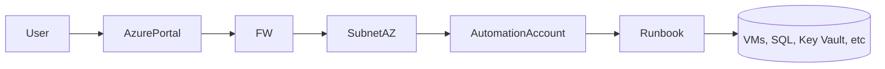

Contenido de Automation Accounts – Runbook.
## 1. Resumen

- **Objetivo**:  Azure Automation Account permite automatizar tareas administrativas y operativas dentro y fuera de Azure. Los _Runbooks_ son scripts que automatizan flujos en PowerShell, Python o a través de interfaces gráficas (Graphical/Hybrid Runbooks).
- **Dependencias**: [[...]]  

> Notas El Runbook Worker híbrido de usuario basado en agente de Azure Automation (Windows y Linux) se retiró el 31 de agosto de 2024
{: .prompt-tip }

## 2. Arquitectura




## 3. Diseño

- Naming: aa rb
- SKUs: `Free` (hasta 500 minutos/mes). | `Basic` o `Job-based` según carga y requisitos de SLA.
- Red:  VNet Integration mediante Private Endpoint (Automation Account). 
- Hybrid: Si se usa Hybrid Worker, necesita conectividad desde la red local hacia Azure.

## 4. Observabilidad

- Alertas (Logs, métricas, alertas):
- Backup/DR:   
- Parches/Actualizaciones: 
- Dashboards: 

## 5. Implementación (IaC)

### Terraform

```hcl
module "automation_account" {
  source              = "./modules/automation_account"
  name                = "aa-prod-euw-webapp"
  location            = var.location
  resource_group_name = var.rg_name
  sku_name            = "Basic"
  identity_type       = "SystemAssigned"
}

resource "azurerm_automation_runbook" "example" {
  name                    = "rb-start-vm"
  location                = azurerm_automation_account.example.location
  resource_group_name     = azurerm_automation_account.example.resource_group_name
  automation_account_name = azurerm_automation_account.example.name
  log_verbose             = true
  log_progress            = true
  runbook_type            = "PowerShell"
  content                 = file("scripts/start-vm.ps1")
}

```

## 6. Seguridad

- Policy: Aplicar Azure Policy para restringir uso del SKU `Free` en producción.
- Cifrado/keys:  Secrets accedidos mediante Managed Identity desde Key Vault.
- Private endpoint: Habilitado en entornos con acceso restringido.
- Identidad / RBAC:  
	- Automation Account con System-Assigned o User-Assigned Managed Identity.
	- Permisos mínimos necesarios (Least Privilege) definidos por roles personalizados.

## 7. Costes

  - **Estimación mensual**:
    - SKU `Basic`: ~0.002/min de ejecución.
    - Ejemplo: 1.000 min/mes ≈ $2.
- **Ahorros**:
    - Consolidar Runbooks.
    - Uso de _job concurrency_ eficiente.
    - Automatizar apagado de VMs y recursos para optimizar costes.

## 8. Administración
```markdown
### CLI

# =============================
# VARIABLES GENERALES
# =============================
$resourceGroup = "rg-tu-entorno"
$automationAccount = "aa-tu-automation-account"
$runbookName = "rb-tu-runbook"
$jobId = "<job-id-si-aplica>"  # Solo para consultar ejecución específica
```
```markdown
# =============================
# LISTAR RUNBOOKS
# =============================
az automation runbook list `
  --resource-group $resourceGroup `
  --automation-account-name $automationAccount `
  --output table
```
```markdown
# =============================
# OBTENER DETALLES DE UN RUNBOOK
# =============================
az automation runbook show `
  --resource-group $resourceGroup `
  --automation-account-name $automationAccount `
  --name $runbookName
```
```markdown
# =============================
# ACTUALIZAR PROPIEDADES DEL RUNBOOK (log)
# =============================
az automation runbook update `
  --resource-group $resourceGroup `
  --automation-account-name $automationAccount `
  --name $runbookName `
  --log-verbose true `
  --log-progress true
```
```markdown
# =============================
# INICIAR RUNBOOK
# =============================
az automation runbook start `
  --resource-group $resourceGroup `
  --automation-account-name $automationAccount `
  --name $runbookName
```
```markdown
# =============================
# LISTAR JOBS (EJECUCIONES)
# =============================
az automation job list `
  --resource-group $resourceGroup `
  --automation-account-name $automationAccount `
  --output table
```
```markdown
# =============================
# OBTENER DETALLES DE UN JOB
# =============================
az automation job show `
  --resource-group $resourceGroup `
  --automation-account-name $automationAccount `
  --job-id $jobId
```
```markdown
# =============================
# OBTENER SALIDA DE UN JOB
# =============================
az automation job output show `
  --resource-group $resourceGroup `
  --automation-account-name $automationAccount `
  --job-id $jobId
```
```markdown
# =============================
# ELIMINAR UN RUNBOOK
# =============================
az automation runbook delete `
  --resource-group $resourceGroup `
  --automation-account-name $automationAccount `
  --name $runbookName `
  --yes
```
```markdown
# =============================
# OBTENER IDENTIDAD ASIGNADA
# =============================
az automation account show `
  --resource-group $resourceGroup `
  --name $automationAccount `
  --query identity
```

## 9. Decisiones (ADR)
- Se elige Automation Account sobre Logic Apps por mayor control en scripts PowerShell y ejecución sobre redes privadas (via Hybrid Worker).
- Uso de Managed Identity como mecanismo de autenticación seguro.

## 10. Referencias
- Docs, enlaces externos


## Mi tabla

| Columna 1   | Columna 2   |
| ----------- | ----------- |
| Terraform  | https://registry.terraform.io/providers/hashicorp/azurerm/latest/docs/resources/automation_runbook  |
| Fila 2, C1  | Fila 2, C2  |
