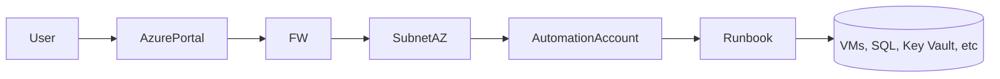

Contenido de Automation Accounts – Runbook.
## 1. Resumen

- **Objetivo**:
- **Dependencias**:


> [!tip] Notas Importantes

## 2. Arquitectura



## 3. Diseño

- Naming:
- SKU:
- Terraform: 
- Cost:
- Red: 
- Hybrid:

## 4. Implementación (IaC)
### Terraform
```terraform

```
## 5. Administración (CLI Azure)
### Powershell
```powershell

```
## 6. Referencias