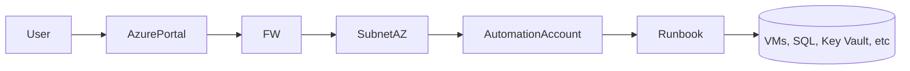

Contenido de Automation Accounts – Runbook.

## 1. Resumen

- **Objetivo**:  Azure Automation Account permite automatizar tareas administrativas y operativas dentro y fuera de Azure. Los _Runbooks_ son scripts que automatizan, flujos en PowerShell, Python o a través de interfaces gráficas (Graphical/Hybrid Runbooks).
- **Dependencias**: [[...]]  

> [!tip] Notas Importantes
> HLD, LLD, Terraform/Bicep, Runbooks, pruebas.


## 2. Arquitectura


## 3. Diseño

- Naming: aa rb
- SKUs: `Free` (hasta 500 minutos/mes). | `Basic` o `Job-based` según carga y requisitos de SLA.
- Terraform: 
- Cost
- Red:  VNet Integration mediante Private Endpoint (Automation Account). 
- Hybrid: Si se usa Hybrid Worker, necesita conectividad desde la red local hacia Azure.

## 4. Implementación (IaC)
### Terraform


## 5. Administración (CLI Azure)
### Powershell

```powershell
# =============================
# VARIABLES GENERALES
# =============================
$resourceGroup = "rg-tu-entorno"
$automationAccount = "aa-tu-automation-account"
$runbookName = "rb-tu-runbook"
$jobId = "<job-id-si-aplica>"  # Solo para consultar ejecución específica

# =============================
# LISTAR RUNBOOKS
# =============================
az automation runbook list `
  --resource-group $resourceGroup `
  --automation-account-name $automationAccount `
  --output table

# =============================
# OBTENER DETALLES DE UN RUNBOOK
# =============================
az automation runbook show `
  --resource-group $resourceGroup `
  --automation-account-name $automationAccount `
  --name $runbookName

# =============================
# ACTUALIZAR PROPIEDADES DEL RUNBOOK (log)
# =============================
az automation runbook update `
  --resource-group $resourceGroup `
  --automation-account-name $automationAccount `
  --name $runbookName `
  --log-verbose true `
  --log-progress true

# =============================
# INICIAR RUNBOOK
# =============================
az automation runbook start `
  --resource-group $resourceGroup `
  --automation-account-name $automationAccount `
  --name $runbookName

# =============================
# LISTAR JOBS (EJECUCIONES)
# =============================
az automation job list `
  --resource-group $resourceGroup `
  --automation-account-name $automationAccount `
  --output table

# =============================
# OBTENER DETALLES DE UN JOB
# =============================
az automation job show `
  --resource-group $resourceGroup `
  --automation-account-name $automationAccount `
  --job-id $jobId

# =============================
# OBTENER SALIDA DE UN JOB
# =============================
az automation job output show `
  --resource-group $resourceGroup `
  --automation-account-name $automationAccount `
  --job-id $jobId

# =============================
# ELIMINAR UN RUNBOOK
# =============================
az automation runbook delete `
  --resource-group $resourceGroup `
  --automation-account-name $automationAccount `
  --name $runbookName `
  --yes

# =============================
# OBTENER IDENTIDAD ASIGNADA
# =============================
az automation account show `
  --resource-group $resourceGroup `
  --name $automationAccount `
  --query identity

```

## 6. Referencias