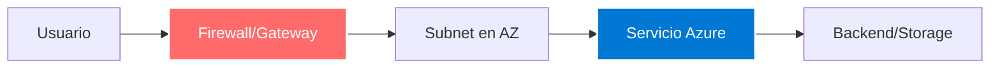

# [Nombre del Servicio Azure]

## 1. Resumen

- **Objetivo**: [Descripción del propósito principal del recurso]
- **Caso de uso**: [Escenarios principales de aplicación]
- **Dependencias**: [[Recurso1]], [[Recurso2]], [[Recurso3]]

> [!tip] Notas Importantes
> - HLD/LLD disponible en `_assets/docs/`
> - Código IaC: Terraform y Bicep
> - Runbooks de operación en `_runbooks/`
> - Suite de pruebas automatizadas

## 2. Arquitectura



**Diagrama fuente**: `_assets/diagrams/[nombre-servicio]-architecture.drawio`

### Componentes principales
- **[Componente 1]**: [Descripción]
- **[Componente 2]**: [Descripción]
- **[Componente 3]**: [Descripción]

## 3. Diseño

### Naming Convention
```
[prefijo]-[ambiente]-[región]-[servicio]-[sufijo]
Ejemplo: lam-prod-eus-webapp-001
```

### SKUs y Dimensionamiento
| Ambiente | SKU | vCores/Tamaño | RAM | Justificación |
|----------|-----|---------------|-----|---------------|
| Dev      |     |               |     |               |
| QA       |     |               |     |               |
| Prod     |     |               |     |               |

### Configuración de Red
- **VNet**: [nombre] / [CIDR]
- **Subnet**: [nombre] / [CIDR]
- **NSG**: [reglas principales]
- **DNS**: [configuración]

## 4. Observabilidad

### Logs y Métricas
```hcl
# Métricas clave a monitorear
- CPU Usage > 80%
- Memory Usage > 85%
- Request latency > 2s
- Error rate > 5%
```

### Alertas Configuradas
| Alerta | Umbral | Severidad | Acción |
|--------|--------|-----------|--------|
|        |        |           |        |

### Backup y Disaster Recovery
- **RPO**: [Recovery Point Objective]
- **RTO**: [Recovery Time Objective]
- **Estrategia**: [Descripción de backup]
- **Retención**: [Política de retención]

### Mantenimiento
- **Parches**: [Frecuencia y ventana de mantenimiento]
- **Actualizaciones**: [Proceso de actualización]

### Dashboards
- **Azure Monitor**: [URL o descripción]
- **Grafana/Custom**: [URL si aplica]

## 5. Implementación (IaC)

### Terraform

```hcl
# Ejemplo de módulo Terraform
module "azure_service" {
  source = "./modules/azure-service"

  # Configuración básica
  resource_group_name = var.resource_group_name
  location           = var.location
  environment        = var.environment

  # Naming
  name_prefix = var.name_prefix
  name_suffix = var.name_suffix

  # Networking
  subnet_id = var.subnet_id
  
  # SKU y dimensionamiento
  sku_name = var.sku_name
  capacity = var.capacity

  # Seguridad
  enable_private_endpoint = true
  key_vault_id           = var.key_vault_id

  # Tags
  tags = merge(
    var.common_tags,
    {
      Service = "[nombre-servicio]"
      ManagedBy = "Terraform"
    }
  )
}
```

### Bicep

```bicep
// Ejemplo de recurso en Bicep
@description('Nombre del recurso')
param resourceName string

@description('Ubicación del recurso')
param location string = resourceGroup().location

@description('SKU del servicio')
param skuName string = 'Standard'

@description('Tags comunes')
param tags object = {}

resource azureService 'Microsoft.[Provider]/[ResourceType]@2024-01-01' = {
  name: resourceName
  location: location
  sku: {
    name: skuName
  }
  properties: {
    // Configuración específica del servicio
  }
  tags: tags
}

output resourceId string = azureService.id
output resourceName string = azureService.name
```

## 6. Seguridad

### Azure Policy
- **Políticas aplicadas**:
  - [Política 1]: [Descripción]
  - [Política 2]: [Descripción]
- **Compliance**: [Estado de cumplimiento]

### Cifrado y Key Management
- **Datos en reposo**: [Método de cifrado]
- **Datos en tránsito**: TLS 1.2+
- **Key Vault**: [Referencia al Key Vault]
- **Managed Identity**: [Configuración]

### Private Endpoint
- **Habilitado**: Sí/No
- **DNS privado**: [Configuración]
- **Subnet**: [Subnet dedicado]

### Identidad y RBAC
| Rol | Alcance | Identidad | Justificación |
|-----|---------|-----------|---------------|
|     |         |           |               |

### Seguridad de Red
- **Firewall rules**: [Configuración]
- **Service Endpoints**: [Lista]
- **NSG rules**: [Reglas principales]

## 7. Costes

### Estimación Mensual
| Componente | SKU | Cantidad | Coste/Hora | Coste/Mes | Notas |
|------------|-----|----------|------------|-----------|-------|
|            |     |          |            |           |       |
| **TOTAL**  |     |          |            | **$XXX**  |       |

### Estrategias de Ahorro
- **Reserved Instances**: [Ahorro potencial: XX%]
- **Spot Instances**: [Aplicable: Sí/No]
- **Autoscaling**: [Configuración para reducir costes]
- **Apagado automático**: [Ambientes no productivos]

### Calculadora
[Azure Pricing Calculator - Link específico](https://azure.microsoft.com/pricing/calculator/)

## 8. Pruebas y Validación

### Pruebas Funcionales
```bash
# Ejemplo de prueba con Azure CLI
az [resource] show \
  --name [nombre-recurso] \
  --resource-group [nombre-rg] \
  --query "provisioningState" \
  --output tsv

# Resultado esperado: Succeeded
```

### Pruebas de Conectividad
```bash
# Test de conectividad
curl -I https://[endpoint].azure.net
nslookup [endpoint].azure.net
```

### Pruebas de Seguridad
```bash
# Validar cifrado TLS
openssl s_client -connect [endpoint]:443 -tls1_2

# Validar private endpoint
nslookup [service].privatelink.azure.net
```

### Checklist de Validación
- [ ] Recurso desplegado correctamente
- [ ] Conectividad verificada
- [ ] Cifrado habilitado
- [ ] Private endpoint funcional
- [ ] Alertas configuradas
- [ ] Backups funcionando
- [ ] RBAC asignado
- [ ] Tags aplicados
- [ ] Logs enviándose a Log Analytics
- [ ] Documentación actualizada

## 9. Decisiones (ADR)

### ADR-001: [Título de la Decisión]
**Fecha**: YYYY-MM-DD  
**Estado**: [Propuesta | Aceptada | Rechazada | Obsoleta]  

**Contexto**: [Descripción del problema o necesidad]

**Decisión**: [Decisión tomada]

**Consecuencias**:
- ✅ **Positivas**: [Beneficios]
- ⚠️ **Negativas**: [Trade-offs]
- 🔄 **Alternativas consideradas**: [Otras opciones]

---

### ADR-002: [Siguiente Decisión]
[Seguir el mismo formato]

## 10. Referencias

### Documentación Oficial

| Descripción | URL | Notas |
| ----------- | --- | ----- |
| Azure [Service] Overview | [URL] | Documentación principal |
| Best Practices | [URL] | Guía de mejores prácticas |
| Pricing Details | [URL] | Detalles de costes |
| Security Baseline | [URL] | Baseline de seguridad |

### Recursos Adicionales

| Descripción | URL | Notas |
| ----------- | --- | ----- |
| Terraform Provider | [URL] | Documentación del provider |
| Bicep Reference | [URL] | Referencia de Bicep |
| GitHub Samples | [URL] | Ejemplos de código |

### Documentación Interna

| Documento | Ubicación | Última actualización |
| --------- | --------- | -------------------- |
| HLD | `_assets/docs/hld-[servicio].pdf` | YYYY-MM-DD |
| LLD | `_assets/docs/lld-[servicio].pdf` | YYYY-MM-DD |
| Runbook | `_runbooks/[servicio]-operations.md` | YYYY-MM-DD |

---

## Historial de Cambios

| Fecha | Versión | Autor | Cambios |
|-------|---------|-------|---------|
| 2026-01-27 | 1.0 | Luis Adán Muñoz | Creación inicial del documento |
|       |     |     |         |

---

**Próxima revisión**: [Fecha]  
**Propietario**: Luis Adán Muñoz  
**Aprobadores**: [Lista de aprobadores]
