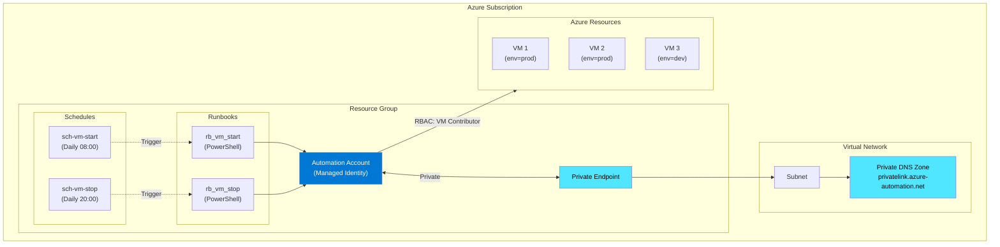

# Azure Automation Accounts – Guía Completa de Runbooks

Implementación completa de Azure Automation Accounts para la ejecución automatizada de Runbooks PowerShell con identidad administrada, control mediante schedules, RBAC y conectividad privada.

**Autor:** Luis Adán Muñoz  
**Última actualización:** Enero 2026  
**Tiempo de lectura:** 15 min

---

## Tabla de Contenidos

1. [Introducción](#1-introducción)
2. [Arquitectura y Diseño](#2-arquitectura-y-diseño)
3. [Implementación con Terraform](#3-implementación-con-terraform)
4. [Runbooks PowerShell](#4-runbooks-powershell)
5. [Administración con Azure CLI](#5-administración-con-azure-cli)
6. [Monitorización y Troubleshooting](#6-monitorización-y-troubleshooting)
7. [Mejores Prácticas](#7-mejores-prácticas)
8. [Costos y Optimización](#8-costos-y-optimización)
9. [Referencias](#9-referencias)

---

## 1. Introducción

### ¿Qué es Azure Automation?

Azure Automation es un servicio de automatización y configuración que permite gestionar infraestructura y aplicaciones en Azure, entornos híbridos y otras nubes. Proporciona control de procesos, gestión de configuración, gestión de actualizaciones y capacidades compartidas como runbooks, variables y credenciales.

### Casos de Uso Principales

- **Gestión de máquinas virtuales**: Arranque/parada programada para optimizar costos
- **Automatización de tareas operativas**: Backups, limpieza de recursos, rotación de logs
- **Orquestación de procesos**: Flujos de trabajo complejos entre múltiples servicios
- **Gestión de configuración**: Estado deseado con DSC (Desired State Configuration)
- **Respuesta a eventos**: Automatización reactiva basada en alertas de Azure Monitor

### ¿Por qué usar Automation Accounts?

**Ventajas:**
- ✅ Ejecución programada sin infraestructura que mantener
- ✅ Managed Identity para seguridad sin credenciales expuestas
- ✅ Integración nativa con servicios de Azure
- ✅ Control de versiones integrado
- ✅ Monitorización y logging centralizados

**Cuándo NO usar Automation Accounts:**
- ❌ Necesitas ejecución de código en tiempo real (< 1 segundo de latencia) → Usar Azure Functions
- ❌ Requieres workflows visuales sin código → Usar Logic Apps
- ❌ Procesamiento de datos masivos → Usar Azure Batch o Data Factory

> ⚠️ **Importante**: Microsoft recomienda Managed Identities sobre credenciales embebidas para la ejecución segura de Runbooks.

---

## 2. Arquitectura y Diseño

### Diagrama de Arquitectura



### Componentes Clave

| Componente | Propósito | Configuración Recomendada |
|------------|-----------|---------------------------|
| **Automation Account** | Contenedor de runbooks y recursos | SKU: Basic, Managed Identity habilitada |
| **Managed Identity** | Autenticación sin credenciales | System-assigned, roles RBAC mínimos necesarios |
| **Private Endpoint** | Conectividad segura | Solo si `public_network_access_enabled = false` |
| **Private DNS Zone** | Resolución de nombres privada | `privatelink.azure-automation.net` |
| **Runbooks** | Scripts de automatización | PowerShell 7.2 (recomendado) |
| **Schedules** | Programación de ejecuciones | Timezone: Europe/Madrid, formato ISO8601 |

### Flujo de Ejecución

1. **Schedule Trigger**: El schedule configurado activa el runbook en el horario especificado
2. **Job Creation**: Azure Automation crea un job y asigna recursos
3. **Authentication**: La Managed Identity del Automation Account se autentica
4. **Execution**: El runbook se ejecuta con los permisos RBAC asignados
5. **Resource Management**: El runbook interactúa con recursos de Azure (VMs, Storage, etc.)
6. **Logging**: Los resultados y logs se almacenan en el job history

### Acceso Público vs Privado

| Aspecto | Acceso Público | Acceso Privado |
|---------|----------------|----------------|
| **Seguridad** | Expuesto a Internet | Solo desde VNet específica |
| **Configuración** | Simple, sin DNS adicional | Requiere Private Endpoint + DNS |
| **Costo** | Solo Automation Account | + Private Endpoint (~$8/mes) |
| **Latencia** | Estándar | Potencialmente menor |
| **Compliance** | Puede no cumplir políticas | Requerido para entornos regulados |
| **Webhook Access** | Desde cualquier lugar | Solo desde redes autorizadas |

> 💡 **Tip**: Usa acceso privado solo si tus políticas de seguridad lo requieren o si necesitas cumplir con normativas específicas (PCI-DSS, HIPAA, etc.).

---

## 3. Implementación con Terraform

### Estructura del Proyecto

```
terraform/
├── main.tf
├── variables.tf
├── outputs.tf
├── automation_account.tf
├── runbooks.tf
├── schedules.tf
├── rbac.tf
├── network.tf
└── terraform.tfvars
```

### 3.1 Automation Account

**automation_account.tf**

```hcl
# ============================================================================
# AUTOMATION ACCOUNT
# ============================================================================

resource "azurerm_automation_account" "this" {
  name                          = var.automation_account_name
  location                      = var.location
  resource_group_name           = var.resource_group_name
  sku_name                      = var.sku_name
  public_network_access_enabled = var.public_network_access_enabled

  identity {
    type = "SystemAssigned"
  }

  tags = merge(
    var.tags,
    {
      "ManagedBy" = "Terraform"
      "Purpose"   = "VM Lifecycle Management"
    }
  )
}

# ============================================================================
# PRIVATE ENDPOINT (Condicional)
# ============================================================================

resource "azurerm_private_endpoint" "automation" {
  count               = var.public_network_access_enabled ? 0 : 1
  name                = "pe-${var.automation_account_name}"
  location            = azurerm_automation_account.this.location
  resource_group_name = azurerm_automation_account.this.resource_group_name
  subnet_id           = var.subnet_id

  private_service_connection {
    name                           = "psc-${var.automation_account_name}"
    private_connection_resource_id = azurerm_automation_account.this.id
    subresource_names              = ["Webhook"]
    is_manual_connection           = false
  }

  private_dns_zone_group {
    name                 = "pdnszg-${var.automation_account_name}"
    private_dns_zone_ids = [var.private_dns_zone_id]
  }

  tags = var.tags
}

# ============================================================================
# MODULOS POWERSHELL NECESARIOS
# ============================================================================

resource "azurerm_automation_module" "az_accounts" {
  name                    = "Az.Accounts"
  resource_group_name     = azurerm_automation_account.this.resource_group_name
  automation_account_name = azurerm_automation_account.this.name

  module_link {
    uri = "https://www.powershellgallery.com/api/v2/package/Az.Accounts/2.15.1"
  }
}

resource "azurerm_automation_module" "az_compute" {
  name                    = "Az.Compute"
  resource_group_name     = azurerm_automation_account.this.resource_group_name
  automation_account_name = azurerm_automation_account.this.name

  module_link {
    uri = "https://www.powershellgallery.com/api/v2/package/Az.Compute/7.1.0"
  }

  depends_on = [azurerm_automation_module.az_accounts]
}
```

### 3.2 Runbooks

**runbooks.tf**

```hcl
# ============================================================================
# RUNBOOK: START VMs
# ============================================================================

resource "azurerm_automation_runbook" "vm_start" {
  name                    = "rb_vm_start"
  location                = azurerm_automation_account.this.location
  resource_group_name     = azurerm_automation_account.this.resource_group_name
  automation_account_name = azurerm_automation_account.this.name
  log_verbose             = true
  log_progress            = true
  description             = "Start VMs filtered by tags"
  runbook_type            = "PowerShell72"

  content = file("${path.module}/runbooks/Start-VMs.ps1")

  tags = var.tags
}

# ============================================================================
# RUNBOOK: STOP VMs
# ============================================================================

resource "azurerm_automation_runbook" "vm_stop" {
  name                    = "rb_vm_stop"
  location                = azurerm_automation_account.this.location
  resource_group_name     = azurerm_automation_account.this.resource_group_name
  automation_account_name = azurerm_automation_account.this.name
  log_verbose             = true
  log_progress            = true
  description             = "Stop VMs filtered by tags"
  runbook_type            = "PowerShell72"

  content = file("${path.module}/runbooks/Stop-VMs.ps1")

  tags = var.tags
}

# ============================================================================
# RUNBOOK: HEALTHCHECK
# ============================================================================

resource "azurerm_automation_runbook" "healthcheck" {
  name                    = "rb_healthcheck"
  location                = azurerm_automation_account.this.location
  resource_group_name     = azurerm_automation_account.this.resource_group_name
  automation_account_name = azurerm_automation_account.this.name
  log_verbose             = true
  log_progress            = true
  description             = "Verify Automation Account connectivity and permissions"
  runbook_type            = "PowerShell72"

  content = file("${path.module}/runbooks/Healthcheck.ps1")

  tags = var.tags
}
```

### 3.3 Schedules

**schedules.tf**

```hcl
# ============================================================================
# SCHEDULE: START VMs (Weekdays 08:00)
# ============================================================================

resource "azurerm_automation_schedule" "vm_start_weekdays" {
  name                    = "sch-vm-start-weekdays-0800"
  resource_group_name     = azurerm_automation_account.this.resource_group_name
  automation_account_name = azurerm_automation_account.this.name
  frequency               = "Week"
  interval                = 1
  timezone                = "Europe/Madrid"
  start_time              = "2026-01-20T08:00:00+01:00"
  description             = "Start production VMs on weekdays at 08:00"
  week_days               = ["Monday", "Tuesday", "Wednesday", "Thursday", "Friday"]
}

resource "azurerm_automation_job_schedule" "vm_start_weekdays" {
  resource_group_name     = azurerm_automation_account.this.resource_group_name
  automation_account_name = azurerm_automation_account.this.name
  schedule_name           = azurerm_automation_schedule.vm_start_weekdays.name
  runbook_name            = azurerm_automation_runbook.vm_start.name

  parameters = {
    tagName  = "AutoShutdown"
    tagValue = "true"
    action   = "start"
  }
}

# ============================================================================
# SCHEDULE: STOP VMs (Weekdays 20:00)
# ============================================================================

resource "azurerm_automation_schedule" "vm_stop_weekdays" {
  name                    = "sch-vm-stop-weekdays-2000"
  resource_group_name     = azurerm_automation_account.this.resource_group_name
  automation_account_name = azurerm_automation_account.this.name
  frequency               = "Week"
  interval                = 1
  timezone                = "Europe/Madrid"
  start_time              = "2026-01-20T20:00:00+01:00"
  description             = "Stop production VMs on weekdays at 20:00"
  week_days               = ["Monday", "Tuesday", "Wednesday", "Thursday", "Friday"]
}

resource "azurerm_automation_job_schedule" "vm_stop_weekdays" {
  resource_group_name     = azurerm_automation_account.this.resource_group_name
  automation_account_name = azurerm_automation_account.this.name
  schedule_name           = azurerm_automation_schedule.vm_stop_weekdays.name
  runbook_name            = azurerm_automation_runbook.vm_stop.name

  parameters = {
    tagName  = "AutoShutdown"
    tagValue = "true"
    action   = "stop"
  }
}
```

### 3.4 RBAC

**rbac.tf**

```hcl
# ============================================================================
# RBAC: Virtual Machine Contributor
# ============================================================================

data "azurerm_subscription" "current" {}

resource "azurerm_role_assignment" "vm_contributor" {
  scope                = data.azurerm_subscription.current.id
  role_definition_name = "Virtual Machine Contributor"
  principal_id         = azurerm_automation_account.this.identity[0].principal_id
  
  description = "Allow Automation Account to start/stop VMs"
}

# ============================================================================
# RBAC: Reader (para listar recursos)
# ============================================================================

resource "azurerm_role_assignment" "reader" {
  scope                = data.azurerm_subscription.current.id
  role_definition_name = "Reader"
  principal_id         = azurerm_automation_account.this.identity[0].principal_id
  
  description = "Allow Automation Account to read resource metadata"
}
```

### 3.5 Variables

**variables.tf**

```hcl
variable "automation_account_name" {
  description = "Name of the Automation Account"
  type        = string
}

variable "location" {
  description = "Azure region"
  type        = string
  default     = "westeurope"
}

variable "resource_group_name" {
  description = "Resource Group name"
  type        = string
}

variable "sku_name" {
  description = "SKU for Automation Account"
  type        = string
  default     = "Basic"
  
  validation {
    condition     = contains(["Free", "Basic"], var.sku_name)
    error_message = "SKU must be Free or Basic"
  }
}

variable "public_network_access_enabled" {
  description = "Enable public network access"
  type        = bool
  default     = false
}

variable "subnet_id" {
  description = "Subnet ID for Private Endpoint"
  type        = string
  default     = null
}

variable "private_dns_zone_id" {
  description = "Private DNS Zone ID"
  type        = string
  default     = null
}

variable "tags" {
  description = "Tags to apply to resources"
  type        = map(string)
  default     = {}
}
```

**terraform.tfvars** (ejemplo)

```hcl
automation_account_name           = "aa-prod-weu-001"
location                          = "westeurope"
resource_group_name               = "rg-automation-prod"
sku_name                          = "Basic"
public_network_access_enabled     = false
subnet_id                         = "/subscriptions/xxx/resourceGroups/rg-network/providers/Microsoft.Network/virtualNetworks/vnet-prod/subnets/snet-automation"
private_dns_zone_id               = "/subscriptions/xxx/resourceGroups/rg-network/providers/Microsoft.Network/privateDnsZones/privatelink.azure-automation.net"

tags = {
  Environment = "Production"
  ManagedBy   = "Terraform"
  CostCenter  = "IT-OPS"
  Owner       = "CloudTeam"
}
```

---

## 4. Runbooks PowerShell

### 4.1 Runbook: Start VMs

**runbooks/Start-VMs.ps1**

```powershell
<#
.SYNOPSIS
    Start Azure VMs filtered by tags

.DESCRIPTION
    This runbook starts VMs in the subscription that match specific tag criteria.
    Uses Managed Identity for authentication.

.PARAMETER tagName
    Tag name to filter VMs (default: AutoShutdown)

.PARAMETER tagValue
    Tag value to filter VMs (default: true)

.PARAMETER resourceGroup
    Optional: Specific Resource Group to target

.NOTES
    Author: Luis Adán Muñoz
    Version: 2.0
    Last Updated: January 2026
#>

param(
    [Parameter(Mandatory=$false)]
    [string]$tagName = "AutoShutdown",
    
    [Parameter(Mandatory=$false)]
    [string]$tagValue = "true",
    
    [Parameter(Mandatory=$false)]
    [string]$resourceGroup = ""
)

# ============================================================================
# FUNCIONES AUXILIARES
# ============================================================================

function Write-Log {
    param(
        [string]$Message,
        [ValidateSet('Info','Warning','Error','Success')]
        [string]$Level = 'Info'
    )
    
    $timestamp = Get-Date -Format "yyyy-MM-dd HH:mm:ss"
    $color = switch ($Level) {
        'Info'    { 'White' }
        'Warning' { 'Yellow' }
        'Error'   { 'Red' }
        'Success' { 'Green' }
    }
    
    Write-Output "[$timestamp] [$Level] $Message"
}

# ============================================================================
# AUTENTICACION CON MANAGED IDENTITY
# ============================================================================

Write-Log "Starting VM Start Runbook..." -Level Info
Write-Log "Tag Filter: $tagName = $tagValue" -Level Info

try {
    Write-Log "Authenticating with Managed Identity..." -Level Info
    Connect-AzAccount -Identity -ErrorAction Stop
    Write-Log "Authentication successful!" -Level Success
} catch {
    Write-Log "Authentication failed: $_" -Level Error
    throw
}

# Obtener contexto de la suscripción
$context = Get-AzContext
Write-Log "Subscription: $($context.Subscription.Name) ($($context.Subscription.Id))" -Level Info

# ============================================================================
# OBTENER VMs FILTRADAS POR TAGS
# ============================================================================

try {
    Write-Log "Searching for VMs with tag '$tagName=$tagValue'..." -Level Info
    
    $vmSearchParams = @{
        TagName  = $tagName
        TagValue = $tagValue
    }
    
    if ($resourceGroup) {
        $vmSearchParams['ResourceGroupName'] = $resourceGroup
        Write-Log "Searching only in Resource Group: $resourceGroup" -Level Info
    }
    
    $vms = Get-AzResource @vmSearchParams | Where-Object { $_.ResourceType -eq "Microsoft.Compute/virtualMachines" }
    
    if ($vms.Count -eq 0) {
        Write-Log "No VMs found matching criteria" -Level Warning
        return
    }
    
    Write-Log "Found $($vms.Count) VM(s) to start" -Level Success
    
} catch {
    Write-Log "Error searching for VMs: $_" -Level Error
    throw
}

# ============================================================================
# ARRANCAR VMs
# ============================================================================

$successCount = 0
$failureCount = 0
$skippedCount = 0
$results = @()

foreach ($vm in $vms) {
    $vmName = $vm.Name
    $vmRG = $vm.ResourceGroupName
    
    try {
        Write-Log "Processing VM: $vmName (RG: $vmRG)" -Level Info
        
        # Obtener estado actual
        $vmStatus = Get-AzVM -ResourceGroupName $vmRG -Name $vmName -Status
        $powerState = ($vmStatus.Statuses | Where-Object { $_.Code -like "PowerState/*" }).Code
        
        Write-Log "Current state: $powerState" -Level Info
        
        if ($powerState -eq "PowerState/running") {
            Write-Log "VM already running - skipping" -Level Warning
            $skippedCount++
            $results += [PSCustomObject]@{
                VM = $vmName
                ResourceGroup = $vmRG
                Status = "Skipped"
                Reason = "Already running"
            }
            continue
        }
        
        # Arrancar VM
        Write-Log "Starting VM..." -Level Info
        $startResult = Start-AzVM -ResourceGroupName $vmRG -Name $vmName -NoWait
        
        Write-Log "Start command issued successfully for $vmName" -Level Success
        $successCount++
        
        $results += [PSCustomObject]@{
            VM = $vmName
            ResourceGroup = $vmRG
            Status = "Started"
            Reason = "Start command issued"
        }
        
    } catch {
        Write-Log "Failed to start $vmName : $_" -Level Error
        $failureCount++
        
        $results += [PSCustomObject]@{
            VM = $vmName
            ResourceGroup = $vmRG
            Status = "Failed"
            Reason = $_.Exception.Message
        }
    }
}

# ============================================================================
# RESUMEN
# ============================================================================

Write-Log "======================================" -Level Info
Write-Log "EXECUTION SUMMARY" -Level Info
Write-Log "======================================" -Level Info
Write-Log "Total VMs found    : $($vms.Count)" -Level Info
Write-Log "Successfully started: $successCount" -Level Success
Write-Log "Skipped           : $skippedCount" -Level Warning
Write-Log "Failed            : $failureCount" -Level Error
Write-Log "======================================" -Level Info

# Mostrar tabla de resultados
$results | Format-Table -AutoSize

Write-Log "Runbook execution completed" -Level Success
```

### 4.2 Runbook: Stop VMs

**runbooks/Stop-VMs.ps1**

```powershell
<#
.SYNOPSIS
    Stop Azure VMs filtered by tags

.DESCRIPTION
    This runbook stops VMs in the subscription that match specific tag criteria.
    Uses Managed Identity for authentication.
    Supports graceful shutdown.

.PARAMETER tagName
    Tag name to filter VMs (default: AutoShutdown)

.PARAMETER tagValue
    Tag value to filter VMs (default: true)

.PARAMETER resourceGroup
    Optional: Specific Resource Group to target

.PARAMETER force
    Force shutdown without graceful OS shutdown

.NOTES
    Author: Luis Adán Muñoz
    Version: 2.0
    Last Updated: January 2026
#>

param(
    [Parameter(Mandatory=$false)]
    [string]$tagName = "AutoShutdown",
    
    [Parameter(Mandatory=$false)]
    [string]$tagValue = "true",
    
    [Parameter(Mandatory=$false)]
    [string]$resourceGroup = "",
    
    [Parameter(Mandatory=$false)]
    [bool]$force = $false
)

# ============================================================================
# FUNCIONES AUXILIARES
# ============================================================================

function Write-Log {
    param(
        [string]$Message,
        [ValidateSet('Info','Warning','Error','Success')]
        [string]$Level = 'Info'
    )
    
    $timestamp = Get-Date -Format "yyyy-MM-dd HH:mm:ss"
    Write-Output "[$timestamp] [$Level] $Message"
}

# ============================================================================
# AUTENTICACION CON MANAGED IDENTITY
# ============================================================================

Write-Log "Starting VM Stop Runbook..." -Level Info
Write-Log "Tag Filter: $tagName = $tagValue" -Level Info
Write-Log "Force Shutdown: $force" -Level Info

try {
    Write-Log "Authenticating with Managed Identity..." -Level Info
    Connect-AzAccount -Identity -ErrorAction Stop
    Write-Log "Authentication successful!" -Level Success
} catch {
    Write-Log "Authentication failed: $_" -Level Error
    throw
}

$context = Get-AzContext
Write-Log "Subscription: $($context.Subscription.Name)" -Level Info

# ============================================================================
# OBTENER VMs FILTRADAS
# ============================================================================

try {
    Write-Log "Searching for VMs with tag '$tagName=$tagValue'..." -Level Info
    
    $vmSearchParams = @{
        TagName  = $tagName
        TagValue = $tagValue
    }
    
    if ($resourceGroup) {
        $vmSearchParams['ResourceGroupName'] = $resourceGroup
    }
    
    $vms = Get-AzResource @vmSearchParams | Where-Object { $_.ResourceType -eq "Microsoft.Compute/virtualMachines" }
    
    if ($vms.Count -eq 0) {
        Write-Log "No VMs found matching criteria" -Level Warning
        return
    }
    
    Write-Log "Found $($vms.Count) VM(s) to stop" -Level Success
    
} catch {
    Write-Log "Error searching for VMs: $_" -Level Error
    throw
}

# ============================================================================
# DETENER VMs
# ============================================================================

$successCount = 0
$failureCount = 0
$skippedCount = 0
$results = @()

foreach ($vm in $vms) {
    $vmName = $vm.Name
    $vmRG = $vm.ResourceGroupName
    
    try {
        Write-Log "Processing VM: $vmName (RG: $vmRG)" -Level Info
        
        # Obtener estado actual
        $vmStatus = Get-AzVM -ResourceGroupName $vmRG -Name $vmName -Status
        $powerState = ($vmStatus.Statuses | Where-Object { $_.Code -like "PowerState/*" }).Code
        
        Write-Log "Current state: $powerState" -Level Info
        
        if ($powerState -eq "PowerState/deallocated" -or $powerState -eq "PowerState/stopped") {
            Write-Log "VM already stopped - skipping" -Level Warning
            $skippedCount++
            $results += [PSCustomObject]@{
                VM = $vmName
                ResourceGroup = $vmRG
                Status = "Skipped"
                Reason = "Already stopped"
            }
            continue
        }
        
        # Detener VM
        Write-Log "Stopping VM (Force: $force)..." -Level Info
        
        if ($force) {
            Stop-AzVM -ResourceGroupName $vmRG -Name $vmName -Force -NoWait
        } else {
            Stop-AzVM -ResourceGroupName $vmRG -Name $vmName -NoWait
        }
        
        Write-Log "Stop command issued successfully for $vmName" -Level Success
        $successCount++
        
        $results += [PSCustomObject]@{
            VM = $vmName
            ResourceGroup = $vmRG
            Status = "Stopped"
            Reason = "Stop command issued"
        }
        
    } catch {
        Write-Log "Failed to stop $vmName : $_" -Level Error
        $failureCount++
        
        $results += [PSCustomObject]@{
            VM = $vmName
            ResourceGroup = $vmRG
            Status = "Failed"
            Reason = $_.Exception.Message
        }
    }
}

# ============================================================================
# RESUMEN
# ============================================================================

Write-Log "======================================" -Level Info
Write-Log "EXECUTION SUMMARY" -Level Info
Write-Log "======================================" -Level Info
Write-Log "Total VMs found    : $($vms.Count)" -Level Info
Write-Log "Successfully stopped: $successCount" -Level Success
Write-Log "Skipped           : $skippedCount" -Level Warning
Write-Log "Failed            : $failureCount" -Level Error
Write-Log "======================================" -Level Info

$results | Format-Table -AutoSize

Write-Log "Runbook execution completed" -Level Success
```

### 4.3 Runbook: Healthcheck

**runbooks/Healthcheck.ps1**

```powershell
<#
.SYNOPSIS
    Healthcheck for Automation Account

.DESCRIPTION
    Verifies connectivity, authentication, and permissions

.NOTES
    Author: Luis Adán Muñoz
    Version: 1.0
#>

function Write-Log {
    param([string]$Message, [string]$Level = 'Info')
    $timestamp = Get-Date -Format "yyyy-MM-dd HH:mm:ss"
    Write-Output "[$timestamp] [$Level] $Message"
}

Write-Log "=== AUTOMATION ACCOUNT HEALTHCHECK ===" -Level Info

# Test 1: Managed Identity Authentication
try {
    Write-Log "TEST 1: Managed Identity Authentication" -Level Info
    Connect-AzAccount -Identity -ErrorAction Stop
    $context = Get-AzContext
    Write-Log "✓ Authentication successful" -Level Success
    Write-Log "  Subscription: $($context.Subscription.Name)" -Level Info
    Write-Log "  Tenant: $($context.Tenant.Id)" -Level Info
} catch {
    Write-Log "