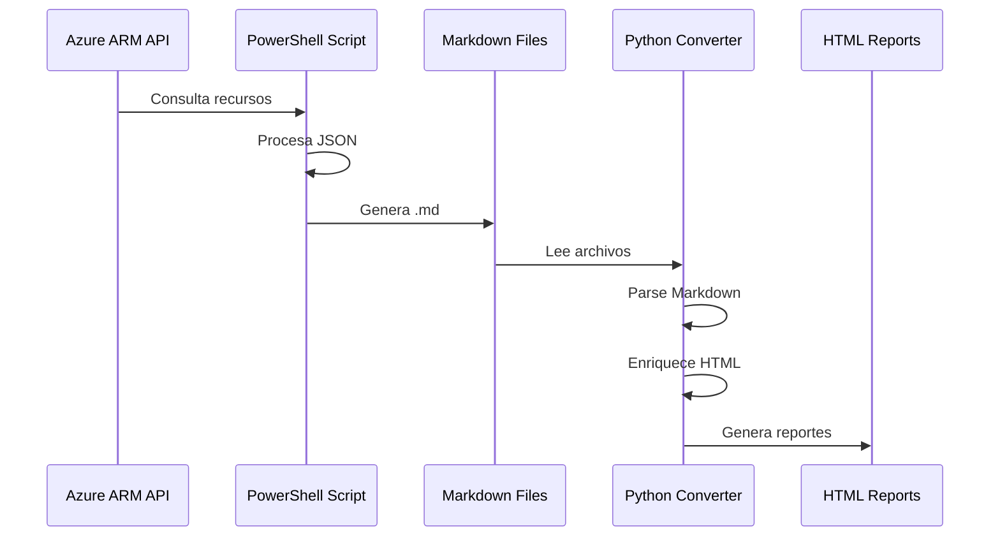

# 📘 DocAzureAutomatic: Automatiza la Documentación de tu Infraestructura Azure

## Introducción: El Desafío de Documentar Cloud Infrastructure

En el ecosistema de Azure, mantener documentación actualizada de la infraestructura cloud es uno de los mayores retos que enfrentan los equipos de DevOps y arquitectos de soluciones. Los recursos se crean, modifican y eliminan constantemente, y la documentación manual rápidamente se vuelve obsoleta y consume tiempo valioso del equipo.

**DocAzureAutomatic** surge como respuesta a este problema: una solución automatizada que genera documentación profesional de recursos Azure con solo ejecutar un script.

## 🎯 ¿Qué es DocAzureAutomatic?

DocAzureAutomatic es un sistema de **documentación automatizada** que transforma la información de tus recursos Azure en reportes HTML profesionales y visualmente atractivos. El proyecto consta de dos componentes principales que trabajan en perfecta sincronía:

### Arquitectura del Sistema


1. **Motor de Recopilación (PowerShell)**: `DocAzureAutomatic.ps1` se conecta a tu tenant de Azure y extrae información detallada de todos tus recursos
2. **Conversor de Presentación (Python)**: `html_DocAzureAutomatic.py` transforma los archivos Markdown en reportes HTML con diseño profesional

## 💡 Características Destacadas

### Generación Automática de Documentación
El script de PowerShell realiza un análisis exhaustivo de tu infraestructura Azure, recopilando:
- Configuraciones de recursos
- Propiedades y metadatos
- Estados de cumplimiento
- Información de suscripciones

### Reportes Visuales Profesionales
Los reportes HTML generados incluyen:

- **📊 Dashboard de Métricas**: Visualización de recursos válidos, inválidos y faltantes
- **📈 Indicador de Cumplimiento**: Medidor circular con porcentaje de cumplimiento
- **🎨 Tema Oscuro Moderno**: Diseño profesional con los colores corporativos de Azure
- **📱 Diseño Responsive**: Optimizado para visualización en cualquier dispositivo
- **🏷️ Badges Visuales**: Identificación clara de suscripciones y estados

## 🔧 Detalles Técnicos

### Stack Tecnológico

**Backend de Recopilación:**
- PowerShell 5.1+
- Azure PowerShell Modules
- Procesamiento de datos JSON

**Frontend de Presentación:**
- Python 3.7+
- markdown-it-py (Parser CommonMark compliant)
- BeautifulSoup4 (Manipulación HTML)
- CSS3 con variables y flexbox

### Arquitectura de Datos

El flujo de datos sigue esta secuencia:



1. PowerShell consulta Azure Resource Manager API
2. Datos JSON → Procesamiento → Archivos .md estructurados
3. Python parsea Markdown → AST (Abstract Syntax Tree)
4. BeautifulSoup enriquece HTML con clases CSS
5. Generación de documento HTML completo con estilos embebidos

## 🚀 Casos de Uso Reales

### 1. **Auditorías de Cumplimiento**
Genera reportes instantáneos mostrando el porcentaje de recursos que cumplen con políticas organizacionales. Ideal para auditorías ISO 27001, SOC 2 o frameworks de seguridad internos.

### 2. **Documentación de Arquitectura**
Crea documentación técnica actualizada para:
- Onboarding de nuevos miembros del equipo
- Presentaciones a stakeholders
- Documentación de disaster recovery
- Inventarios de recursos

### 3. **Governance y FinOps**
Identifica rápidamente:
- Recursos sin tags obligatorios
- Recursos no conformes con estándares
- Estadísticas de distribución por suscripción

### 4. **Change Management**
Documenta el estado de la infraestructura antes y después de cambios importantes, creando un registro histórico de configuraciones.

## 🎨 El Diseño: Más que Solo Funcionalidad

El diseño visual no es un detalle menor. DocAzureAutomatic utiliza:

**Paleta de Colores Azure:**
- `#0078D4` - Azure Blue (acción y énfasis)
- `#121212` - Fondo oscuro (reducción de fatiga visual)
- `#e0e0e0` - Texto claro (alta legibilidad)

**Componentes UI:**
```css
/* Tarjetas de estadísticas con efectos visuales */
.stat-card {
  transition: transform 0.3s ease;
  hover: transform: translateY(-5px);
}

/* Indicador circular de cumplimiento */
.compliance-meter {
  animation: fillProgress 1.5s ease-out;
}
```

## 🔄 Workflow de Implementación

### Instalación Rápida

```powershell
# 1. Configurar PowerShell
Set-ExecutionPolicy -Scope CurrentUser -ExecutionPolicy RemoteSigned
Unblock-File -Path .\DocAzureAutomatic.ps1

# 2. Instalar dependencias Python
pip install markdown-it-py beautifulsoup4

# 3. Ejecutar pipeline completo
.\DocAzureAutomatic.ps1
python .\html_DocAzureAutomatic.py
```

### Ejecución Paso a Paso

**Paso 1: Recopilación de Datos**
```powershell
# Ejecutar el script de PowerShell
.\DocAzureAutomatic.ps1
```

Este script se conecta a Azure y genera archivos `.md` con toda la información de recursos.

**Paso 2: Generación de Reportes HTML**
```bash
# Convertir Markdown a HTML
python .\html_DocAzureAutomatic.py

# O especificar ruta personalizada
python .\html_DocAzureAutomatic.py C:\ruta\a\documentos
```

### Personalización Avanzada

El sistema es altamente customizable:

**Modificar estilos CSS:**
```css
:root {
  --primary-color: #0078D4;  /* Cambia a tu color corporativo */
  --bg-color: #121212;
  --text-color: #e0e0e0;
}
```

**Extender el script Python:**
```python
# Agregar procesamiento adicional
def custom_parser(md_content):
    # Tu lógica personalizada
    return enhanced_content
```

## 📊 Métricas y Análisis

El sistema proporciona métricas cruciales:

| Métrica | Descripción | Valor en Dashboard |
|---------|-------------|-------------------|
| ✅ Recursos Válidos | Cumplen con todas las políticas | Badge verde |
| ❌ Recursos Inválidos | Requieren atención inmediata | Badge rojo |
| ⚠️ Datos Faltantes | Información incompleta | Badge amarillo |
| 🚫 Recursos Excluidos | Fuera del scope del análisis | Badge gris |
| 📈 Cumplimiento | KPI general de governance | Medidor circular |

## 📁 Estructura del Proyecto

```
DocAzureAutomatic/
│
├── DocAzureAutomatic.ps1      # Script principal PowerShell
├── html_DocAzureAutomatic.py  # Conversor MD → HTML
├── styles.css                 # Hoja de estilos tema oscuro
├── dependencias.txt           # Guía de instalación
├── README.md                  # Documentación del proyecto
│
└── [Salida generada]/
    ├── *.md                   # Archivos Markdown generados
    ├── *.html                 # Reportes HTML finales
    └── styles.css             # CSS copiado automáticamente
```

## 🔐 Consideraciones de Seguridad

Al implementar DocAzureAutomatic, considera:

1. **Permisos Mínimos**: El script requiere permisos de lectura en Azure
2. **Credenciales**: Usa Azure Managed Identities cuando sea posible
3. **Datos Sensibles**: Revisa los reportes antes de compartirlos externamente
4. **Control de Acceso**: Almacena los HTML generados en ubicaciones seguras

### Best Practices de Seguridad

```powershell
# Conectar con Azure usando Managed Identity
Connect-AzAccount -Identity

# O usar Service Principal con permisos mínimos
$credential = Get-Credential
Connect-AzAccount -ServicePrincipal -Credential $credential -Tenant $tenantId
```

## 🌟 Best Practices de Implementación

### Automatización Continua
Integra DocAzureAutomatic en tu pipeline CI/CD:

```yaml
# Azure DevOps Pipeline
trigger:
  - main

pool:
  vmImage: 'windows-latest'

steps:
- task: PowerShell@2
  displayName: 'Generar Documentación Markdown'
  inputs:
    filePath: 'DocAzureAutomatic.ps1'

- task: UsePythonVersion@0
  inputs:
    versionSpec: '3.x'

- script: |
    pip install markdown-it-py beautifulsoup4
    python html_DocAzureAutomatic.py
  displayName: 'Convertir a HTML'

- task: PublishBuildArtifacts@1
  inputs:
    PathtoPublish: '$(Build.SourcesDirectory)'
    ArtifactName: 'azure-docs'
```

### Programación Regular
Ejecuta el sistema en intervalos definidos:
- **Diario**: Para entornos de desarrollo activos
- **Semanal**: Para entornos de producción estables
- **Bajo demanda**: Antes de auditorías o revisiones

## 🐛 Solución de Problemas Comunes

### Error: "No se encontró el fichero CSS"

```bash
# Verifica que styles.css esté en el directorio correcto
ls styles.css

# Si falta, copia desde el repositorio
cp styles.css ./ruta/destino/
```

### Error: PowerShell no ejecuta el script

```powershell
# Verifica la política de ejecución
Get-ExecutionPolicy

# Si es Restricted, cámbiala
Set-ExecutionPolicy -Scope CurrentUser -ExecutionPolicy RemoteSigned

# Desbloquea el archivo específico
Unblock-File -Path .\DocAzureAutomatic.ps1
```

### Error: Módulo Python no encontrado

```bash
# Verifica la instalación de Python
python --version

# Reinstala las dependencias
pip install --upgrade markdown-it-py beautifulsoup4

# Si usas entornos virtuales
python -m venv venv
.\venv\Scripts\activate
pip install markdown-it-py beautifulsoup4
```

### Error: Conexión a Azure falla

```powershell
# Verifica conexión actual
Get-AzContext

# Reconecta a Azure
Connect-AzAccount

# Lista suscripciones disponibles
Get-AzSubscription

# Selecciona suscripción específica
Set-AzContext -SubscriptionId "tu-subscription-id"
```

## 🔮 Roadmap y Futuras Mejoras

Posibles extensiones del proyecto:

### Corto Plazo
- ✨ Integración con Azure DevOps para almacenamiento automático
- 📄 Export a PDF para distribución offline
- 🔍 Búsqueda full-text en reportes HTML

### Medio Plazo
- 📊 Dashboard interactivo con JavaScript
- 📈 Comparación histórica de cambios (git-like diff)
- 🔔 Notificaciones automáticas de cambios críticos

### Largo Plazo
- 🤖 Integración con Azure Policy para análisis más profundo
- 🌐 Portal web para visualización centralizada
- 📱 App móvil para consulta en movimiento
- 🔄 Sincronización bidireccional con Azure Resource Graph

## 💼 Casos de Éxito

### Empresa Financiera Internacional
**Desafío**: Auditoría trimestral de 2,500+ recursos Azure  
**Solución**: DocAzureAutomatic automatizado vía Azure DevOps  
**Resultado**: Reducción de 40 horas a 15 minutos en generación de reportes

### Startup de HealthTech
**Desafío**: Documentación para certificación HIPAA  
**Solución**: Reportes diarios de cumplimiento  
**Resultado**: Aprobación certificación en primera revisión

### Gobierno Regional
**Desafío**: Inventario de recursos para presupuesto anual  
**Solución**: Generación automática mensual de reportes  
**Resultado**: Ahorro de 120 horas/año en documentación manual

## 📚 Recursos Adicionales

### Documentación Oficial
- [Azure PowerShell Documentation](https://docs.microsoft.com/powershell/azure/)
- [Markdown-it-py GitHub](https://github.com/executablebooks/markdown-it-py)
- [BeautifulSoup Documentation](https://www.crummy.com/software/BeautifulSoup/)
- [GitHub Solution](https://github.com/luisadanmunoz/DocAzureAutomatic)

### Comunidad
- Reporta bugs y solicita features en el repositorio del proyecto
- Únete a las discusiones sobre mejores prácticas
- Contribuye con tu propio código y mejoras

## Conclusión

DocAzureAutomatic representa una solución pragmática al problema universal de documentación de infraestructura cloud. Al combinar la potencia de PowerShell para recopilación de datos con la flexibilidad de Python para presentación, obtienes un sistema robusto, extensible y profesional.

La documentación ya no tiene que ser una tarea manual y propensa a errores. Con DocAzureAutomatic, tu infraestructura Azure se auto-documenta, permitiendo a tu equipo enfocarse en lo que realmente importa: construir y mantener sistemas excepcionales.

### Beneficios Clave

✅ **Ahorro de tiempo**: De horas a minutos  
✅ **Consistencia**: Mismo formato siempre  
✅ **Actualización**: Documentación siempre al día  
✅ **Profesionalismo**: Reportes de calidad enterprise  
✅ **Compliance**: Facilita auditorías y certificaciones  
✅ **Visibilidad**: Métricas y estadísticas claras  

---

## 🚀 ¡Empieza Ahora!

**¿Listo para automatizar tu documentación Azure?**

```powershell
# Clona el repositorio
git clone https://github.com/tu-repo/DocAzureAutomatic.git

# Navega al directorio
cd DocAzureAutomatic

# Sigue los pasos de instalación
.\DocAzureAutomatic.ps1
python .\html_DocAzureAutomatic.py

# ¡En minutos tendrás reportes profesionales!
```

---

**Tags:** `#Azure` `#CloudAutomation` `#DevOps` `#Infrastructure` `#Documentation` `#PowerShell` `#Python` `#CloudGovernance` `#AzureResourceManager` `#InfrastructureAsCode`

---

*¿Tienes preguntas o mejoras para DocAzureAutomatic? Contribuye al proyecto y ayuda a mejorar la documentación cloud para toda la comunidad. Comparte tus experiencias y casos de uso en los comentarios.*