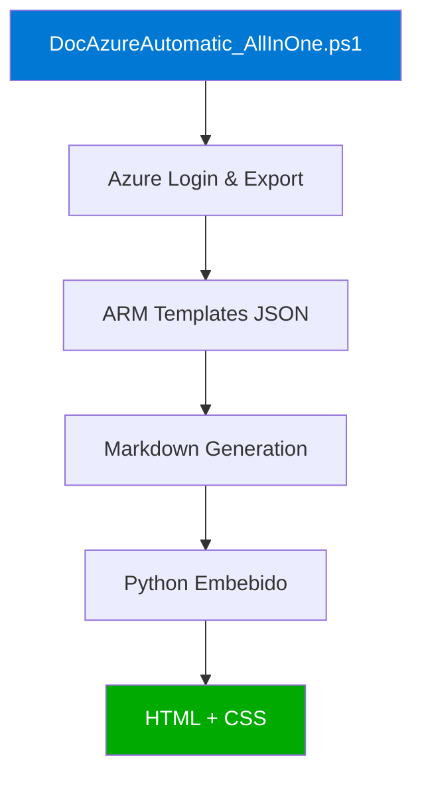
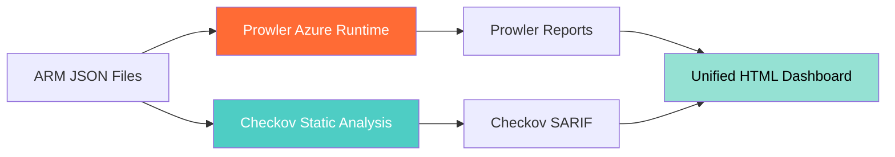
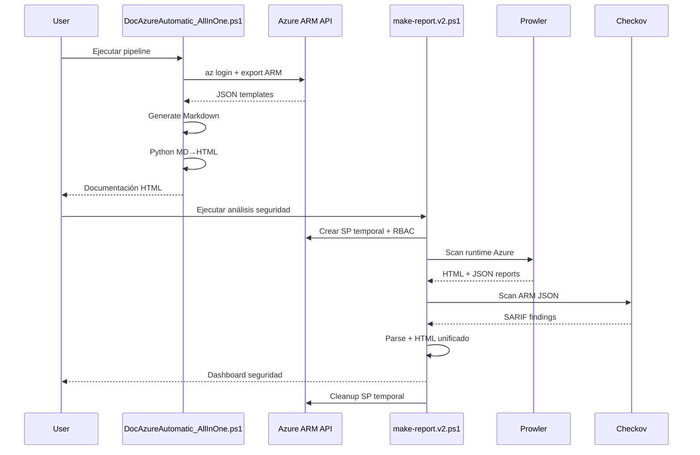

# 🔒 DocAzureAutomatic v2: Cuando la Documentación se Encuentra con DevSecOps

## Introducción: De Documentación a Security Intelligence

En la primera versión de **DocAzureAutomatic**, revolucionamos cómo documentamos infraestructura Azure: exportación automática de ARM templates, generación de Markdown detallado y reportes HTML profesionales. Pero en el mundo cloud actual, documentar **qué tienes** ya no es suficiente. Necesitas saber si lo que tienes es **seguro**.

**DocAzureAutomatic v2** da el siguiente paso evolutivo: combina documentación automática con análisis de seguridad de clase enterprise usando **Prowler** y **Checkov**, las herramientas preferidas por equipos de DevSecOps a nivel mundial.

## 🎯 ¿Qué hay de nuevo en v2?

### 1. **Unificación Total: DocAzureAutomatic_AllInOne.ps1**

La arquitectura se simplifica drásticamente. Lo que antes requería dos scripts separados (PowerShell + Python) ahora es **un solo archivo ejecutable**:



**Beneficios de la unificación:**
- ✅ Un solo comando para ejecutar todo el pipeline
- ✅ Python embebido dentro del script PowerShell
- ✅ Cero dependencias de archivos externos (excepto styles.css)
- ✅ Deployment más simple en entornos corporativos
- ✅ Menos superficie de error

### 2. **Análisis de Seguridad con Prowler + Checkov**

La estrella de v2: **make-report.v2.ps1**, un orchestrator de seguridad que:



**Prowler**: Análisis en tiempo real contra las suscripciones de Azure. Detecta misconfigurations, vulnerabilidades de compliance y desviaciones de best practices directamente en tu tenant.

**Checkov**: Análisis estático de tus ARM templates exportados. Encuentra issues antes de desplegar, valida contra CIS Benchmarks, PCI-DSS, HIPAA y más.

### 3. **Entorno Virtual Python para Aislamiento**

v2 introduce gestión profesional de dependencias con virtual environments:

```powershell
# Instalación aislada de herramientas
python -m venv .venv
.\.venv\Scripts\Activate.ps1
pip install prowler checkov
```

**Ventajas del venv:**
- 🔒 Aislamiento de dependencias (no contaminas el Python global)
- 🔄 Versionado reproducible de herramientas
- 🚀 Portabilidad: lleva tu .venv a cualquier máquina
- 👥 Colaboración en equipo sin conflictos de versiones

## 🏗️ Arquitectura Completa del Sistema v2



## 🛠️ Componentes Técnicos en Detalle

### DocAzureAutomatic_AllInOne.ps1: El Nuevo Monolito Inteligente

**Fase 1: Autenticación y Descubrimiento**
```powershell
# Login interactivo con selección de suscripciones
az login --tenant $TenantId

# Lista todas las suscripciones del tenant
$subscriptions = az account list --all --output json | ConvertFrom-Json
```

**Fase 2: Exportación Masiva de ARM Templates**
```powershell
# Por cada suscripción → Por cada Resource Group
foreach ($rg in $resourceGroups) {
    az group export --name $rg --include-parameter-default-value --output json
}
```

Genera estructura:
```
PlantillasARM/
├── Produccion/
│   ├── RG-WebApps_template.json
│   ├── RG-Databases_template.json
│   └── Resumen.md
└── Desarrollo/
    ├── RG-DevEnv_template.json
    └── Resumen.md
```

**Fase 3: Procesamiento JSON → Markdown**

El script implementa un **flatten algorithm** que descompone objetos JSON anidados en propiedades planas:

```powershell
function Expand-FlattenObject {
    param([hashtable]$Object, [string]$Prefix = '')
    # Convierte { properties: { config: { value: 10 } } }
    # En: properties.config.value = 10
}
```

Resultado: tablas Markdown legibles con **todos** los detalles de configuración:

```markdown
## 💻 mi-vm-produccion — Microsoft.Compute/virtualMachines

| Propiedad | Valor |
|-----------|-------|
| location | westeurope |
| vmSize | Standard_D4s_v3 |
| osType | Linux |
| osDisk.caching | ReadWrite |
| nicId | /subscriptions/.../networkInterfaces/vm-nic |
```

**Fase 4: Conversión Python Embebida**

El código Python completo está embebido como **here-string** en PowerShell:

```powershell
$pyCode = @'
import markdown_it, bs4
# ... todo el código Python ...
'@

$tmpPy = Join-Path $env:TEMP "md2html_embedded.py"
$pyCode | Set-Content -Path $tmpPy
& python $tmpPy $BaseFolder
```

Ventajas:
- No necesitas un archivo `.py` separado
- Todo se distribuye en un solo `.ps1`
- Funciona incluso si el usuario no tiene permisos de escritura en el directorio de trabajo

### make-report.v2.ps1: El Orchestrator de Seguridad

**Innovación 1: Gestión de Service Principal Temporal**

```powershell
# 1) Crear SP con permisos mínimos
$sp = az ad sp create-for-rbac --name "ProwlerTempSP-$timestamp" `
    --role "Reader" --scopes "/subscriptions/$subId"

# 2) Asignar roles adicionales por suscripción
Add-RolesToSP -ClientId $sp.clientId -Roles @("Security Reader", "ProwlerRole")

# 3) Esperar propagación RBAC (crítico!)
Start-Sleep -Seconds 45

# 4) Ejecutar scans

# 5) Cleanup automático
Delete-SPAndApp -ClientId $sp.clientId
```

**¿Por qué un SP temporal?**
- 🔒 Principio de mínimo privilegio: existe solo durante el escaneo
- 🧹 Limpieza automática: no deja recursos huérfanos
- 🔄 Auditable: cada ejecución crea nuevo SP con timestamp
- 👮 Compliance: evita credenciales permanentes de servicio

**Innovación 2: ProwlerRole Personalizado**

Prowler v5.x recomienda un custom role con permisos específicos que Reader no cubre:

```json
{
  "Name": "ProwlerRole",
  "IsCustom": true,
  "Description": "Permisos adicionales para Prowler no cubiertos por Reader",
  "Actions": [
    "Microsoft.Web/sites/host/listkeys/action",
    "Microsoft.Web/sites/config/list/Action"
  ],
  "AssignableScopes": ["/subscriptions/{subscription-id}"]
}
```

El script crea esta role automáticamente si no existe y la limpia al finalizar (opcional).

**Innovación 3: Resolución Inteligente de Herramientas**

```powershell
function Resolve-ToolPath {
    param($ToolName, $VenvDir, [switch]$PreferVenv)
    
    # 1) Buscar en venv (si PreferVenv=true)
    $candidates = @(
        "$VenvDir\Scripts\$ToolName.exe",
        "$VenvDir\Scripts\$ToolName.cmd"
    )
    
    # 2) Fallback a PATH global
    return (Get-Command $ToolName).Source
}
```

Prioridad: `venv → PATH global → error`

**Innovación 4: Staging de Archivos para Checkov**

```powershell
function New-ScanStaging {
    # Copia SOLO *.json a un directorio temporal
    # Evita que Checkov procese .md, .html, etc.
}
```

Sin staging: Checkov analiza **todos** los archivos (lento + falsos positivos)  
Con staging: Solo JSON válidos (rápido + preciso)

**Innovación 5: Parsing SARIF Avanzado**

Checkov genera SARIF (Static Analysis Results Interchange Format). El script extrae:

```powershell
foreach ($result in $sarif.runs[0].results) {
    $finding = @{
        RuleId = $result.ruleId
        Level = $result.level  # error/warning/note
        Resource = $result.properties.resource_name
        File = $result.locations[0].physicalLocation.artifactLocation.uri
        RemediationUrl = $result.rule.helpUri
    }
}
```

**Output final**: HTML interactivo con filtros por severidad y búsqueda full-text:

```html
<div class="filters">
  <label><input type="checkbox" id="f_error" checked> error</label>
  <label><input type="checkbox" id="f_warning" checked> warning</label>
  <input type="search" placeholder="buscar recurso, rule, archivo..." />
</div>
```

## 📊 Dashboard de Seguridad Unificado

El HTML generado por make-report.v2.ps1 incluye:

### Panel de Resumen
```
┌─────────────────────┬─────────────────────┐
│   Checkov Summary   │   Prowler Summary   │
│                     │                     │
│ • Error: 12         │ • Critical: 5       │
│ • Warning: 34       │ • High: 18          │
│ • Note: 89          │ • Medium: 42        │
│                     │ • Low: 156          │
│                     │ [Ver índice →]      │
└─────────────────────┴─────────────────────┘
```

### Tabla de Findings

| Tool    | Level    | RuleId                           | Resource                                      | File          | Message                               | Remediation |
|---------|----------|----------------------------------|-----------------------------------------------|---------------|---------------------------------------|-------------|
| Checkov | error    | CKV_AZURE_1                      | my-storage-account                            | rg-prod.json  | Storage account allows public access  | [link →]    |
| Prowler | critical | storage_ensure_secure_transfer   | /subscriptions/.../storageAccounts/mysa       | N/A           | Secure transfer not enabled           | [link →]    |

### Filtrado Interactivo JavaScript

```javascript
// Filtros por nivel + búsqueda texto
document.querySelectorAll('#t tbody tr').forEach(r => {
    const level = r.getAttribute('data-level');
    const okLevel = checks[level].checked;
    const okQuery = r.innerText.toLowerCase().includes(query);
    r.style.display = (okLevel && okQuery) ? '' : 'none';
});
```

## 🚀 Guía de Implementación Paso a Paso

### Requisitos Previos

**Software necesario:**
```powershell
# Azure CLI
winget install Microsoft.AzureCLI

# Python 3.7+
winget install Python.Python.3.11

# PowerShell 5.1+ (incluido en Windows 10/11)
$PSVersionTable.PSVersion
```

**Permisos de Azure necesarios:**
- `Reader` en las suscripciones a documentar
- `Security Reader` para análisis de seguridad con Prowler
- `User Access Administrator` (solo si quieres crear ProwlerRole)

### Instalación en 5 Minutos

**Paso 1: Preparar el Proyecto**
```powershell
# Crear directorio y descargar archivos
mkdir C:\DocAzureAutomatic
cd C:\DocAzureAutomatic

# Descargar desde tu repositorio
# git clone https://github.com/tuusuario/DocAzureAutomatic.git .
```

**Paso 2: Configurar Entorno Virtual Python**
```powershell
# Crear venv
python -m venv .venv

# Activar (puede requerir cambiar execution policy)
Set-ExecutionPolicy -Scope CurrentUser RemoteSigned
.\.venv\Scripts\Activate.ps1

# Instalar dependencias
python -m pip install --upgrade pip
pip install prowler checkov markdown-it-py beautifulsoup4
```

**Paso 3: Verificar Instalación**
```powershell
# Comprobar herramientas venv
Test-Path .\.venv\Scripts\prowler.exe  # True
Test-Path .\.venv\Scripts\checkov.cmd  # True

# Verificar versiones
.\.venv\Scripts\prowler.exe --version   # Prowler 5.x
.\.venv\Scripts\checkov.cmd --version   # Checkov 3.x
```

**Paso 4: Ejecutar Pipeline de Documentación**
```powershell
# Ejecutar DocAzureAutomatic unificado
.\DocAzureAutomatic_AllInOne.ps1

# Introduce tu Tenant ID cuando se solicite
# Selecciona las suscripciones a procesar
```

Resultado:
```
PlantillasARM/
├── Produccion/
│   ├── RG-WebApps_template.json
│   ├── RG-WebApps_template.md
│   ├── RG-WebApps_template.html
│   └── styles.css
└── ResumenGlobal.html
```

**Paso 5: Ejecutar Análisis de Seguridad**
```powershell
# Ejecutar con herramientas del venv
.\make-report.v2.ps1 -PreferVenvTools -VenvDir ".\.venv"

# Opciones útiles:
# -UseTempSP $true              # Crear SP temporal (recomendado)
# -EnsureProwlerRole $true      # Crear ProwlerRole custom
# -ProwlerSubscriptionIds "id1,id2"  # Limitar suscripciones
```

Resultado:
```
reports/
├── checkov/
│   ├── results.sarif
│   └── index.html          # ← Dashboard principal
└── prowler/
    ├── azure_*.html
    └── prowler-output-*.json
```

### Automatización con Azure DevOps

```yaml
# azure-pipelines.yml
trigger:
  branches:
    include: [main]

pool:
  vmImage: 'windows-latest'

steps:
- task: UsePythonVersion@0
  inputs:
    versionSpec: '3.11'

- script: |
    python -m venv .venv
    .\.venv\Scripts\Activate.ps1
    pip install prowler checkov markdown-it-py beautifulsoup4
  displayName: 'Setup Python venv'

- task: AzureCLI@2
  inputs:
    azureSubscription: 'MyAzureConnection'
    scriptType: 'ps'
    scriptLocation: 'inlineScript'
    inlineScript: |
      .\DocAzureAutomatic_AllInOne.ps1 -TenantId $(tenantId) -SubscriptionIds $(subscriptionIds)
  displayName: 'Generate Documentation'

- task: PowerShell@2
  inputs:
    filePath: 'make-report.v2.ps1'
    arguments: '-PreferVenvTools -VenvDir .\.venv -UseTempSP $true'
  displayName: 'Security Analysis'

- task: PublishBuildArtifacts@1
  inputs:
    PathtoPublish: '$(System.DefaultWorkingDirectory)'
    ArtifactName: 'azure-security-docs'
  displayName: 'Publish Reports'
```

## 🔍 Deep Dive: ¿Qué Analiza Cada Herramienta?

### Prowler: Runtime Security Posture

**Categorías de checks:**
- 🔐 **Identity & Access**: MFA, privileged accounts, stale users
- 🌐 **Networking**: NSG rules, open ports, public IPs
- 💾 **Storage**: Encryption, public access, logging
- 🗄️ **Databases**: TLS, auditing, vulnerability assessments
- 🔑 **Key Vault**: access policies, soft delete, purge protection
- 📊 **Monitoring**: Log Analytics, alerts, diagnostic settings
- 🛡️ **Security Center**: Defender plans, recommendations

**Ejemplo de finding Prowler:**
```json
{
  "CheckID": "storage_ensure_secure_transfer_enabled",
  "CheckTitle": "Ensure secure transfer is required for storage accounts",
  "Status": "FAIL",
  "StatusExtended": "Storage account 'mystorageaccount' does not require secure transfer",
  "ResourceId": "/subscriptions/.../storageAccounts/mystorageaccount",
  "Severity": "high",
  "Remediation": {
    "Code": {
      "CLI": "az storage account update --name mystorageaccount --https-only true",
      "PowerShell": "Set-AzStorageAccount -Name mystorageaccount -EnableHttpsTrafficOnly $true"
    }
  }
}
```

### Checkov: Infrastructure as Code Compliance

**Frameworks soportados:**
- CIS Azure Foundations Benchmark
- PCI-DSS
- HIPAA
- SOC 2
- NIST 800-53
- ISO 27001
- GDPR

**Tipos de checks:**
- ⚙️ **Configuration**: Tamaño de VM, SKUs, regiones
- 🔐 **Security**: Encryption, access controls, network rules
- 💰 **Cost Optimization**: Over-provisioned resources
- 🏷️ **Tagging**: Mandatory tags, naming conventions
- 🔄 **Dependencies**: Resource relationships

**Ejemplo de check Checkov:**
```python
# Check CKV_AZURE_35: Storage account uses customer-managed keys
{
  "check_id": "CKV_AZURE_35",
  "bc_check_id": "BC_AZR_GENERAL_35",
  "check_name": "Storage account encryption uses customer-managed key",
  "check_result": {
    "result": "failed",
    "evaluated_keys": ["properties/encryption/keySource"]
  },
  "file_path": "/PlantillasARM/Produccion/RG-Storage_template.json",
  "resource": "storageAccounts/mystorage",
  "guideline": "https://docs.bridgecrew.io/docs/bc_azr_general_35"
}
```

## 🎓 Casos de Uso Empresariales

### 1. **Auditoría Trimestral de Compliance**

**Escenario**: Empresa financiera con certificación ISO 27001 necesita demostrar compliance cada trimestre.

**Solución con DocAzureAutomatic v2:**
```powershell
# Programar en Task Scheduler cada 90 días
$trigger = New-ScheduledTaskTrigger -Weekly -DaysOfWeek Monday -At 2am
$action = New-ScheduledTaskAction -Execute "PowerShell.exe" `
    -Argument "-File C:\DocAzureAutomatic\run-audit.ps1"

Register-ScheduledTask -TaskName "Azure Quarterly Audit" `
    -Trigger $trigger -Action $action
```

**run-audit.ps1:**
```powershell
.\DocAzureAutomatic_AllInOne.ps1 -TenantId $tid -SubscriptionIds $sids
.\make-report.v2.ps1 -PreferVenvTools -VenvDir ".\.venv"

# Archivar resultados con timestamp
$date = Get-Date -Format "yyyy-MM-dd"
Compress-Archive -Path ".\reports" -DestinationPath ".\archives\audit-$date.zip"

# Enviar email con resultados
Send-MailMessage -To "compliance@company.com" `
    -Subject "Azure Audit Report $date" `
    -Attachments ".\archives\audit-$date.zip"
```

**ROI**:
- Antes: 40 horas/persona por auditoría manual
- Después: 2 horas de review de reportes automatizados
- **Ahorro**: 95% de tiempo + reducción de errores humanos

### 2. **CI/CD con Security Gates**

**Escenario**: Pipeline de despliegue debe validar seguridad antes de aprobar cambios a producción.

**Azure DevOps Pipeline:**
```yaml
stages:
- stage: SecurityValidation
  jobs:
  - job: SecurityScan
    steps:
    - script: |
        .\make-report.v2.ps1 -ScanRoot ".\arm-templates" -PreferVenvTools
      displayName: 'Security Scan'
    
    - powershell: |
        $sarif = Get-Content .\reports\checkov\results.sarif | ConvertFrom-Json
        $errors = $sarif.runs[0].results | Where-Object {$_.level -eq "error"}
        if ($errors.Count -gt 0) {
          Write-Error "❌ Security check failed: $($errors.Count) critical issues found"
          exit 1
        }
      displayName: 'Validate Findings'

- stage: Deploy
  dependsOn: SecurityValidation
  condition: succeeded()
  # ... deployment steps
```

**Resultado**: Despliegues bloqueados automáticamente si hay vulnerabilidades críticas.

### 3. **Onboarding de Clientes en MSP**

**Escenario**: Managed Service Provider necesita documentar infraestructura de nuevos clientes rápidamente.

**Workflow:**
```powershell
# 1) Obtener acceso guest en tenant del cliente
# 2) Ejecutar pipeline completo
.\DocAzureAutomatic_AllInOne.ps1 -TenantId $clientTenantId
.\make-report.v2.ps1 -PreferVenvTools

# 3) Generar "Customer Onboarding Package"
$package = @{
    Cliente = "ACME Corp"
    Fecha = Get-Date
    Documentacion = ".\PlantillasARM"
    SeguridadCheckov = ".\reports\checkov\index.html"
    SeguridadProwler = ".\reports\prowler\index.html"
}

# 4) Subir a SharePoint del cliente
Upload-ToSharePoint -Package $package -SiteUrl $clientSharePoint
```

**Valor añadido**:
- Primera reunión con datos concretos
- Identificación temprana de security gaps
- Plan de remediación priorizado desde día 1

### 4. **FinOps: Análisis de Costos por Compliance**

**Escenario**: Recursos no compliant suelen ser más costosos (over-provisioned, redundancia innecesaria).

**Script de análisis:**
```powershell
# Correlacionar findings de Checkov con costos
$sarif = Get-Content .\reports\checkov\results.sarif | ConvertFrom-Json
$findings = $sarif.runs[0].results

$costFindings = $findings | Where-Object {
    $_.ruleId -match "CKV.*COST" -or 
    $_.properties.guideline -match "optimization"
}

foreach ($f in $costFindings) {
    $resource = $f.properties.resource_name
    # Consultar Azure Cost Management API
    $cost = Get-AzConsumptionUsageDetail -ResourceId $resource
    
    [PSCustomObject]@{
        Resource = $resource
        MonthlySpend = $cost.PreTaxCost
        Issue = $f.message.text
        PotentialSaving = $cost.PreTaxCost * 0.30  # estimación 30%
    }
}
```

**Output**:
```
Resource                    MonthlySpend  Issue                           PotentialSaving
--------                    ------------  -----                           ---------------
my-oversized-vm                  $450    VM size exceeds workload needs        $135
storage-premium-unnecessary      $280    Premium tier not required             $84
```

## 📈 Métricas y KPIs de Seguridad

El sistema genera métricas accionables:

### Dashboard de Evolución Temporal
```powershell
# Ejecutar semanalmente y almacenar métricas
$metrics = @{
    Fecha = Get-Date
    TotalFindings = $findings.Count
    Critical = ($findings | Where-Object {$_.level -eq "error"}).Count
    High = ($findings | Where-Object {$_.level -eq "warning"}).Count
    MeanTimeToRemediate = (Get-RemediationMetrics).AvgDays
    ComplianceScore = (1 - ($Critical / $TotalFindings)) * 100
}

$metrics | Export-Csv -Path ".\metrics\security-trends.csv" -Append
```

### Visualización con Power BI
Conectar el CSV a Power BI Desktop y crear dashboard:
- 📊 Tendencia de findings por semana
- 🎯 Compliance score evolution
- 🔥 Top 10 recursos más vulnerables
- ⏱️ Time-to-fix por tipo de vulnerabilidad
- 👥 Findings por equipo/suscripción

## 🛡️ Best Practices de Seguridad

### 1. **Gestión Segura de Credenciales**

**❌ MAL: Credenciales hardcodeadas**
```powershell
$password = "SuperSecretP@ssw0rd!"
az login -u admin@company.com -p $password
```

**✅ BIEN: Azure Managed Identity**
```powershell
# En Azure VM o Azure DevOps
az login --identity

# En local: Device Code Flow (interactivo)
az login --use-device-code
```

**✅ MEJOR: Service Principal con Azure Key Vault**
```powershell
$clientId = az keyvault secret show --vault-name myvault --name sp-client-id --query value -o tsv
$clientSecret = az keyvault secret show --vault-name myvault --name sp-client-secret --query value -o tsv
az login --service-principal -u $clientId -p $clientSecret --tenant $tenantId
```

### 2. **Principio de Mínimo Privilegio**

El SP temporal creado por make-report.v2.ps1 solo tiene:
- `Reader` (lectura de recursos)
- `Security Reader` (acceso a Security Center)
- `ProwlerRole` (acciones específicas de lectura)

**NUNCA** des `Contributor` o `Owner` a SPs de scanning.

### 3. **Encriptación de Reportes Sensibles**

```powershell
# Encriptar reportes con certificado corporativo
$cert = Get-ChildItem Cert:\CurrentUser\My | Where-Object {$_.Subject -match "security"}
Protect-CmsMessage -To $cert -Path ".\reports\checkov\index.html" `
    -OutFile ".\reports\checkov\index.html.encrypted"

# Solo usuarios con el certificado pueden desencriptar
Unprotect-CmsMessage -Path ".\reports\checkov\index.html.encrypted"
```

### 4. **Retención y Archivado de Auditorías**

```powershell
# Política de retención: 7 años para compliance
$archiveDate = (Get-Date).AddDays(-2555)  # 7 años

Get-ChildItem ".\archives" -Filter "audit-*.zip" | Where-Object {
    $_.LastWriteTime -lt $archiveDate
} | ForEach-Object {
    # Mover a Azure Blob Storage (Archive tier) antes de borrar local
    az storage blob upload --account-name $storageAccount `
        --container-name "audit-archives" --file $_.FullName `
        --tier Archive
    
    Remove-Item $_.FullName
}
```

## 🔧 Troubleshooting Común

### Error: "Prowler/Checkov not found"

**Síntoma**: Script dice que no encuentra las herramientas.

**Solución 1**: Verificar instalación en venv
```powershell
# Activar venv
.\.venv\Scripts\Activate.ps1

# Reinstalar herramientas
pip install --upgrade prowler checkov

# Verificar instalación
where.exe prowler  # debe mostrar ruta en .venv
where.exe checkov
```

**Solución 2**: Ejecutar con flag correcto
```powershell
# Forzar uso de venv
.\make-report.v2.ps1 -PreferVenvTools $true -VenvDir ".\.venv"
```

### Error: "Insufficient privileges for Prowler"

**Síntoma**: Prowler falla con errores de permisos.

**Diagnóstico**:
```powershell
# Verificar roles actuales del SP
$spId = az ad sp list --display-name "ProwlerTempSP-*" --query "[0].id" -o tsv
az role assignment list --assignee $spId --all

# Debe mostrar:
# - Reader en /subscriptions/{id}
# - Security Reader en /subscriptions/{id}
# - ProwlerRole en /subscriptions/{id}
```

**Solución**: Asegurar que ProwlerRole existe y está asignado
```powershell
# Forzar creación de ProwlerRole
.\make-report.v2.ps1 -EnsureProwlerRole $true
```

### Error: "RBAC propagation delay"

**Síntoma**: Prowler falla inmediatamente después de crear SP.

**Explicación**: Azure RBAC no es instantáneo. Puede tardar hasta 5 minutos en propagarse.

**Solución**: Aumentar tiempo de espera
```powershell
# En make-report.v2.ps1
.\make-report.v2.ps1 -RbacPropagationSleepSeconds 90  # 90 segundos
```

### Error: "Python module not found: markdown_it"

**Síntoma**: AllInOne.ps1 falla al intentar convertir MD→HTML.

**Solución**:
```powershell
# Instalar dependencias de conversión
pip install markdown-it-py beautifulsoup4

# Verificar instalación
python -c "import markdown_it, bs4; print('OK')"
```

### Error: "Access denied to subscription"

**Síntoma**: Script no puede listar recursos de una suscripción.

**Diagnóstico**:
```powershell
# Ver suscripciones accesibles
az account list --query "[].{Name:name, ID:id, State:state}" -o table

# Verificar tu rol en suscripción específica
az role assignment list --assignee (az account show --query user.name -o tsv) `
    --scope "/subscriptions/{subscription-id}"
```

**Solución**: Pedir a admin que te asigne rol `Reader` mínimo.

## 🌍 Extensiones y Roadmap

### Corto Plazo (Q1 2026)
- ✅ **Multi-cloud**: Extensión para AWS (boto3) y GCP (gcloud)
- ✅ **API REST**: Exponer findings vía API para integraciones
- ✅ **Slack/Teams**: Notificaciones de critical findings en tiempo real
- ✅ **Terraform/Bicep**: Soporte para parsear estos IaC formats

### Medio Plazo (Q2-Q3 2026)
- 🔄 **Remediation automática**: Scripts de fix para issues comunes
- 📊 **Trend analysis**: ML para predecir degradación de security posture
- 🔗 **SIEM integration**: Export a Splunk, Sentinel, QRadar
- 🎯 **Policy as Code**: Definir thresholds personalizados por equipo

### Largo Plazo (2026+)
- 🤖 **AI-powered**: GPT-4 para explicar findings en lenguaje natural
- 🌐 **SaaS version**: Portal web con multi-tenancy
- 📱 **Mobile app**: Dashboard iOS/Android para CISOs on-the-go
- 🔐 **Zero Trust**: Integración con Azure AD Conditional Access

## 📚 Recursos y Comunidad

### Documentación Oficial
- **Prowler**: [https://github.com/prowler-cloud/prowler](https://github.com/prowler-cloud/prowler)
- **Checkov**: [https://www.checkov.io/](https://www.checkov.io/)
- **Azure CLI**: [https://docs.microsoft.com/cli/azure/](https://docs.microsoft.com/cli/azure/)
- **SARIF Spec**: [https://sarifweb.azurewebsites.net/](https://sarifweb.azurewebsites.net/)

### Comunidad DocAzureAutomatic
- **GitHub**: [https://github.com/luisadanmunoz/DocAzureAutomatic](https://github.com/luisadanmunoz/DocAzureAutomatic)
- **Issues**: Reporta bugs y solicita features
- **Discussions**: Comparte casos de uso y mejores prácticas
- **Pull Requests**: Contribuye con mejoras

### Training y Certificaciones Recomendadas
- **AZ-500**: Azure Security Engineer Associate
- **Certified Cloud Security Professional (CCSP)**
- **Prowler Certification** (cuando esté disponible)
- **DevSecOps Foundation** (DevOps Institute)

## 💡 Conclusión: Seguridad como Código

DocAzureAutomatic v2 representa un cambio de paradigma:

**De → A:**
- Documentación manual → Automatizada
- Auditorías trimestrales → Continuous compliance
- Silos de seguridad → Integración DevSecOps
- Reactivo → Proactivo
- Checklist estático → Intelligence dinámica

### El Valor Real

No es solo sobre generar reportes bonitos. Es sobre:
1. **Visibilidad**: Saber exactamente qué tienes y cómo de seguro está
2. **Velocidad**: Pasar de semanas a minutos en compliance
3. **Calidad**: Eliminar errores humanos en documentación
4. **Confianza**: Dormir tranquilo sabiendo que tienes control

### El Siguiente Paso

```powershell
# Tu infraestructura te está esperando
cd C:\DocAzureAutomatic
.\.venv\Scripts\Activate.ps1

# Documenta
.\DocAzureAutomatic_AllInOne.ps1

# Asegura
.\make-report.v2.ps1 -PreferVenvTools -VenvDir ".\.venv"

# Mejora
# (aquí es donde empieza el verdadero trabajo)
```

---

## 🚀 ¡Comienza Hoy!

**Instalación en 3 comandos:**
```powershell
git clone https://github.com/luisadanmunoz/DocAzureAutomatic.git
cd DocAzureAutomatic
python -m venv .venv && .\.venv\Scripts\Activate.ps1 && pip install prowler checkov markdown-it-py beautifulsoup4
```

**Primera ejecución:**
```powershell
.\DocAzureAutomatic_AllInOne.ps1
.\make-report.v2.ps1 -PreferVenvTools -VenvDir ".\.venv"
```

**En 10 minutos tendrás:**
- ✅ Documentación completa de tu infraestructura
- ✅ Análisis de seguridad con Prowler y Checkov
- ✅ Dashboard HTML interactivo con todos los findings
- ✅ SARIF para CI/CD integration

---

**Tags:** `#Azure` `#DevSecOps` `#Prowler` `#Checkov` `#CloudSecurity` `#Automation` `#IaC` `#Compliance` `#SecurityAudit` `#InfrastructureAsCode` `#AzureSecurity` `#PowerShell` `#Python`

---

*¿Implementaste DocAzureAutomatic v2 en tu organización? ¿Encontraste un security gap crítico gracias a los reportes? Comparte tu historia en los comentarios y ayuda a otros a mejorar su security posture. La seguridad cloud es responsabilidad de todos.*

**¡Contribuye al proyecto en GitHub y forma parte de la comunidad DocAzureAutomatic!**
