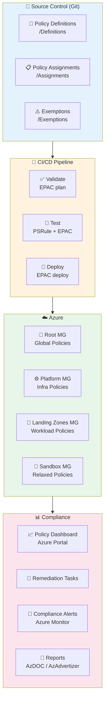
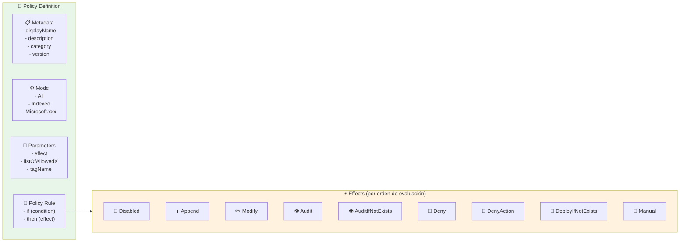
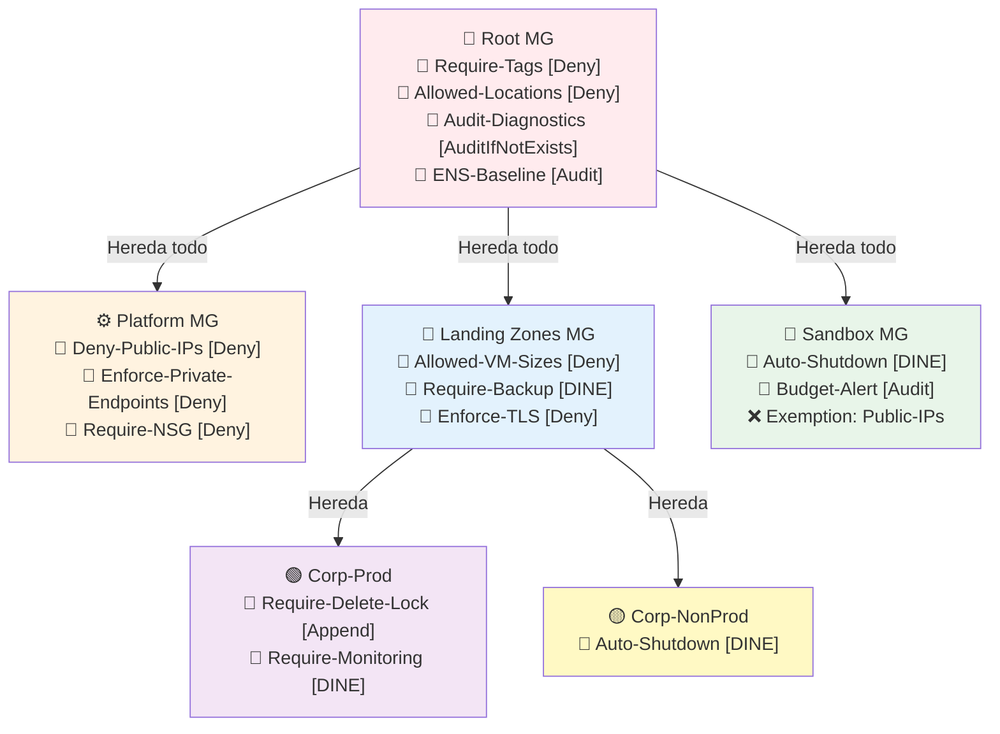

## 📋 1. Resumen

- **Objetivo**: Implementar una estrategia enterprise de Azure Policy para garantizar cumplimiento normativo, seguridad consistente y gobernanza centralizada a través de toda la jerarquía de Management Groups, usando Policy as Code (PaC) con Enterprise Policy as Code (EPAC) como framework principal.

- **Dependencias**:
  - [[Azure-Management-Groups-Enterprise]] - Jerarquía donde se asignan las políticas
  - [[Azure-RBAC]] - Identidades para remediation tasks y policy assignments
  - [[Azure-Log-Analytics]] - Workspace destino para diagnostic settings via policy
  - [[Microsoft-Sentinel]] - SIEM que consume eventos de compliance
  - [[Azure-Automation]] - Runbooks para remediation tasks complejas
  - [[Cost-Management]] - Presupuestos gobernados via policy

> [!tip] Notas Importantes
> - Las políticas con efecto `Deny` pueden bloquear despliegues en producción; prueba siempre en Sandbox primero
> - `DeployIfNotExists` y `Modify` requieren una Managed Identity asignada al Policy Assignment
> - El compliance state se actualiza cada ~24h; usa `az policy state trigger-scan` para forzar evaluación
> - Las Policy Exemptions deben tener fecha de expiración y aprobación formal
> - EPAC es el framework recomendado por Microsoft para Policy as Code a escala enterprise
> - Built-in policies tienen ahora versionado (Public Preview 2024): usa versiones fijas en producción
> - Diagrama de anatomía de políticas: `_assets/diagrams/policy-anatomy.drawio`
> - Terraform modules en `terraform/modules/azure-policy/`

## 🏛️ 2. Arquitectura

### Flujo de Policy as Code con EPAC



### Anatomía de una Azure Policy



### Jerarquía de Assignments y Herencia



**Diagrama detallado**: `_assets/diagrams/policy-assignments-matrix.drawio`

## 🎨 3. Diseño

### Naming Convention

```
Policy Definitions:
  Formato: pol-<category>-<action>-<resource>-<version>
  Ejemplos:
  - pol-sec-deny-publicip-v1
  - pol-net-require-nsg-subnet-v2
  - pol-tag-require-costcenter-v1
  - pol-mon-dine-diagnostics-v3

Policy Initiatives (Sets):
  Formato: ini-<framework>-<scope>
  Ejemplos:
  - ini-security-baseline-platform
  - ini-ens-esquema-nacional-seguridad
  - ini-cis-benchmark-azure
  - ini-cost-governance-landingzones

Policy Assignments:
  Formato: pa-<initiative/policy>-<mg-scope>
  Ejemplos:
  - pa-security-baseline-root
  - pa-require-tags-landingzones
  - pa-auto-shutdown-sandbox
```

### Matriz de Efectos por Entorno

| Efecto | Root MG | Platform | Landing Zones Prod | Landing Zones NonProd | Sandbox |
|--------|---------|----------|--------------------|-----------------------|---------|
| **Deny** | Tags, Locations | PublicIP, Ports | VM Sizes, SKUs | Límites básicos | ❌ Mínimo |
| **DenyAction** | Delete locks | — | Delete recursos críticos | — | — |
| **DeployIfNotExists** | Diagnostics | Private Endpoints | Backup, Monitoring | Monitoring | Auto-Shutdown |
| **Modify** | Tag enforcement | — | Tag inheritance | — | — |
| **Audit** | ENS, CIS | Encryption | Compliance checks | All | All |
| **AuditIfNotExists** | Defender plans | Key Vault logs | Backup status | — | — |

### Categorías de Políticas

| Categoría | Descripción | Iniciativa |
|-----------|-------------|-----------|
| **Security** | Seguridad de red, endpoints, cifrado | `ini-security-baseline` |
| **Tagging** | Etiquetado obligatorio y herencia | `ini-tagging-governance` |
| **Monitoring** | Diagnostic settings, Log Analytics | `ini-monitoring-baseline` |
| **Cost** | VM sizes, auto-shutdown, budgets | `ini-cost-governance` |
| **Compliance** | ENS, CIS, NIST, ISO 27001 | `ini-regulatory-compliance` |
| **Networking** | NSG, Private Endpoints, DNS | `ini-network-governance` |
| **Backup & DR** | Azure Backup, ASR | `ini-bcdr-requirements` |
| **Identity** | MFA, PIM, RBAC | `ini-identity-governance` |

## 📊 4. Observabilidad

### Compliance Dashboard

```json
{
  "Alertas_Compliance": {
    "compliance_drop": {
      "metric": "NonCompliantResources",
      "threshold": "20% increase in 24h",
      "severity": "High",
      "notification": "governance-team@contoso.com"
    },
    "new_deny_triggered": {
      "operation": "Microsoft.Authorization/policyAssignments/deny",
      "severity": "Medium",
      "notification": "platform-team@contoso.com"
    },
    "exemption_expiring": {
      "check": "Exemptions expiring in 7 days",
      "severity": "Medium",
      "notification": "compliance-team@contoso.com"
    },
    "remediation_failed": {
      "operation": "Microsoft.PolicyInsights/remediations/write",
      "status": "Failed",
      "severity": "High",
      "notification": "sre-team@contoso.com"
    }
  }
}
```

### KPIs de Gobernanza

```
Métricas clave a monitorear semanalmente:

├── Overall Compliance Rate
│   ├── Target: > 95% en Production MGs
│   ├── Target: > 80% en NonProd MGs
│   └── Target: > 60% en Sandbox
│
├── Non-Compliant Resources por categoría
│   ├── Security (crítico - resolver en <24h)
│   ├── Tagging (alto - resolver en <72h)
│   └── Monitoring (medio - resolver en <1 semana)
│
├── Policy Exemptions activas
│   ├── Count total (target: < 20 activas)
│   ├── Próximas a expirar (< 7 días)
│   └── Sin fecha de expiración (target: 0)
│
├── Remediation Tasks
│   ├── Pendientes
│   ├── En progreso
│   ├── Completadas (última semana)
│   └── Fallidas (requiere atención)
│
└── EPAC Drift Detection
    ├── Políticas fuera de source control
    ├── Assignments sin definición en repo
    └── Exemptions no registradas en Git
```

### Logs y Diagnósticos

- **Activity Logs**: Todas las operaciones de policy (create, modify, delete, deny triggered)
  - Retención: 90 días en Log Analytics
  - Alertas en Azure Monitor para cambios críticos
  
- **Policy Insights**: Estado de compliance en tiempo real
  - Dashboard URL: `https://portal.azure.com/#view/Microsoft_Azure_Policy/PolicyComplianceBlade`
  - Export a Storage Account para análisis histórico
  
- **AzAdvertizer**: Herramienta externa para explorar y visualizar políticas
  - URL: `https://www.azadvertizer.net/`

### Backup y DR

- **Todo como código**: EPAC en repositorio Git con ramas `main`, `staging`, `dev`
- **State management**: EPAC usa Azure Storage como backend de estado
- **Rollback**: Revert en Git + `epac deploy` restaura estado anterior en minutos
  - RPO: 1 hora (commits frecuentes)
  - RTO: 30 minutos (re-despliegue EPAC)

## ⚙️ 5. Implementación (IaC)

### Estructura EPAC (Enterprise Policy as Code)

```
epac-root/
├── .github/
│   └── workflows/
│       ├── epac-plan.yml          # PR: valida cambios
│       └── epac-deploy.yml        # main: despliega
├── Definitions/
│   ├── policyDefinitions/
│   │   ├── Security/
│   │   │   ├── pol-deny-publicip.jsonc
│   │   │   ├── pol-require-nsg-subnet.jsonc
│   │   │   └── pol-enforce-tls-storage.jsonc
│   │   ├── Tagging/
│   │   │   ├── pol-require-tag-costcenter.jsonc
│   │   │   └── pol-inherit-tags-rg.jsonc
│   │   ├── Monitoring/
│   │   │   ├── pol-dine-diagnostics-vm.jsonc
│   │   │   └── pol-dine-diagnostics-storage.jsonc
│   │   ├── Cost/
│   │   │   ├── pol-deny-vm-size.jsonc
│   │   │   └── pol-dine-autoshutdown.jsonc
│   │   └── Networking/
│   │       ├── pol-require-private-endpoint.jsonc
│   │       └── pol-manage-nsg-subnet.jsonc
│   ├── policySetDefinitions/
│   │   ├── ini-security-baseline.jsonc
│   │   ├── ini-tagging-governance.jsonc
│   │   ├── ini-monitoring-baseline.jsonc
│   │   ├── ini-cost-governance.jsonc
│   │   ├── ini-ens-spain.jsonc
│   │   └── ini-network-governance.jsonc
│   └── global-settings.jsonc
├── Assignments/
│   ├── root-mg/
│   │   ├── pa-security-baseline.jsonc
│   │   ├── pa-tagging-governance.jsonc
│   │   └── pa-monitoring-baseline.jsonc
│   ├── platform-mg/
│   │   └── pa-network-governance.jsonc
│   ├── landingzones-mg/
│   │   ├── pa-cost-governance.jsonc
│   │   └── pa-bcdr-requirements.jsonc
│   └── sandbox-mg/
│       └── pa-sandbox-governance.jsonc
├── Exemptions/
│   └── sandbox/
│       └── exempt-publicip-sandbox.jsonc
└── README.md
```

### Terraform - Módulo de Azure Policy

```hcl
# terraform/modules/azure-policy/main.tf

terraform {
  required_version = ">= 1.5.0"
  required_providers {
    azurerm = {
      source  = "hashicorp/azurerm"
      version = ">= 3.90.0, < 5.0.0"
    }
  }
}

# ─────────────────────────────────────────────
# Custom Policy Definition
# ─────────────────────────────────────────────
resource "azurerm_policy_definition" "this" {
  for_each = var.create ? var.custom_policy_definitions : {}

  name         = each.key
  display_name = each.value.display_name
  description  = each.value.description
  policy_type  = "Custom"
  mode         = each.value.mode # "All" | "Indexed" | "Microsoft.Kubernetes.Data" etc.

  management_group_id = each.value.management_group_id

  metadata = jsonencode({
    category = each.value.category
    version  = each.value.version
  })

  parameters  = each.value.parameters != null ? jsonencode(each.value.parameters) : null
  policy_rule = jsonencode(each.value.policy_rule)
}

# ─────────────────────────────────────────────
# Policy Initiative (Set Definition)
# ─────────────────────────────────────────────
resource "azurerm_policy_set_definition" "this" {
  for_each = var.create ? var.policy_initiatives : {}

  name         = each.key
  display_name = each.value.display_name
  description  = each.value.description
  policy_type  = "Custom"

  management_group_id = each.value.management_group_id

  metadata = jsonencode({
    category = each.value.category
    version  = each.value.version
  })

  parameters = each.value.parameters != null ? jsonencode(each.value.parameters) : null

  dynamic "policy_definition_reference" {
    for_each = each.value.policy_references
    content {
      policy_definition_id = policy_definition_reference.value.policy_definition_id
      reference_id         = policy_definition_reference.value.reference_id
      parameter_values     = policy_definition_reference.value.parameter_values != null ? jsonencode(policy_definition_reference.value.parameter_values) : null
    }
  }

  depends_on = [azurerm_policy_definition.this]
}

# ─────────────────────────────────────────────
# Policy Assignment (con soporte para DINE/Modify → Managed Identity)
# DEPENDENCY: El scope (MG/Subscription/RG) debe existir previamente
# ─────────────────────────────────────────────
resource "azurerm_management_group_policy_assignment" "this" {
  for_each = {
    for k, v in(var.create ? var.policy_assignments : {}) :
    k => v if v.scope_type == "management_group"
  }

  name                 = each.key
  display_name         = each.value.display_name
  description          = each.value.description
  management_group_id  = each.value.scope_id
  policy_definition_id = each.value.policy_definition_id
  enforce              = each.value.enforce # false = "DoNotEnforce" (audit-only mode)
  not_scopes           = each.value.not_scopes

  parameters = each.value.parameters != null ? jsonencode(each.value.parameters) : null

  # Managed Identity requerida para efectos DINE y Modify
  dynamic "identity" {
    for_each = each.value.identity_type != null ? [1] : []
    content {
      type         = each.value.identity_type
      identity_ids = each.value.identity_type == "UserAssigned" ? each.value.identity_ids : null
    }
  }

  location = each.value.identity_type != null ? each.value.location : null

  dynamic "non_compliance_message" {
    for_each = each.value.non_compliance_messages
    content {
      content                        = non_compliance_message.value.content
      policy_definition_reference_id = non_compliance_message.value.reference_id
    }
  }

  depends_on = [
    azurerm_policy_definition.this,
    azurerm_policy_set_definition.this
  ]
}

# ─────────────────────────────────────────────
# Role Assignment para Managed Identity de la Policy
# DEPENDENCY: Requiere que el assignment con managed identity ya exista
# ─────────────────────────────────────────────
resource "azurerm_role_assignment" "policy_remediation" {
  for_each = {
    for k, v in(var.create ? var.policy_assignments : {}) :
    k => v if v.identity_type != null && v.remediation_role != null
  }

  scope                = each.value.remediation_scope != null ? each.value.remediation_scope : each.value.scope_id
  role_definition_name = each.value.remediation_role
  principal_id         = azurerm_management_group_policy_assignment.this[each.key].identity[0].principal_id

  depends_on = [azurerm_management_group_policy_assignment.this]
}

# ─────────────────────────────────────────────
# Remediation Task (para recursos ya existentes no conformes)
# ─────────────────────────────────────────────
resource "azurerm_management_group_policy_remediation" "this" {
  for_each = {
    for k, v in(var.create ? var.policy_assignments : {}) :
    k => v if v.create_remediation_task == true
  }

  name                    = "remediation-${each.key}"
  management_group_id     = each.value.scope_id
  policy_assignment_id    = azurerm_management_group_policy_assignment.this[each.key].id
  resource_discovery_mode = "ReEvaluateCompliance"

  depends_on = [
    azurerm_management_group_policy_assignment.this,
    azurerm_role_assignment.policy_remediation
  ]
}

# ─────────────────────────────────────────────
# Policy Exemption
# DEPENDENCY: El assignment al que se exime debe existir
# ─────────────────────────────────────────────
resource "azurerm_management_group_policy_exemption" "this" {
  for_each = var.create ? var.policy_exemptions : {}

  name                            = each.key
  display_name                    = each.value.display_name
  description                     = each.value.description
  management_group_id             = each.value.scope_id
  policy_assignment_id            = each.value.policy_assignment_id
  exemption_category              = each.value.exemption_category # "Waiver" | "Mitigated"
  expires_on                      = each.value.expires_on         # ISO 8601, obligatorio en este módulo
  policy_definition_reference_ids = each.value.policy_definition_reference_ids
  metadata = each.value.metadata != null ? jsonencode(each.value.metadata) : jsonencode({
    approvedBy   = each.value.approved_by
    ticketNumber = each.value.ticket_number
    reviewDate   = each.value.review_date
  })
}
```

```hcl
# terraform/modules/azure-policy/variables.tf

variable "create" {
  description = "Controla si el módulo crea recursos."
  type        = bool
  default     = true
}

variable "custom_policy_definitions" {
  description = "Mapa de custom policy definitions a crear."
  type = map(object({
    display_name        = string
    description         = string
    mode                = string
    category            = string
    version             = string
    management_group_id = string
    parameters          = optional(any, null)
    policy_rule         = any
  }))
  default = {}
}

variable "policy_initiatives" {
  description = "Mapa de policy initiatives (set definitions) a crear."
  type = map(object({
    display_name        = string
    description         = string
    category            = string
    version             = string
    management_group_id = string
    parameters          = optional(any, null)
    policy_references = list(object({
      policy_definition_id = string
      reference_id         = string
      parameter_values     = optional(any, null)
    }))
  }))
  default = {}
}

variable "policy_assignments" {
  description = "Mapa de policy assignments a Management Groups."
  type = map(object({
    display_name         = string
    description          = string
    scope_type           = string  # "management_group"
    scope_id             = string  # DEPENDENCY: MG debe existir
    policy_definition_id = string
    enforce              = optional(bool, true)
    not_scopes           = optional(list(string), [])
    parameters           = optional(any, null)
    identity_type        = optional(string, null)   # null | "SystemAssigned" | "UserAssigned"
    identity_ids         = optional(list(string), [])
    location             = optional(string, null)   # Requerido si identity_type != null
    remediation_role     = optional(string, null)
    remediation_scope    = optional(string, null)
    create_remediation_task = optional(bool, false)
    non_compliance_messages = optional(list(object({
      content      = string
      reference_id = optional(string, null)
    })), [])
  }))
  default = {}
}

variable "policy_exemptions" {
  description = "Mapa de exemptions. TODAS deben tener expires_on y ticket de aprobación."
  type = map(object({
    display_name                    = string
    description                     = string
    scope_id                        = string
    policy_assignment_id            = string
    exemption_category              = string  # "Waiver" | "Mitigated"
    expires_on                      = string  # ISO 8601 - OBLIGATORIO
    policy_definition_reference_ids = optional(list(string), [])
    approved_by                     = string
    ticket_number                   = string
    review_date                     = string
    metadata                        = optional(any, null)
  }))
  default = {}
}

variable "tags" {
  description = "Tags aplicados a recursos que lo soportan."
  type        = map(string)
  default     = {}
}
```

```hcl
# terraform/modules/azure-policy/outputs.tf

output "policy_definition_ids" {
  description = "Mapa de IDs de custom policy definitions creadas."
  value = {
    for k, v in azurerm_policy_definition.this : k => v.id
  }
}

output "initiative_ids" {
  description = "Mapa de IDs de policy initiatives creadas."
  value = {
    for k, v in azurerm_policy_set_definition.this : k => v.id
  }
}

output "assignment_ids" {
  description = "Mapa de IDs de policy assignments."
  value = {
    for k, v in azurerm_management_group_policy_assignment.this : k => v.id
  }
}

output "assignment_principal_ids" {
  description = "Principal IDs de las Managed Identities de los assignments (para RBAC externo)."
  value = {
    for k, v in azurerm_management_group_policy_assignment.this :
    k => try(v.identity[0].principal_id, null)
    if try(v.identity[0].principal_id, null) != null
  }
}

output "exemption_ids" {
  description = "Mapa de IDs de policy exemptions."
  value = {
    for k, v in azurerm_management_group_policy_exemption.this : k => v.id
  }
}
```

### Ejemplo de Custom Policy Definition (Deny Public IP)

```jsonc
// Definitions/policyDefinitions/Security/pol-deny-publicip.jsonc
{
  "name": "pol-sec-deny-publicip-v1",
  "type": "Microsoft.Authorization/policyDefinitions",
  "properties": {
    "displayName": "[Contoso] Deny creation of Public IP Addresses",
    "description": "Denies creation of Public IP resources except for approved SKUs.",
    "policyType": "Custom",
    "mode": "All",
    "metadata": {
      "category": "Security",
      "version": "1.0.0",
      "preview": false
    },
    "parameters": {
      "effect": {
        "type": "String",
        "allowedValues": ["Deny", "Audit", "Disabled"],
        "defaultValue": "Deny",
        "metadata": {
          "displayName": "Effect",
          "description": "Deny | Audit | Disabled"
        }
      },
      "allowedSKUs": {
        "type": "Array",
        "defaultValue": [],
        "metadata": {
          "displayName": "Allowed Public IP SKUs",
          "description": "Empty array = deny all. Add SKUs to allow specific ones."
        }
      }
    },
    "policyRule": {
      "if": {
        "allOf": [
          {
            "field": "type",
            "equals": "Microsoft.Network/publicIPAddresses"
          },
          {
            "not": {
              "field": "Microsoft.Network/publicIPAddresses/sku.name",
              "in": "[parameters('allowedSKUs')]"
            }
          }
        ]
      },
      "then": {
        "effect": "[parameters('effect')]"
      }
    }
  }
}
```

### Ejemplo de Policy DINE - Diagnostic Settings

```jsonc
// Definitions/policyDefinitions/Monitoring/pol-dine-diagnostics-storage.jsonc
{
  "name": "pol-mon-dine-diagnostics-storage-v2",
  "properties": {
    "displayName": "[Contoso] Deploy Diagnostic Settings for Storage Accounts",
    "description": "Deploys diagnostic settings to Storage Accounts sending logs to central Log Analytics Workspace.",
    "mode": "Indexed",
    "metadata": {
      "category": "Monitoring",
      "version": "2.0.0"
    },
    "parameters": {
      "effect": {
        "type": "String",
        "allowedValues": ["DeployIfNotExists", "AuditIfNotExists", "Disabled"],
        "defaultValue": "DeployIfNotExists"
      },
      "logAnalyticsWorkspaceId": {
        "type": "String",
        "metadata": {
          "displayName": "Log Analytics Workspace Resource ID",
          "description": "DEPENDENCY: Must be an existing Log Analytics Workspace.",
          "strongType": "omsWorkspace"
        }
      }
    },
    "policyRule": {
      "if": {
        "field": "type",
        "equals": "Microsoft.Storage/storageAccounts"
      },
      "then": {
        "effect": "[parameters('effect')]",
        "details": {
          "type": "Microsoft.Insights/diagnosticSettings",
          "roleDefinitionIds": [
            "/providers/Microsoft.Authorization/roleDefinitions/92aaf0da-9dab-42b6-94a3-d43ce8d16293"
          ],
          "deployment": {
            "properties": {
              "mode": "incremental",
              "template": {
                "$schema": "https://schema.management.azure.com/schemas/2019-04-01/deploymentTemplate.json#",
                "contentVersion": "1.0.0.0",
                "parameters": {
                  "resourceName": { "type": "string" },
                  "workspaceId": { "type": "string" }
                },
                "resources": [
                  {
                    "type": "Microsoft.Storage/storageAccounts/providers/diagnosticSettings",
                    "apiVersion": "2021-05-01-preview",
                    "name": "[concat(parameters('resourceName'), '/Microsoft.Insights/setByPolicy')]",
                    "properties": {
                      "workspaceId": "[parameters('workspaceId')]",
                      "logs": [
                        { "category": "StorageRead", "enabled": true },
                        { "category": "StorageWrite", "enabled": true },
                        { "category": "StorageDelete", "enabled": true }
                      ],
                      "metrics": [
                        { "category": "Transaction", "enabled": true }
                      ]
                    }
                  }
                ]
              },
              "parameters": {
                "resourceName": { "value": "[field('name')]" },
                "workspaceId": { "value": "[parameters('logAnalyticsWorkspaceId')]" }
              }
            }
          }
        }
      }
    }
  }
}
```

### Pipeline EPAC (GitHub Actions)

```yaml
# .github/workflows/epac-plan.yml
name: EPAC Plan (PR Validation)

on:
  pull_request:
    branches: [main]
    paths:
      - 'Definitions/**'
      - 'Assignments/**'
      - 'Exemptions/**'

jobs:
  epac-plan:
    runs-on: ubuntu-latest
    permissions:
      id-token: write
      contents: read
      pull-requests: write

    steps:
      - uses: actions/checkout@v4

      - name: Azure Login (OIDC)
        uses: azure/login@v2
        with:
          client-id: ${{ secrets.AZURE_CLIENT_ID }}
          tenant-id: ${{ secrets.AZURE_TENANT_ID }}
          subscription-id: ${{ secrets.AZURE_SUBSCRIPTION_ID }}

      - name: Install EPAC
        shell: pwsh
        run: Install-Module EnterprisePolicyAsCode -Force -AllowClobber

      - name: EPAC Build-DeploymentPlans
        shell: pwsh
        run: |
          Build-DeploymentPlans `
            -DefinitionsRootFolder ./Definitions `
            -OutputFolder ./Output `
            -GlobalSettingsFile ./Definitions/global-settings.jsonc

      - name: PSRule Validation
        uses: microsoft/psrule-action@v2
        with:
          inputPath: './Output'
          modules: 'PSRule.Rules.Azure'
          option: '.ps-rule/ps-rule.yaml'

      - name: Comment PR with Plan
        uses: actions/github-script@v7
        with:
          script: |
            const fs = require('fs');
            const plan = fs.readFileSync('./Output/plan-summary.md', 'utf8');
            github.rest.issues.createComment({
              issue_number: context.issue.number,
              owner: context.repo.owner,
              repo: context.repo.repo,
              body: `## EPAC Deployment Plan\n\n${plan}`
            });
```

```yaml
# .github/workflows/epac-deploy.yml
name: EPAC Deploy (main branch)

on:
  push:
    branches: [main]
    paths:
      - 'Definitions/**'
      - 'Assignments/**'
      - 'Exemptions/**'

jobs:
  deploy-definitions:
    name: Deploy Policy Definitions
    runs-on: ubuntu-latest
    environment: production
    steps:
      - uses: actions/checkout@v4

      - name: Azure Login
        uses: azure/login@v2
        with:
          client-id: ${{ secrets.AZURE_CLIENT_ID }}
          tenant-id: ${{ secrets.AZURE_TENANT_ID }}
          subscription-id: ${{ secrets.AZURE_SUBSCRIPTION_ID }}

      - name: Install EPAC
        shell: pwsh
        run: Install-Module EnterprisePolicyAsCode -Force

      - name: Deploy Policy Definitions
        shell: pwsh
        run: |
          Deploy-PolicyPlan `
            -DefinitionsRootFolder ./Definitions `
            -PlanFile ./Output/policy-plan.json

  deploy-assignments:
    name: Deploy Policy Assignments
    needs: deploy-definitions
    runs-on: ubuntu-latest
    environment: production
    steps:
      - uses: actions/checkout@v4
      - name: Azure Login
        uses: azure/login@v2
        with:
          client-id: ${{ secrets.AZURE_CLIENT_ID }}
          tenant-id: ${{ secrets.AZURE_TENANT_ID }}
          subscription-id: ${{ secrets.AZURE_SUBSCRIPTION_ID }}

      - name: Deploy Assignments
        shell: pwsh
        run: |
          Deploy-RolesPlan `
            -DefinitionsRootFolder ./Definitions `
            -PlanFile ./Output/roles-plan.json
```

## 🔒 6. Seguridad

### Políticas Críticas por Dominio

#### Seguridad de Red

```json
{
  "network_policies": [
    {
      "name": "Deny-Public-IPs",
      "effect": "Deny",
      "scope": "Platform MG",
      "description": "Previene exposición accidental a internet"
    },
    {
      "name": "Require-NSG-Subnet",
      "effect": "Deny",
      "scope": "Landing Zones MG",
      "description": "Toda subnet debe tener NSG asociado",
      "ref": "https://techcommunity.microsoft.com/blog/azurenetworkingblog/manage-nsg-association-on-subnets-via-azure-policy/4243157"
    },
    {
      "name": "Enforce-Private-Endpoints",
      "effect": "Deny",
      "scope": "Platform + Corp Prod",
      "description": "Storage, SQL, KeyVault deben usar Private Endpoints"
    },
    {
      "name": "DNS-Private-Endpoint",
      "effect": "DeployIfNotExists",
      "scope": "Landing Zones MG",
      "description": "Registra automáticamente Private Endpoints en DNS privado"
    }
  ]
}
```

#### Cumplimiento ENS (España)

```json
{
  "ens_initiative": {
    "name": "ini-ens-spain",
    "displayName": "Spain ENS - Esquema Nacional de Seguridad",
    "description": "Initiative aligning with Spain's National Security Framework",
    "ref": "https://learn.microsoft.com/es-es/azure/governance/policy/samples/spain-ens",
    "categories": [
      "Acceso al sistema",
      "Gestión de activos",
      "Continuidad del negocio",
      "Control de acceso",
      "Criptografía",
      "Auditoría y responsabilidad"
    ]
  }
}
```

#### Seguridad de Datos

```json
{
  "data_security_policies": [
    {
      "name": "Require-Encryption-At-Rest",
      "effect": "Deny",
      "resources": ["Storage", "SQL", "CosmosDB", "KeyVault"]
    },
    {
      "name": "Enforce-TLS-1.2-Minimum",
      "effect": "Deny",
      "resources": ["Storage", "AppService", "APIManagement"]
    },
    {
      "name": "Deny-HTTP-AppService",
      "effect": "Deny",
      "description": "Fuerza HTTPS en todas las App Services"
    }
  ]
}
```

### DenyAction - Protección contra Borrado

```json
{
  "denyaction_policies": [
    {
      "name": "DenyAction-Delete-Recovery-Vault",
      "effect": "DenyAction",
      "action": "delete",
      "resource": "Microsoft.RecoveryServices/vaults",
      "description": "Previene borrado accidental de Recovery Services Vaults",
      "ref": "https://journeyofthegeek.com/2024/05/08/azure-authorization-resource-locks-and-azure-policy-denyactions/"
    },
    {
      "name": "DenyAction-Delete-Network-Hub",
      "effect": "DenyAction",
      "action": "delete",
      "resource": "Microsoft.Network/virtualNetworks",
      "scope": "Connectivity MG"
    }
  ]
}
```

### Govern de Identidad y RBAC para Policy

```yaml
Policy Management Permissions:
  Root MG:
    - Resource Policy Contributor: Governance-Team-Group
    - Policy Insights Data Writer: Automation-Service-Principal

  All MGs:
    - Reader: Security-Team (para auditoría de compliance)

  Remediation Managed Identities (por assignment):
    DINE-Diagnostics:
      - Role: Log Analytics Contributor
      - Scope: Landing Zones MG

    DINE-Backup:
      - Role: Backup Contributor
      - Scope: Corp-Prod MG

    Modify-Tags:
      - Role: Tag Contributor
      - Scope: Root MG

Custom Role "Policy Exemption Manager":
  Actions:
    - Microsoft.Authorization/policyExemptions/write
    - Microsoft.Authorization/policyExemptions/delete
    - Microsoft.Authorization/policyExemptions/read
  AssignableScope: Root MG
  Principals: Governance-Team-Group (via PIM)
```

## 💰 7. Costes

### Modelo de Costes de Azure Policy

| Rango de Recursos | Coste por operación |
|-------------------|---------------------|
| Primeros 1,000 recursos | **Gratuito** |
| 1,001 – 10,000 recursos | $0.50 / 100 recursos evaluados |
| 10,001 – 100,000 recursos | $0.30 / 100 recursos evaluados |
| > 100,000 recursos | $0.20 / 100 recursos evaluados |

> **Nota**: Solo cuentan evaluaciones de políticas con Guest Configuration, las demás son gratuitas. Las políticas de Regulatory Compliance (ENS, CIS, etc.) pueden tener coste.

### Estimación para Enterprise (500+ suscripciones)

| Componente | Coste Mensual Estimado |
|------------|------------------------|
| Azure Policy (evaluaciones) | ~$200/mes |
| Log Analytics (compliance logs) | ~$150/mes |
| EPAC Storage Account | ~$5/mes |
| GitHub Actions (CI/CD) | ~$20/mes |
| **Total** | **~$375/mes** |

### ROI de Gobernanza via Policy

| Ahorro | Mecanismo | Impacto Anual |
|--------|-----------|---------------|
| **Prevención de over-provisioning** | Deny VM sizes costosas | $45,000 |
| **Auto-shutdown dev/test** | DINE auto-shutdown 18:00 | $28,000 |
| **Prevención de recursos huérfanos** | Require-Tags → visibilidad | $15,000 |
| **Remediación automática** | DINE vs remediación manual | $20,000 (tiempo técnico) |
| **Compliance automático** | Evitar multas/auditorías | $50,000+ |
| **Total estimado** | | **~$158,000/año** |

### Cost Governance via Policy

```bash
# Policy que fuerza tags de CostCenter en todos los recursos
az policy assignment create \
  --name "require-costcenter-tag" \
  --display-name "Require CostCenter tag" \
  --policy "/providers/Microsoft.Authorization/policyDefinitions/1e30110a-5ceb-460c-a204-c1c3969c6d62" \
  --scope "/providers/Microsoft.Management/managementGroups/mg-root" \
  --params '{"tagName": {"value": "CostCenter"}}'

# Policy que hereda tags del Resource Group a recursos hijos
az policy assignment create \
  --name "inherit-rg-tags" \
  --policy-set-definition "Inherit a tag from the resource group" \
  --scope "/providers/Microsoft.Management/managementGroups/mg-root"
```

## 🧪 8. Pruebas y Validación

### Azure CLI

```bash
# ============================================
# GESTIÓN DE POLICY DEFINITIONS
# ============================================

# Listar custom policies en un Management Group
az policy definition list \
  --management-group "mg-root" \
  --query "[?policyType=='Custom'].{Name:displayName, Mode:mode, Category:metadata.category}" \
  -o table

# Ver detalles de una policy definition
az policy definition show \
  --name "pol-sec-deny-publicip-v1" \
  --management-group "mg-root"

# Crear custom policy desde archivo JSON
az policy definition create \
  --name "pol-sec-deny-publicip-v1" \
  --display-name "[Contoso] Deny Public IPs" \
  --description "Denies creation of Public IP resources" \
  --rules "policy-rules.json" \
  --params "policy-params.json" \
  --mode "All" \
  --management-group "mg-root"

# Listar built-in policies por categoría
az policy definition list \
  --query "[?policyType=='BuiltIn' && metadata.category=='Security'].{Name:displayName, ID:name}" \
  -o table

# ============================================
# GESTIÓN DE INITIATIVES
# ============================================

# Listar todas las initiatives
az policy set-definition list \
  --management-group "mg-root" \
  --query "[?policyType=='Custom'].{Name:displayName, Policies:length(policyDefinitions)}" \
  -o table

# Ver políticas en una initiative
az policy set-definition show \
  --name "ini-security-baseline" \
  --management-group "mg-root" \
  --query "policyDefinitions[].{Policy:policyDefinitionId, Effect:parameters.effect.defaultValue}" \
  -o table

# ============================================
# GESTIÓN DE ASSIGNMENTS
# ============================================

# Listar todos los assignments en un MG (heredados inclusive)
az policy assignment list \
  --scope "/providers/Microsoft.Management/managementGroups/mg-corp-prod" \
  --disable-scope-strict-match \
  --query "[].{Name:displayName, Enforce:enforcementMode, Scope:scope}" \
  -o table

# Crear assignment con Managed Identity (para DINE)
az policy assignment create \
  --name "pa-diagnostics-baseline" \
  --display-name "Deploy Diagnostic Settings" \
  --policy-set-definition "ini-monitoring-baseline" \
  --scope "/providers/Microsoft.Management/managementGroups/mg-root" \
  --mi-system-assigned \
  --location "westeurope" \
  --identity-scope "/providers/Microsoft.Management/managementGroups/mg-root" \
  --role "Log Analytics Contributor"

# Deshabilitar enforcement (modo DoNotEnforce / Audit-only)
az policy assignment update \
  --name "pa-diagnostics-baseline" \
  --scope "/providers/Microsoft.Management/managementGroups/mg-root" \
  --enforcement-mode DoNotEnforce

# ============================================
# COMPLIANCE Y REMEDIATION
# ============================================

# Forzar evaluación de compliance (trigger scan)
az policy state trigger-scan \
  --resource-group "rg-app-prod"

# Ver resumen de compliance por Management Group
az policy state summarize \
  --management-group "mg-corp-prod" \
  --query "{Compliant:results.resourceDetails[?complianceState=='Compliant'].count, NonCompliant:results.resourceDetails[?complianceState=='NonCompliant'].count}"

# Listar recursos no conformes con detalle
az policy state list \
  --management-group "mg-corp-prod" \
  --filter "complianceState eq 'NonCompliant'" \
  --query "[].{Resource:resourceId, Policy:policyDefinitionName, Effect:additionalProperties.policyDefinitionEffect}" \
  -o table

# Crear Remediation Task
az policy remediation create \
  --name "remediate-diagnostics-$(date +%Y%m%d)" \
  --management-group "mg-corp-prod" \
  --policy-assignment "pa-diagnostics-baseline" \
  --resource-discovery-mode ReEvaluateCompliance

# Ver estado de remediation tasks
az policy remediation list \
  --management-group "mg-corp-prod" \
  --query "[].{Name:name, Status:properties.provisioningState, Succeeded:properties.deploymentStatus.successfulDeployments, Failed:properties.deploymentStatus.failedDeployments}" \
  -o table

# ============================================
# EXEMPTIONS
# ============================================

# Crear exemption con expiración obligatoria
az policy exemption create \
  --name "exempt-publicip-sandbox-2026" \
  --display-name "Temporary: Allow Public IPs in Sandbox" \
  --scope "/providers/Microsoft.Management/managementGroups/mg-sandbox" \
  --policy-assignment "/providers/Microsoft.Management/managementGroups/mg-root/providers/Microsoft.Authorization/policyAssignments/pa-deny-publicip-root" \
  --exemption-category Waiver \
  --expires-on "2026-06-30T00:00:00Z" \
  --description "Approved by: Governance Team | Ticket: GOV-2026-042 | Justification: Dev testing requires public access"

# Listar exemptions activas
az policy exemption list \
  --scope "/providers/Microsoft.Management/managementGroups/mg-root" \
  --query "[].{Name:displayName, Category:properties.exemptionCategory, Expires:properties.expiresOn}" \
  -o table

# ============================================
# EPAC WORKFLOW
# ============================================

# Instalar EPAC
Install-Module EnterprisePolicyAsCode -Force

# Build deployment plans
Build-DeploymentPlans \
  -DefinitionsRootFolder ./Definitions \
  -OutputFolder ./Output

# Deploy definitions
Deploy-PolicyPlan \
  -DefinitionsRootFolder ./Definitions \
  -PlanFile ./Output/policy-plan.json

# Export current state to source control
Export-AzPolicyResources \
  -DefinitionsRootFolder ./ExportedDefinitions \
  -Mode Export
```

### PowerShell

```powershell
# ============================================
# VALIDACIÓN DE ESTRUCTURA
# ============================================

Connect-AzAccount

# Listar todas las custom policies de un tenant
Get-AzPolicyDefinition -Custom |
  Select-Object -Property `
    @{N="Name"; E={$_.Properties.DisplayName}},
    @{N="Category"; E={$_.Properties.Metadata.Category}},
    @{N="Mode"; E={$_.Properties.Mode}},
    @{N="Effect"; E={$_.Properties.PolicyRule.then.effect}} |
  Format-Table -AutoSize

# Ver compliance general del tenant
Get-AzPolicyStateSummary -ManagementGroupName (Get-AzContext).Tenant.Id |
  Select-Object -ExpandProperty Results

# Exportar todas las non-compliant resources a CSV
Get-AzPolicyState `
  -ManagementGroupName "mg-corp-prod" `
  -Filter "complianceState eq 'NonCompliant'" |
  Select-Object ResourceId, PolicyDefinitionName, PolicyAssignmentName, ComplianceState |
  Export-Csv "./reports/noncompliant-$(Get-Date -Format 'yyyyMMdd').csv" -NoTypeInformation

# ============================================
# GESTIÓN DE ASSIGNMENTS
# ============================================

# Obtener todos los assignments con managed identity
Get-AzPolicyAssignment `
  -Scope "/providers/Microsoft.Management/managementGroups/mg-root" `
  -IncludeDescendent |
  Where-Object { $_.Identity.Type -ne $null } |
  Select-Object Name, @{N="IdentityType"; E={$_.Identity.Type}},
    @{N="PrincipalId"; E={$_.Identity.PrincipalId}} |
  Format-Table

# Verificar role assignments de managed identities de policies
$policyAssignments = Get-AzPolicyAssignment `
  -Scope "/providers/Microsoft.Management/managementGroups/mg-root" `
  -IncludeDescendent |
  Where-Object { $_.Identity.Type -eq "SystemAssigned" }

foreach ($pa in $policyAssignments) {
  $roles = Get-AzRoleAssignment -ObjectId $pa.Identity.PrincipalId
  if (-not $roles) {
    Write-Warning "Policy Assignment '$($pa.Properties.DisplayName)' has no role assignments!"
  }
}

# ============================================
# REMEDIATION MONITORING
# ============================================

function Get-PolicyRemediationStatus {
  param([string]$ManagementGroupId)

  $remediations = Get-AzPolicyRemediation -ManagementGroupId $ManagementGroupId

  $summary = $remediations | Group-Object { $_.ProvisioningState } |
    Select-Object Name, Count

  Write-Host "`n=== Remediation Summary for $ManagementGroupId ===" -ForegroundColor Cyan
  $summary | Format-Table

  $failed = $remediations | Where-Object { $_.ProvisioningState -eq "Failed" }
  if ($failed) {
    Write-Warning "Failed remediations detected:"
    $failed | Select-Object Name, PolicyAssignmentId | Format-Table
  }
}

Get-PolicyRemediationStatus -ManagementGroupId "mg-corp-prod"

# ============================================
# COMPLIANCE REPORT GENERATOR
# ============================================

function New-PolicyComplianceReport {
  param(
    [string]$ManagementGroupId,
    [string]$OutputPath = "./reports"
  )

  $date = Get-Date -Format 'yyyy-MM-dd'
  $states = Get-AzPolicyState -ManagementGroupName $ManagementGroupId
  $summary = $states | Group-Object ComplianceState |
    Select-Object @{N="State"; E={$_.Name}}, Count

  $byPolicy = $states |
    Where-Object { $_.ComplianceState -eq "NonCompliant" } |
    Group-Object PolicyDefinitionName |
    Select-Object @{N="Policy"; E={$_.Name}}, Count |
    Sort-Object Count -Descending

  $html = @"
<!DOCTYPE html>
<html>
<head><title>Policy Compliance Report - $date</title></head>
<body>
<h1>Azure Policy Compliance Report</h1>
<h2>Management Group: $ManagementGroupId</h2>
<h3>Date: $date</h3>
<h2>Summary</h2>
$(($summary | ConvertTo-Html -Fragment))
<h2>Top Non-Compliant Policies</h2>
$(($byPolicy | Select-Object -First 20 | ConvertTo-Html -Fragment))
</body>
</html>
"@

  New-Item -ItemType Directory -Path $OutputPath -Force | Out-Null
  $html | Out-File "$OutputPath/compliance-report-$date.html"
  $states | Export-Csv "$OutputPath/compliance-raw-$date.csv" -NoTypeInformation
  Write-Host "Report saved to $OutputPath" -ForegroundColor Green
}

New-PolicyComplianceReport -ManagementGroupId "mg-root"
```

### Tests Automatizados (Pester + PSRule)

```powershell
# tests/AzurePolicy.Tests.ps1
Describe "Azure Policy Governance Tests" {

  BeforeAll {
    Connect-AzAccount -Identity
    $tenantId = (Get-AzContext).Tenant.Id
  }

  Context "Policy Definition Quality" {

    It "All custom policies should have a version in metadata" {
      $policies = Get-AzPolicyDefinition -Custom
      foreach ($policy in $policies) {
        $policy.Properties.Metadata.Version | Should -Not -BeNullOrEmpty `
          -Because "$($policy.Properties.DisplayName) must be versioned"
      }
    }

    It "All custom policies should have a category" {
      $policies = Get-AzPolicyDefinition -Custom
      foreach ($policy in $policies) {
        $policy.Properties.Metadata.Category | Should -Not -BeNullOrEmpty
      }
    }

    It "DINE policies should use parameterized effect" {
      $dinePolicies = Get-AzPolicyDefinition -Custom |
        Where-Object { $_.Properties.PolicyRule.then.effect -like "*DeployIfNotExists*" }
      foreach ($policy in $dinePolicies) {
        $effect = $policy.Properties.PolicyRule.then.effect
        $effect | Should -Match "\[parameters\(" `
          -Because "Effects should be parameterized, not hardcoded"
      }
    }
  }

  Context "Assignment Coverage" {

    It "Root MG should have Require-Tags policy" {
      $assignment = Get-AzPolicyAssignment `
        -Scope "/providers/Microsoft.Management/managementGroups/$tenantId" |
        Where-Object { $_.Properties.DisplayName -match "tag" }
      $assignment | Should -Not -BeNullOrEmpty
    }

    It "All Production MGs should have backup policy assigned" {
      $prodMGs = Get-AzManagementGroup |
        Where-Object { $_.DisplayName -like "*Production*" -or $_.DisplayName -like "*Prod*" }
      foreach ($mg in $prodMGs) {
        $backupPolicy = Get-AzPolicyAssignment -Scope $mg.Id |
          Where-Object { $_.Properties.DisplayName -match "backup" }
        $backupPolicy | Should -Not -BeNullOrEmpty `
          -Because "$($mg.DisplayName) must enforce backup"
      }
    }

    It "DINE assignments should have managed identity" {
      $allAssignments = Get-AzPolicyAssignment `
        -Scope "/providers/Microsoft.Management/managementGroups/$tenantId" `
        -IncludeDescendent
      foreach ($pa in $allAssignments) {
        $policyDef = Get-AzPolicyDefinition -Id $pa.Properties.PolicyDefinitionId -ErrorAction SilentlyContinue
        if ($policyDef.Properties.PolicyRule.then.effect -like "*DeployIfNotExists*") {
          $pa.Identity | Should -Not -BeNullOrEmpty `
            -Because "$($pa.Properties.DisplayName) is DINE and needs managed identity"
        }
      }
    }
  }

  Context "Exemption Governance" {

    It "All exemptions should have expiration date" {
      $exemptions = Get-AzPolicyExemption -Scope "/providers/Microsoft.Management/managementGroups/$tenantId"
      foreach ($ex in $exemptions) {
        $ex.Properties.ExpiresOn | Should -Not -BeNullOrEmpty `
          -Because "Exemption '$($ex.Properties.DisplayName)' must have expiry date"
      }
    }

    It "No exemptions should be expired" {
      $exemptions = Get-AzPolicyExemption -Scope "/providers/Microsoft.Management/managementGroups/$tenantId"
      $expired = $exemptions | Where-Object {
        $_.Properties.ExpiresOn -ne $null -and
        [DateTime]$_.Properties.ExpiresOn -lt (Get-Date)
      }
      $expired | Should -BeNullOrEmpty -Because "Expired exemptions must be removed"
    }
  }

  Context "Compliance Thresholds" {

    It "Production MGs compliance rate should exceed 90%" {
      $states = Get-AzPolicyState -ManagementGroupName "mg-corp-prod"
      $total = $states.Count
      $compliant = ($states | Where-Object { $_.ComplianceState -eq "Compliant" }).Count
      $rate = if ($total -gt 0) { ($compliant / $total) * 100 } else { 100 }
      $rate | Should -BeGreaterThan 90 -Because "Production compliance must exceed 90%"
    }
  }
}

Invoke-Pester -Path "./tests/AzurePolicy.Tests.ps1" -Output Detailed
```

## 📝 9. Decisiones (ADR)

### ADR-001: EPAC como framework principal de Policy as Code

- **Fecha**: 2025-09-01
- **Estado**: ✅ Aceptado
- **Contexto**: Necesitábamos gestionar 200+ policy assignments a través de 15 Management Groups de forma reproducible y auditada
- **Decisión**: Adoptar Enterprise Policy as Code (EPAC) como framework oficial de Policy as Code
- **Alternativas consideradas**:
  1. Terraform puro (azurerm provider)
  2. Bicep + ARM Templates
  3. Azure CLI scripts en pipelines
  4. Manual via portal
- **Consecuencias**:
  - ✅ Framework diseñado específicamente para Azure Policy a escala
  - ✅ Soporte oficial de Microsoft
  - ✅ Integración nativa con AMBA (Azure Monitor Baseline Alerts)
  - ✅ Drift detection incorporado
  - ✅ Export de estado actual a código
  - ⚠️ Curva de aprendizaje en JSONC y estructura EPAC
  - ⚠️ Dependencia de módulo PowerShell (no HCL)
  - ⚠️ No gestiona otros recursos Azure (solo policy)

### ADR-002: Efecto parametrizado en todas las custom policies

- **Fecha**: 2025-09-15
- **Estado**: ✅ Aceptado
- **Contexto**: Necesitábamos poder cambiar el efecto (Deny→Audit) sin modificar la definición
- **Decisión**: Toda custom policy debe exponer el efecto como parámetro con `defaultValue` apropiado por entorno
- **Consecuencias**:
  - ✅ Una definición → múltiples comportamientos según entorno
  - ✅ Rollout gradual: empezar en Audit, promover a Deny
  - ✅ Testing seguro en Sandbox sin riesgo de bloqueos
  - ⚠️ Assignments más verbosos con parámetros

### ADR-003: Versionado explícito de built-in policies en assignments

- **Fecha**: 2025-11-01
- **Estado**: ✅ Aceptado
- **Contexto**: Microsoft actualiza built-in policies automáticamente, lo que puede romper comportamientos esperados
- **Decisión**: Usar versiones fijas en Policy Assignments en producción (feature en Public Preview 2024)
- **Ref**: Public Preview Built-in Policy Versioning: `https://techcommunity.microsoft.com/t5/azure-governance-and-management/public-preview-announcement-azure-policy-built-in-versioning/ba-p/4186105`
- **Consecuencias**:
  - ✅ Cambios en built-ins no afectan producción sin revisión
  - ✅ Pipeline de actualización controlada de versiones
  - ⚠️ Requiere proceso activo de actualización de versiones

### ADR-004: Exemptions siempre con expiración y ticket

- **Fecha**: 2025-10-01
- **Estado**: ✅ Aceptado
- **Contexto**: Las exemptions sin control crean deuda de gobernanza
- **Decisión**: Toda exemption DEBE tener: `expires_on` (máximo 90 días), `approvedBy`, `ticketNumber` en metadata
- **Consecuencias**:
  - ✅ No hay exemptions eternas
  - ✅ Trazabilidad completa de excepciones
  - ✅ Revisión trimestral obligatoria
  - ⚠️ Proceso formal de aprobación requerido

### ADR-005: Initiative de Monitoring aplicada en Root MG

- **Fecha**: 2025-10-20
- **Estado**: ✅ Aceptado
- **Contexto**: Necesitábamos garantizar que TODOS los recursos envíen telemetría a Log Analytics
- **Decisión**: DINE Diagnostic Settings initiative asignada en Root MG, en modo `DoNotEnforce` inicialmente, promovida a `Enforce` tras 60 días
- **Consecuencias**:
  - ✅ Cobertura de monitoring al 100% del tenant
  - ✅ Remediación automática de recursos existentes
  - ⚠️ Managed Identity con permisos amplios sobre el tenant

### ADR-006: AMBA para alertas de Azure Monitor vía Policy

- **Fecha**: 2025-12-01
- **Estado**: ✅ Aceptado
- **Contexto**: Necesitábamos alertas de monitoreo consistentes sin configuración manual
- **Decisión**: Adoptar Azure Monitor Baseline Alerts (AMBA) deployado via EPAC
- **Ref**: `https://www.azuredoctor.com/posts/automate-azure-alerts-with-amba/`
- **Consecuencias**:
  - ✅ Alertas baseline para 40+ tipos de recursos automáticamente
  - ✅ Mantenido por Microsoft/comunidad
  - ✅ Integración nativa con EPAC
  - ⚠️ Requiere Action Groups configurados previamente

## 🔗 10. Referencias

| Descripción | URL | Notas |
|-------------|-----|-------|
| **Documentación oficial Azure Policy** | https://learn.microsoft.com/es-es/azure/governance/policy/ | Microsoft Docs ES |
| **ALZ Policies - La Biblia** | https://github.com/Azure/Enterprise-Scale/wiki/ALZ-Policies | Políticas oficiales de Landing Zones |
| **ALZ Policy Refresh Q1 FY25** | https://github.com/Azure/Enterprise-Scale/wiki/Whats-new#-policy-refresh-q1-fy25 | Últimas actualizaciones de políticas ALZ |
| **EPAC - Enterprise Policy as Code** | https://azure.github.io/enterprise-azure-policy-as-code/ | Framework oficial de PaC |
| **EPAC Revisiting v10** | https://techcommunity.microsoft.com/t5/core-infrastructure-and-security/revisiting-enterprise-policy-as-code-v10/ba-p/4128448 | Actualización mayor de EPAC |
| **azure-policy (repositorio oficial)** | https://github.com/Azure/azure-policy | Código fuente built-in policies |
| **Community Policy repo** | https://github.com/Azure/Community-Policy/tree/main/Policies | Políticas contribuidas por comunidad |
| **Custom Policies con Terraform** | https://www.lindbergtech.com/write-your-own-custom-azure-policies-with-terraform/ | Guía práctica Terraform + Policy |
| **Custom Policy Builder** | https://github.com/carlzxc71/azure-policy-custompolicy | Herramienta para crear custom policies |
| **AzAdvertizer** | https://www.azadvertizer.net/ | Explorador de policies, initiatives, roles |
| **Awesome Azure Policy** | https://github.com/globalbao/awesome-azure-policy | Colección curada de recursos |
| **ENS Spain** | https://learn.microsoft.com/es-es/azure/governance/policy/samples/spain-ens | Initiative ENS para administraciones españolas |
| **Policy Anatomy Part 1** | https://laythchebbi.com/index.php/2024/05/26/azure-policy-anatomy/ | Anatomía detallada de policies |
| **Policy Anatomy Part 2** | https://laythchebbi.com/index.php/2024/06/09/azure-policy-anatomy-part-2-building-custom-policies-and-azure-governance/ | Custom policies avanzadas |
| **Built-in Policy Versioning (Preview)** | https://techcommunity.microsoft.com/t5/azure-governance-and-management/public-preview-announcement-azure-policy-built-in-versioning/ba-p/4186105 | Versionado de built-in policies |
| **NSG Association via Policy** | https://techcommunity.microsoft.com/blog/azurenetworkingblog/manage-nsg-association-on-subnets-via-azure-policy/4243157 | Gestionar NSG en subnets via policy |
| **IaC Testing with Policy** | https://techcommunity.microsoft.com/t5/core-infrastructure-and-security/infrastructure-as-code-testing-with-azure-policy/ba-p/3921765 | Tests de IaC con Policy + PSRule |
| **Policy Recommended Practices** | https://techcommunity.microsoft.com/t5/core-infrastructure-and-security/azure-policy-recommended-practices/ba-p/3798024 | Best practices oficiales |
| **Cost Governance with Policy** | https://techcommunity.microsoft.com/t5/core-infrastructure-and-security/cost-governance-with-azure-policy/ba-p/3791888 | Gobernanza de costes |
| **DenyActions & Resource Locks** | https://journeyofthegeek.com/2024/05/08/azure-authorization-resource-locks-and-azure-policy-denyactions/ | DenyAction effect explicado |
| **Policy Modify Effect** | https://www.georgeollis.com/azure-policy-modify/ | Guía del efecto Modify |
| **AMBA - Azure Monitor Baseline Alerts** | https://github.com/Azure/alz-monitor/wiki/Introduction-to-deploying-ALZ-Monitor | Alertas baseline vía Policy |
| **Deploy AMBA with EPAC** | https://www.markou.me/2024/04/deploy-azure-monitor-baseline-alerts-with-enterprise-policy-as-code/ | Integración AMBA + EPAC |
| **AzurePolicyAgents** | https://github.com/Azure/AzurePolicyAgents/tree/main | Agentes de Policy |
| **Policy Assessment Tool** | https://github.com/ripom/AzurePolicyAssessment | Herramienta de evaluación |
| **DNS Private Endpoint via Policy** | https://blog.cloud63.fr/azure-private-endpoint-dns-integration-one-policy-to-rule-them-all/amp/ | DNS integration con Policy |
| **Backup VMs via Policy** | https://charbelnemnom.com/enable-azure-backup-on-vms-using-azure-policy/ | Habilitar backup automático |
| **Implementing Governance with Policy** | https://techcommunity.microsoft.com/t5/core-infrastructure-and-security/implementing-governance-for-your-azure-cloud-using-azure-policy/ba-p/4251248 | Guía completa de implementación |
| **EPAC Cloud Tips** | https://cloudtips.nl/azure-enterprise-policy-as-code-epac-534047d31270 | Introducción práctica a EPAC |
| **Training: Configure RBAC** | https://learn.microsoft.com/es-es/training/modules/configure-role-based-access-control/8-simulation-role-based | Lab interactivo RBAC |
| **Training: Configure Azure Policy** | https://learn.microsoft.com/es-es/training/modules/configure-azure-policy/9-simulation-policy | Lab interactivo Policy |
| **Training: ARM Templates** | https://learn.microsoft.com/es-es/training/modules/configure-resources-arm-templates/7-simulation-template | Lab ARM Templates |
| **Training: Azure PowerShell** | https://learn.microsoft.com/es-es/training/modules/configure-azure-resources-tools/5-simulation-powershell | Lab PowerShell |
| **Training: Azure CLI** | https://learn.microsoft.com/es-es/training/modules/configure-azure-resources-tools/7-simulation-command-line | Lab CLI |

---

## 📚 Recursos Adicionales

### Scripts Útiles

- **Export Policy State**: `scripts/export-policy-state.ps1` → Exporta estado actual a EPAC
- **Compliance Report**: `scripts/generate-compliance-report.ps1` → Reporte HTML semanal
- **Remediation Trigger**: `scripts/trigger-remediation.ps1` → Lanza remediación masiva
- **Exemption Audit**: `scripts/audit-exemptions.ps1` → Lista exemptions próximas a expirar
- **Policy Drift Check**: `scripts/check-epac-drift.ps1` → Detecta drift vs source control

### Diagramas

- **Policy Anatomy**: `_assets/diagrams/policy-anatomy.drawio`
- **EPAC Pipeline**: `_assets/diagrams/epac-cicd-flow.drawio`
- **Assignment Matrix**: `_assets/diagrams/policy-assignments-matrix.xlsx`
- **Effect Decision Tree**: `_assets/diagrams/policy-effect-decision-tree.drawio`

### Runbooks

- **Nueva Custom Policy**: `runbooks/create-custom-policy.md`
- **Proceso de Exemption**: `runbooks/policy-exemption-request.md`
- **Rollout de Deny Policy**: `runbooks/deny-policy-rollout.md` (Audit → Enforce en fases)
- **Remediation Masiva**: `runbooks/mass-remediation.md`
- **Actualización de Built-in**: `runbooks/update-builtin-policy-version.md`

---

**Última actualización**: 2026-02-18
**Próxima revisión**: 2026-05-18
**Owner**: Luis Adán Muñoz (@LuisAdan)
**Reviewers**: Platform Team, Security Team, Compliance Team

---

## 🎯 Quick Start Commands

```bash
# Ver compliance actual del tenant
az policy state summarize --management-group "$(az account show --query tenantId -o tsv)"

# Ver top 10 non-compliant policies
az policy state list --management-group "mg-root" \
  --filter "complianceState eq 'NonCompliant'" \
  --query "[].policyDefinitionName" -o tsv | sort | uniq -c | sort -rn | head -10

# Desplegar con EPAC
Build-DeploymentPlans -DefinitionsRootFolder ./Definitions -OutputFolder ./Output
Deploy-PolicyPlan -DefinitionsRootFolder ./Definitions -PlanFile ./Output/policy-plan.json

# Generar reporte de compliance
pwsh ./scripts/generate-compliance-report.ps1 -ManagementGroupId "mg-root"

# Auditar exemptions próximas a expirar
pwsh ./scripts/audit-exemptions.ps1 -DaysToExpiry 14
```

---

**¿Preguntas?** Contacta al equipo de Governance en Slack: `#governance-team` o abre un issue en el repositorio.
