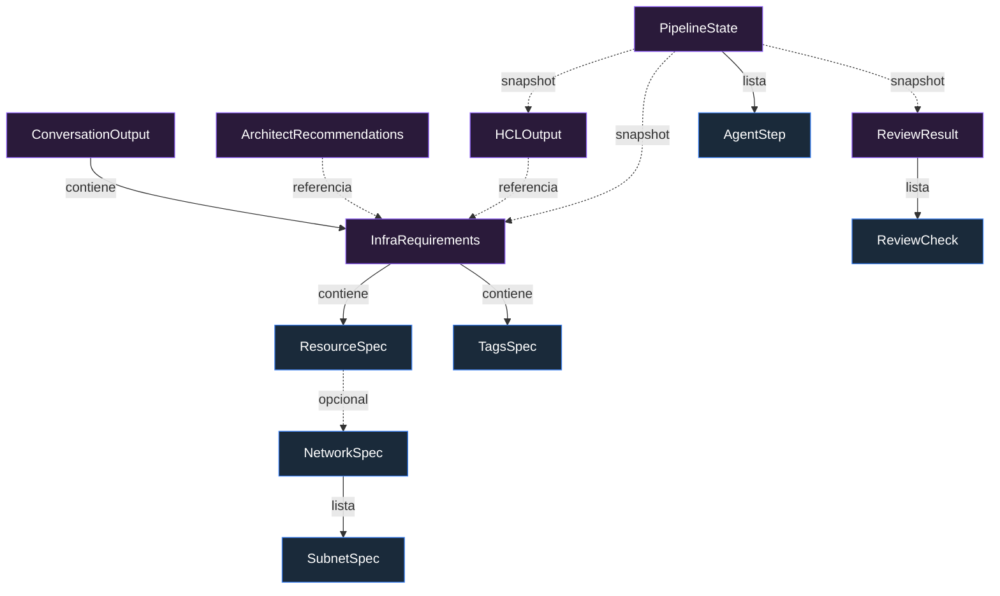
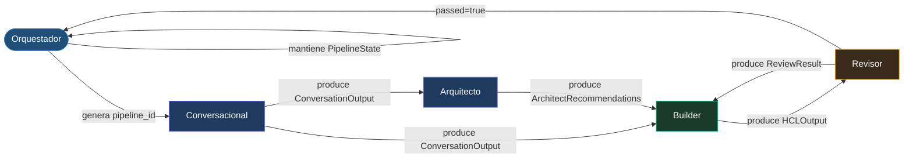

# Paso 1: Por qué empecé un sistema multiagente definiendo contratos Pydantic antes de escribir ningún agente

*Antes de un solo LLM, antes de Terraform, antes de Azure: modelos de datos. Aquí está el razonamiento y las decisiones no obvias.*

---

Si llegaste desde el post anterior, ya sabes qué estoy construyendo. Si no, la versión corta: un pipeline multiagente que convierte lenguaje natural en infraestructura Azure desplegada con Terraform. Este post cubre el Paso 1 en detalle.

El Paso 1 no llama a ningún LLM. No genera HCL. No toca Azure. Tampoco es aburrido.

---

## El problema que resuelve este paso

Un sistema con cinco agentes tiene cinco fronteras de datos. Cada frontera es un sitio donde el sistema puede fallar silenciosamente si no tienes contratos explícitos.

Sin contratos formales, un agente que produce un diccionario con clave `resource_typ` (sin 'e') no falla al crearse. Falla cuando el siguiente agente intenta leer `resource_type` y obtiene `None`. Si ese fallo ocurre dentro de una llamada LLM que está generando HCL, el error que ves es un problema de Terraform, no un problema de tipado Python. La pila de traza no te lleva al sitio real.

Pydantic v2 resuelve esto en el borde: si un modelo no valida, lanza `ValidationError` antes de que el dato contaminado cruce la frontera. El fallo es explícito, localizado y tiene contexto.

---

## Qué se construyó

Seis modelos de contrato, un módulo de utilidades, configuración del paquete y tests:

```
contracts/
├── __init__.py              # exports centralizados
├── requirements.py          # InfraRequirements
├── recommendations.py       # ArchitectRecommendations
├── hcl_output.py            # HCLOutput
├── review_result.py         # ReviewResult
├── pipeline_state.py        # PipelineState
└── conversation.py          # ConversationOutput

core/
├── exceptions.py            # excepciones tipadas
└── logging.py               # logging estructurado

tests/
├── conftest.py              # fixtures reutilizables
└── contracts/
    └── test_contracts.py    # suite completa
```

Cada modelo define exactamente qué agente lo produce, qué agente lo consume, y qué invariantes debe cumplir.

---

## Las decisiones no obvias

### 1. `pipeline_id` se genera una sola vez y solo se propaga

El Orquestador crea un `uuid.UUID` antes de invocar al primer agente. Desde ahí, ese UUID viaja en todos los contratos sin regenerarse.

Ningún agente crea su propio `pipeline_id`. Solo lo recibe y lo reenvía.

La consecuencia práctica: puedes hacer `grep` de un UUID en los logs y ver la traza completa de una ejecución a través de cinco agentes. Sin esto, correlacionar un fallo del Revisor en la iteración 3 con los requisitos originales del Conversacional requiere heurísticas.

El tipo elegido es `uuid.UUID`, no `str`. En serialización JSON con `model_dump(mode="json")` se convierte automáticamente a string. Al deserializar, `model_validate` reconstruye el `UUID`. El coste operativo es mínimo; la precisión semántica vale la pena.

### 2. `ReviewResult.passed` es una `@property`, no un campo

El Revisor ejecuta cinco etapas: `fmt`, `tflint`, `checkov`, `validate`, `plan`. Cada una produce un `ReviewCheck` con su estado. El resultado global `passed` es `True` si y solo si todas las etapas pasaron.

Si `passed` fuera un campo editable, podría desincronizarse con la lista de checks. Un agente podría construir un `ReviewResult` con tres checks fallidos y `passed=True`, y el Orquestador lo trataría como éxito.

```python
@property
def passed(self) -> bool:
    return all(c.status == ReviewCheckStatus.PASSED for c in self.checks)
```

El problema secundario: Pydantic no incluye `@property` en `model_dump()`. Para persistencia, se usa `to_snapshot()`:

```python
def to_snapshot(self) -> dict:
    data = self.model_dump(mode="json")
    data["passed"] = self.passed  # inclusión explícita
    return data
```

### 3. `SubnetSpec` como modelo, no como `dict`

La primera versión usaba `list[dict[str, str]]` para las subredes. Funcionaba. Pero Pydantic no puede validar el contenido de un diccionario genérico: si `address_prefix` tiene un valor malformado, no te enteras hasta que el Builder genera HCL inválido.

```python
class SubnetSpec(BaseModel):
    name: str
    address_prefix: str  # próximo paso: @field_validator con ip_network()
```

```python
# En NetworkSpec:
subnets: list[SubnetSpec] = []
```

La interfaz es idéntica desde fuera. La capacidad de añadir validación de CIDR en el futuro sin cambiar la interfaz es lo que lo justifica.

### 4. `config: dict[str, object]`, no `dict` a secas

`ResourceSpec` tiene un campo `config` para atributos específicos de cada recurso Terraform. No puedes modelar estos atributos con un esquema fijo sin duplicar el schema del provider.

`dict` en Pydantic v2 equivale a `dict[Any, Any]`. `dict[str, object]` fuerza que las claves sean strings (que es lo que Terraform espera) y documenta la intención. Los valores siguen siendo libres, pero eso es correcto: el Builder los validará contra el schema del provider en el Paso 2.

### 5. `AgentStepStatus` como `Enum`, no como `str`

Los estados posibles de un paso del agente son un conjunto cerrado: `PENDING`, `RUNNING`, `SUCCESS`, `FAILED`, `SKIPPED`. Un `str` libre no falla al construirse con el valor `"succes"`. Un `Enum` sí.

```python
class AgentStepStatus(str, Enum):
    PENDING = "pending"
    RUNNING = "running"
    SUCCESS = "success"
    FAILED = "failed"
    SKIPPED = "skipped"
```

Hereda de `str` para que `model_dump(mode="json")` serialice el valor como string, no como objeto Enum.

### 6. Logging estructurado desde el principio

El logging estándar de Python no acepta kwargs arbitrarios. Este código lanza `TypeError` en runtime:

```python
# ❌ no funciona con logging estándar
logger.info("Builder iteration", pipeline_id="abc", iteration=2)
```

La forma correcta, compatible con cualquier handler JSON (Loki, Datadog, etc.):

```python
# ✅
logger.info("Builder iteration", extra={"pipeline_id": str(pipeline_id), "iteration": 2})
```

Es un detalle pequeño que, si no lo corriges desde el principio, se reproduce en cada agente y se convierte en una deuda técnica difusa.

---

## Diagrama 1 — modelos de datos:


## Diagrama 2 — flujo de agentes:


---

## Cómo replicarlo

Prerequisitos: Python 3.11+, pip.

```bash
# 1. Crear entorno virtual
python -m venv .venv

# Linux/macOS
source .venv/bin/activate

# Windows PowerShell
.venv\Scripts\Activate.ps1

# 2. Instalar en modo editable con dependencias de dev
pip install -e ".[dev]"

# 3. Ejecutar los tests
pytest tests/ -v --cov=contracts --cov=core --cov-report=term-missing
```

Resultado esperado: 30 tests en verde, cobertura >90% en la capa de contratos.

Verificación manual rápida para confirmar los invariantes críticos:

```python
from uuid import uuid4
from contracts import InfraRequirements, ResourceSpec, TagsSpec
from contracts import ReviewResult, ReviewCheck, ReviewStage, ReviewCheckStatus
import json

pid = uuid4()

# UUID serializa a str en JSON
req = InfraRequirements(
    pipeline_id=pid, client="acme", environment="dev",
    location="westeurope",
    tags=TagsSpec(environment="dev", owner="alice@example.com"),
    resources=[ResourceSpec(resource_type="azurerm_virtual_network", logical_name="vnet")]
)
data = req.model_dump(mode="json")
assert isinstance(data["pipeline_id"], str)
json.dumps(data)  # no lanza

# passed es propiedad calculada, no campo editable
result = ReviewResult(pipeline_id=pid, iteration=1, checks=[
    ReviewCheck(stage=ReviewStage.FMT, status=ReviewCheckStatus.PASSED),
    ReviewCheck(stage=ReviewStage.TFLINT, status=ReviewCheckStatus.FAILED, errors=["E001"]),
])
assert result.passed is False
assert "passed" not in ReviewResult.model_fields  # no es campo
snap = result.to_snapshot()
assert snap["passed"] is False  # sí aparece en snapshot
```

---

## Lo que este paso no hace (y no debe hacer)

No valida que `address_prefix` sea un CIDR real. No comprueba que `location` sea una región Azure válida. No verifica que los atributos en `config` existan en el schema del provider.

Esas validaciones tienen su sitio en pasos posteriores: el Arquitecto valida convenciones, el Builder valida contra el schema del provider, el Revisor valida con herramientas reales. Los contratos del Paso 1 validan estructura y tipos, no semántica de dominio.

Esta separación es deliberada. Si los contratos hicieran validación de dominio, cambiar la versión del provider o añadir una nueva región Azure requeriría modificar los contratos base. Con la separación actual, los contratos son estables; la lógica de dominio vive donde le corresponde.

---

## Siguiente paso

El Paso 2 construye el `SchemaManager`: el módulo que carga el JSON generado por `terraform providers schema -json` (~15MB para azurerm 4.x) y expone una interfaz limpia para que el Builder consulte exactamente qué atributos existen en cada recurso, cuáles son requeridos y cuáles son opcionales.

Sin el SchemaManager, el Builder no tiene más referencia que su entrenamiento para saber si `enable_https_traffic_only` existe en `azurerm_storage_account` versión 4.x o si fue renombrado. Con él, las alucinaciones de atributos se convierten en un error detectable antes de ejecutar un solo comando de Terraform.

---

*El código de este paso, la documentación técnica completa y los tests estarán disponibles en el repositorio del proyecto.*

---

**Tags:** `terraform` `azure` `pydantic` `python` `multiagent` `llm` `iac` `platform-engineering` `software-architecture`
